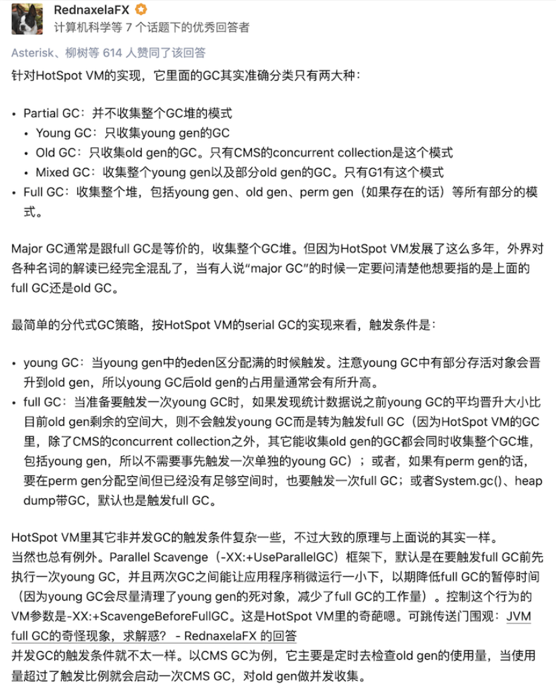
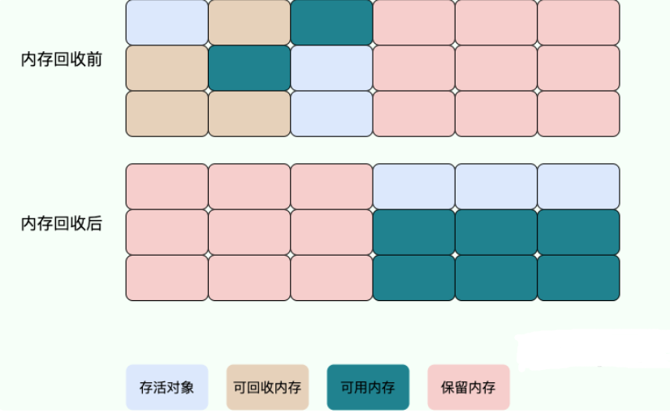

# JVM垃圾回收详解（重点）

> 常见面试题：
>
> - 如何判断对象是否死亡（两种方法）。
> - 简单的介绍一下强引用、软引用、弱引用、虚引用（虚引用与软引用和弱引用的区别、使用软引用能带来的好处）。
> - 如何判断一个常量是废弃常量
> - 如何判断一个类是无用的类
> - 垃圾收集有哪些算法，各自的特点？
> - HotSpot 为什么要分为新生代和老年代？
> - 常见的垃圾回收器有哪些？
> - 介绍一下 CMS,G1 收集器。
> - Minor Gc 和 Full GC 有什么不同呢？

## 内存分配和回收原则

### 对象优先在 Eden 区分配

- 大多数情况下，对象在新生代中 Eden 区分配。

- 当 Eden 区没有足够空间进行分配时，虚拟机将发起一次 Minor GC。GC 期间虚拟机又发现 `allocation1` 无法存入 Survivor 空间，所以只好通过 **分配担保机制** 把新生代的对象提前转移到老年代中去，老年代上的空间足够存放 `allocation1`，所以不会出现 Full GC。执行 Minor GC 后，后面分配的对象如果能够存在 Eden 区的话，还是会在 Eden 区分配内存。可以执行如下代码验证：

### 大对象直接进入老年代

大对象就是需要大量连续内存空间的对象（比如：字符串、数组）。

大对象直接进入老年代的行为是由虚拟机动态决定的，它与具体使用的垃圾回收器和相关参数有关。大对象直接进入老年代是一种优化策略，旨在避免将大对象放入新生代，从而减少新生代的垃圾回收频率和成本。

- G1垃圾回收器会根据-XX:G1HeapRegionSize参数设置的堆区域大小和-XX:G1MixedGCLiveThresholdPercent参数设置的阈值，来决定哪些对象会直接进入老年代。
- Parallel Scavenge垃圾回收器中，默认情况下，并没有一个固定的阈值(XX:ThresholdTolerance是动态调整的)来决定何时直接在老年代分配大对象。而是由虚拟机根据当前的堆内存情况和历史数据动态决定。

### 长期存活的对象将进入老年代

既然虚拟机采用了分代收集的思想来管理内存，那么内存回收时就必须能识别哪些对象应放在新生代，哪些对象应放在老年代中。为了做到这一点，虚拟机给每个对象一个对象年龄（Age）计数器。

大部分情况，对象都会首先在 Eden 区域分配。如果对象在 Eden 出生并经过第一次 Minor GC 后仍然能够存活，并且能被 Survivor 容纳的话，将被移动到 Survivor 空间（s0 或者 s1）中，并将对象年龄设为 1(Eden 区->Survivor 区后对象的初始年龄变为 1)。

对象在 Survivor 中每熬过一次 MinorGC,年龄就增加 1 岁，当它的年龄增加到一定程度（默认为 15 岁），就会被晋升到老年代中。对象晋升到老年代的年龄阈值，可以通过参数 `-XX:MaxTenuringThreshold` 来设置。

###  主要进行 gc 的区域

**总结：**

针对 HotSpot VM 的实现，它里面的 GC 其实准确分类只有两大种：

部分收集 (Partial GC)：

- 新生代收集（Minor GC / Young GC）：只对新生代进行垃圾收集；
- 老年代收集（Major GC / Old GC）：只对老年代进行垃圾收集。需要注意的是 Major GC 在有的语境中也用于指代整堆收集；
- 混合收集（Mixed GC）：对整个新生代和部分老年代进行垃圾收集。

整堆收集 (Full GC)：收集整个 Java 堆和方法区。

## 死亡对象判断方法

堆中几乎放着所有的对象实例，对堆垃圾回收前的第一步就是要判断哪些对象已经死亡（即不能再被任何途径使用的对象）。

### 引用计数法

给对象中添加一个引用计数器：

- 每当有一个地方引用它，计数器就加 1；
- 当引用失效，计数器就减 1；
- 任何时候计数器为 0 的对象就是不可能再被使用的。

**这个方法实现简单，效率高，但是目前主流的虚拟机中并没有选择这个算法来管理内存，其最主要的原因是它很难解决对象之间循环引用的问题。**

------

所谓对象之间的相互引用问题，如下面代码所示：除了对象 `objA` 和 `objB` 相互引用着对方之外，这两个对象之间再无任何引用。但是他们因为互相引用对方，导致它们的引用计数器都不为 0，于是引用计数算法无法通知 GC 回收器回收他们。

### 可达性分析算法

这个算法的基本思想就是通过一系列的称为 **“GC Roots”** 的对象作为起点，从这些节点开始向下搜索，节点所走过的路径称为引用链，当一个对象到 GC Roots 没有任何引用链相连的话，则证明此对象是不可用的，需要被回收。

下图中的 `Object 6 ~ Object 10` 之间虽有引用关系，但它们到 GC Roots 不可达，因此为需要被回收的对象。

**哪些对象可以作为 GC Roots 呢？**

- 虚拟机栈(栈帧中的本地变量表)中引用的对象
- 本地方法栈(Native 方法)中引用的对象
- 方法区中类静态属性引用的对象
- 方法区中常量引用的对象
- 所有被同步锁持有的对象
- JNI（Java Native Interface）引用的对象

**对象可以被回收，就代表一定会被回收吗？**

即使在可达性分析法中不可达的对象，也并非是“非死不可”的，这时候它们暂时处于“缓刑阶段”，要真正宣告一个对象死亡，至少要经历两次标记过程；

###  引用类型总结

无论是通过引用计数法判断对象引用数量，还是通过可达性分析法判断对象的引用链是否可达，**判定对象的存活都与“引用”有关**。

JDK1.2 以后，Java 对引用的概念进行了扩充，将引用分为强引用、软引用、弱引用、虚引用四种（引用强度逐渐减弱）

**1．强引用（StrongReference）**

以前我们使用的大部分引用实际上都是强引用，这是使用最普遍的引用。如果一个对象具有强引用，那就类似于**必不可少的生活用品**，垃圾回收器绝不会回收它。当内存空间不足，Java 虚拟机宁愿抛出 OutOfMemoryError 错误，使程序异常终止，也不会靠随意回收具有强引用的对象来解决内存不足问题。

**2．软引用（SoftReference）**

如果一个对象只具有软引用，那就类似于**可有可无的生活用品**。如果内存空间足够，垃圾回收器就不会回收它，如果内存空间不足了，就会回收这些对象的内存。只要垃圾回收器没有回收它，该对象就可以被程序使用。软引用可用来实现内存敏感的高速缓存。

软引用可以和一个引用队列（ReferenceQueue）联合使用，如果软引用所引用的对象被垃圾回收，JAVA 虚拟机就会把这个软引用加入到与之关联的引用队列中。

**3．弱引用（WeakReference）**

如果一个对象只具有弱引用，那就类似于**可有可无的生活用品**。弱引用与软引用的区别在于：只具有弱引用的对象拥有更短暂的生命周期。在垃圾回收器线程扫描它所管辖的内存区域的过程中，一旦发现了只具有弱引用的对象，不管当前内存空间足够与否，都会回收它的内存。不过，由于垃圾回收器是一个优先级很低的线程， 因此不一定会很快发现那些只具有弱引用的对象。

弱引用可以和一个引用队列（ReferenceQueue）联合使用，如果弱引用所引用的对象被垃圾回收，Java 虚拟机就会把这个弱引用加入到与之关联的引用队列中。

**4．虚引用（PhantomReference）**

"虚引用"顾名思义，就是形同虚设，与其他几种引用都不同，虚引用并不会决定对象的生命周期。如果一个对象仅持有虚引用，那么它就和没有任何引用一样，在任何时候都可能被垃圾回收。

**虚引用主要用来跟踪对象被垃圾回收的活动**。

**虚引用与软引用和弱引用的一个区别在于：** 虚引用必须和引用队列（ReferenceQueue）联合使用

## 垃圾收集算法

### 标记-清除算法

标记-清除（Mark-and-Sweep）算法分为“标记（Mark）”和“清除（Sweep）”阶段：首先标记出所有不需要回收的对象，在标记完成后统一回收掉所有没有被标记的对象。

它是最基础的收集算法，后续的算法都是对其不足进行改进得到。这种垃圾收集算法会带来两个明显的问题：

1. **效率问题**：标记和清除两个过程效率都不高。
2. **空间问题**：标记清除后会产生大量不连续的内存碎片。

### 标记-复制算法

为了解决标记-清除算法的效率和内存碎片问题，复制（Copying）收集算法出现了。它可以将内存分为大小相同的两块，每次使用其中的一块。当这一块的内存使用完后，就将还存活的对象复制到另一块去，然后再把使用的空间一次清理掉。这样就使每次的内存回收都是对内存区间的一半进行回收。

虽然改进了标记-清除算法，但依然存在下面这些问题：

- **可用内存变小**：可用内存缩小为原来的一半。
- **不适合老年代**：如果存活对象数量比较大，复制性能会变得很差。

### 标记-整理算法

标记-整理（Mark-and-Compact）算法是根据老年代的特点提出的一种标记算法，标记过程仍然与“标记-清除”算法一样，但后续步骤不是直接对可回收对象回收，而是让所有存活的对象向一端移动，然后直接清理掉端边界以外的内存。

由于多了整理这一步，因此效率也不高，适合老年代这种垃圾回收频率不是很高的场景。

## 垃圾收集器

**如果说收集算法是内存回收的方法论，那么垃圾收集器就是内存回收的具体实现。**

虽然我们对各个收集器进行比较，但并非要挑选出一个最好的收集器。因为直到现在为止还没有最好的垃圾收集器出现，更加没有万能的垃圾收集器，**我们能做的就是根据具体应用场景选择适合自己的垃圾收集器**。试想一下：如果有一种四海之内、任何场景下都适用的完美收集器存在，那么我们的 HotSpot 虚拟机就不会实现那么多不同的垃圾收集器了。

JDK 默认垃圾收集器（使用 `java -XX:+PrintCommandLineFlags -version` 命令查看）：

- JDK 8：Parallel Scavenge（新生代）+ Parallel Old（老年代）
- JDK 9 ~ JDK20: G1

###  CMS 收集器

**CMS（Concurrent Mark Sweep）收集器是一种以获取最短回收停顿时间为目标的收集器。它非常符合在注重用户体验的应用上使用。**

**CMS（Concurrent Mark Sweep）收集器是 HotSpot 虚拟机第一款真正意义上的并发收集器，它第一次实现了让垃圾收集线程与用户线程（基本上）同时工作。**

------

从名字中的**Mark Sweep**这两个词可以看出，CMS 收集器是一种 **“标记-清除”算法**实现的，它的运作过程相比于前面几种垃圾收集器来说更加复杂一些。整个过程分为四个步骤：

- **初始标记：** 暂停所有的其他线程，并记录下直接与 root 相连的对象，速度很快 ；
- **并发标记：** 同时开启 GC 和用户线程，用一个闭包结构去记录可达对象。但在这个阶段结束，这个闭包结构并不能保证包含当前所有的可达对象。因为用户线程可能会不断的更新引用域，所以 GC 线程无法保证可达性分析的实时性。所以这个算法里会跟踪记录这些发生引用更新的地方。
- **重新标记：** 重新标记阶段就是为了修正并发标记期间因为用户程序继续运行而导致标记产生变动的那一部分对象的标记记录，这个阶段的停顿时间一般会比初始标记阶段的时间稍长，远远比并发标记阶段时间短
- **并发清除：** 开启用户线程，同时 GC 线程开始对未标记的区域做清扫。

------

从它的名字就可以看出它是一款优秀的垃圾收集器，主要优点：**并发收集、低停顿**。但是它有下面三个明显的缺点：

- **对 CPU 资源敏感；**
- **无法处理浮动垃圾；**
- **它使用的回收算法-“标记-清除”算法会导致收集结束时会有大量空间碎片产生。**

### G1 收集器

**G1 (Garbage-First) 是一款面向服务器的垃圾收集器,主要针对配备多颗处理器及大容量内存的机器. 以极高概率满足 GC 停顿时间要求的同时,还具备高吞吐量性能特征.**

被视为 JDK1.7 中 HotSpot 虚拟机的一个重要进化特征。它具备以下特点：

- **并行与并发**：G1 能充分利用 CPU、多核环境下的硬件优势，使用多个 CPU（CPU 或者 CPU 核心）来缩短 Stop-The-World 停顿时间。部分其他收集器原本需要停顿 Java 线程执行的 GC 动作，G1 收集器仍然可以通过并发的方式让 java 程序继续执行。
- **分代收集**：虽然 G1 可以不需要其他收集器配合就能独立管理整个 GC 堆，但是还是保留了分代的概念。
- **空间整合**：与 CMS 的“标记-清除”算法不同，G1 从整体来看是基于“标记-整理”算法实现的收集器；从局部上来看是基于“标记-复制”算法实现的。
- **可预测的停顿**：这是 G1 相对于 CMS 的另一个大优势，降低停顿时间是 G1 和 CMS 共同的关注点，但 G1 除了追求低停顿外，还能建立可预测的停顿时间模型，能让使用者明确指定在一个长度为 M 毫秒的时间片段内，消耗在垃圾收集上的时间不得超过 N 毫秒。

G1 收集器的运作大致分为以下几个步骤：

- **初始标记**
- **并发标记**
- **最终标记**
- **筛选回收**

**G1 收集器在后台维护了一个优先列表，每次根据允许的收集时间，优先选择回收价值最大的 Region(这也就是它的名字 Garbage-First 的由来)** 。这种使用 Region 划分内存空间以及有优先级的区域回收方式，保证了 G1 收集器在有限时间内可以尽可能高的收集效率（把内存化整为零）。

**从 JDK9 开始，G1 垃圾收集器成为了默认的垃圾收集器。**

G1 收集器是面向服务端的垃圾收集器，被称为驾驭一切的垃圾回收器，主要有以下几个特点

- 像 CMS 收集器一样，能与应用程序线程并发执行。

- 整理空闲空间更快。

- 需要 GC 停顿时间更好预测。

- 不会像 CMS 那样牺牲大量的吞吐性能。

- 不需要更大的 Java Heap

  

  

与 CMS 相比，它在以下两个方面表现更出色

1. 运作期间不会产生内存碎片，G1 从整体上看采用的是标记-整理法，局部（两个 Region）上看是基于复制算法实现的，两个算法都不会产生内存碎片，收集后提供规整的可用内存，这样有利于程序的长时间运行。
2. 在 STW 上建立了**可预测**的停顿时间模型，用户可以指定期望停顿时间，G1 会将停顿时间控制在用户设定的停顿时间以内。

G1回收器（Garbage-First Garbage Collector）和CMS回收器（Concurrent Mark-Sweep Garbage Collector）都是Java虚拟机中用于垃圾回收的不同策略。它们各自有一些优势和劣势，以下是G1回收器相对于CMS回收器的一些优势：

1. **可预测的停顿时间**：G1回收器设计的目标之一是减小垃圾收集引起的停顿时间。它通过将堆划分为多个区域，并使用多个线程并发回收这些区域来实现更可控的停顿时间。这意味着在大多数情况下，G1回收器可以提供更稳定和可预测的应用程序响应时间，而CMS回收器的停顿时间会随着应用程序的内存使用情况而波动。
2. **自适应性**：G1回收器可以根据应用程序的需求动态调整回收策略，以优化垃圾收集的性能。它可以在运行时选择要回收的区域，并根据收集的数据动态调整优先级，以提高回收的效率。
3. **更好的内存利用**：G1回收器通常能够更有效地利用堆内存，因为它可以在回收时同时处理多个区域，而CMS回收器在回收过程中可能会产生内存碎片，导致堆空间的浪费。
4. **可预测的Full GC（全垃圾回收）**：与CMS回收器不同，G1回收器不会产生频繁的Full GC。Full GC通常是导致较长停顿时间的原因之一，而G1回收器会在后台以并发方式执行这些操作，从而减小了Full GC的影响。
5. **更好的并行性**：G1回收器充分利用多线程来并发执行垃圾回收操作，这可以提高多核处理器上的性能。

尽管G1回收器在许多方面都有优势，但它也有一些适用场景以外的限制。例如，对于非常大的堆内存，或者对于某些特定的工作负载，其他垃圾收集器（如Parallel GC或Z Garbage Collector）可能更适合。因此，选择垃圾回收器应该根据应用程序的具体需求和性能特征进行评估。