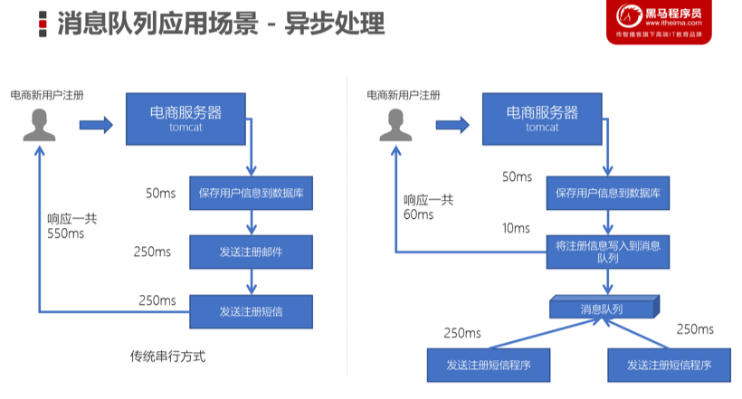

# Kafka第一天课堂笔记

## Kafka简介

### 消息队列

* 消息队列——用于存放消息的组件
* 程序员可以将消息放入到队列中，也可以从消息队列中获取消息
* 很多时候消息队列不是一个永久性的存储，是作为临时存储存在的（设定一个期限：设置消息在MQ中保存10天）
* 消息队列中间件：消息队列的组件，例如：Kafka、Active MQ、RabbitMQ、RocketMQ、ZeroMQ

### Kafka的应用场景

* 异步处理
	* 可以将一些比较耗时的操作放在其他系统中，通过消息队列将需要进行处理的消息进行存储，其他系统可以消费消息队列中的数据
	* 比较常见的：发送短信验证码、发送邮件



* 系统解耦
	* 原先一个微服务是通过接口（HTTP）调用另一个微服务，这时候耦合很严重，只要接口发生变化就会导致系统不可用
	* 使用消息队列可以将系统进行解耦合，现在第一个微服务可以将消息放入到消息队列中，另一个微服务可以从消息队列中把消息取出来进行处理。进行系统解耦


* 流量削峰
	* 因为消息队列是低延迟、高可靠、高吞吐的，可以应对大量并发


* 日志处理
	* 可以使用消息队列作为临时存储，或者一种通信管道


### 消息队列的两种模型

* 生产者、消费者模型
	* 生产者负责将消息生产到MQ中
	* 消费者负责从MQ中获取消息
	* 生产者和消费者是解耦的，可能是生产者一个程序、消费者是另外一个程序
* 消息队列的模式
	* 点对点：一个消费者消费一个消息
	* 发布订阅：多个消费者可以消费一个消息

## Kafka集群搭建

* Kafka集群是必须要有ZooKeeper的

注意：

* 每一个Kafka的节点都需要修改broker.id（每个节点的标识，不能重复）
* log.dir数据存储目录需要配置

### Kafka的生产者/消费者/工具

* 安装Kafka集群，可以测试以下
	* 创建一个topic主题（消息都是存放在topic中，类似mysql建表的过程）
	* 基于kafka的内置测试生产者脚本来读取标准输入（键盘输入）的数据，并放入到topic中
	* 基于kafka的内置测试消费者脚本来消费topic中的数据
* 推荐大家开发的使用Kafka Tool
	* 浏览Kafka集群节点、多少个topic、多少个分区
	* 创建topic/删除topic
	* 浏览ZooKeeper中的数据

### Kafka的基准测试工具

* Kafka中提供了内置的性能测试工具

	* 生产者：测试生产每秒传输的数据量（多少条数据、多少M的数据）

		```html
		5000000 records sent, 11825.446943 records/sec (11.28 MB/sec), 2757.61 ms avg latency
		```

	* 消费者：测试消费每条拉取的数据量

* 对比生产者和消费者：消费者的速度更快

## Kafka Java API开发

### 生产者程序开发

1. 创建连接
	* bootstrap.servers：Kafka的服务器地址
	* acks：表示当生产者生产数据到Kafka中，Kafka中会以什么样的策略返回
	* key.serializer：Kafka中的消息是以key、value键值对存储的，而且生产者生产的消息是需要在网络上传到的，这里指定的是StringSerializer方式，就是以字符串方式发送（将来还可以使用其他的一些序列化框架：Google ProtoBuf、Avro）
	* value.serializer：同上
2. 创建一个生产者对象KafkaProducer
3. 调用send方法发送消息（ProducerRecor，封装是key-value键值对）
4. 调用Future.get表示等带服务端的响应
5. 关闭生产者


```java
public class KafkaProducerTest {
    public static void main(String[] args) throws ExecutionException, InterruptedException {
        // 1. 创建用于连接Kafka的Properties配置
        Properties props = new Properties();
        props.put("bootstrap.servers", "node1.itcast.cn:9092");
        props.put("acks", "all");
        props.put("key.serializer", "org.apache.kafka.common.serialization.StringSerializer");
        props.put("value.serializer", "org.apache.kafka.common.serialization.StringSerializer");

        // 2. 创建一个生产者对象KafkaProducer
        KafkaProducer<String, String> kafkaProducer = new KafkaProducer<>(props);

        // 3. 发送1-100的消息到指定的topic中
        for(int i = 0; i < 100; ++i) {
            // 构建一条消息，直接new ProducerRecord
            ProducerRecord<String, String> producerRecord = new ProducerRecord<>("test", null, i + "");
            Future<RecordMetadata> future = kafkaProducer.send(producerRecord);
            // 调用Future的get方法等待响应
            future.get();
            System.out.println("第" + i + "条消息写入成功！");
        }

        // 4.关闭生产者
        kafkaProducer.close();
    }
}
```

### 消费者程序开发

* group.id：消费者组的概念，可以在一个消费组中包含多个消费者。如果若干个消费者的group.id是一样的，表示它们就在一个组中，一个组中的消费者是共同消费Kafka中topic的数据。
* Kafka是一种拉消息模式的消息队列，在消费者中会有一个offset，表示从哪条消息开始拉取数据
* kafkaConsumer.poll：Kafka的消费者API是一批一批数据的拉取

```java
/**
 * 消费者程序
 *
 * 1.创建Kafka消费者配置
 * Properties props = new Properties();
 * props.setProperty("bootstrap.servers", "node1.itcast.cn:9092");
 * props.setProperty("group.id", "test");
 * props.setProperty("enable.auto.commit", "true");
 * props.setProperty("auto.commit.interval.ms", "1000");
 * props.setProperty("key.deserializer", "org.apache.kafka.common.serialization.StringDeserializer");
 * props.setProperty("value.deserializer", "org.apache.kafka.common.serialization.StringDeserializer");
 *
 * 2.创建Kafka消费者
 * 3.订阅要消费的主题
 * 4.使用一个while循环，不断从Kafka的topic中拉取消息
 * 5.将将记录（record）的offset、key、value都打印出来
 */
public class KafkaConsumerTest {

    public static void main(String[] args) {
        // 1.创建Kafka消费者配置
        Properties props = new Properties();
        props.setProperty("bootstrap.servers", "node1.itcast.cn:9092");
        // 消费者组（可以使用消费者组将若干个消费者组织到一起），共同消费Kafka中topic的数据
        // 每一个消费者需要指定一个消费者组，如果消费者的组名是一样的，表示这几个消费者是一个组中的
        props.setProperty("group.id", "test");
        // 自动提交offset
        props.setProperty("enable.auto.commit", "true");
        // 自动提交offset的时间间隔
        props.setProperty("auto.commit.interval.ms", "1000");
        // 拉取的key、value数据的
        props.setProperty("key.deserializer", "org.apache.kafka.common.serialization.StringDeserializer");
        props.setProperty("value.deserializer", "org.apache.kafka.common.serialization.StringDeserializer");

        // 2.创建Kafka消费者
        KafkaConsumer<String, String> kafkaConsumer = new KafkaConsumer<>(props);

        // 3. 订阅要消费的主题
        // 指定消费者从哪个topic中拉取数据
        kafkaConsumer.subscribe(Arrays.asList("test"));

        // 4.使用一个while循环，不断从Kafka的topic中拉取消息
        while(true) {
            // Kafka的消费者一次拉取一批的数据
            ConsumerRecords<String, String> consumerRecords = kafkaConsumer.poll(Duration.ofSeconds(5));
            // 5.将将记录（record）的offset、key、value都打印出来
            for (ConsumerRecord<String, String> consumerRecord : consumerRecords) {
                // 主题
                String topic = consumerRecord.topic();
                // offset：这条消息处于Kafka分区中的哪个位置
                long offset = consumerRecord.offset();
                // key\value
                String key = consumerRecord.key();
                String value = consumerRecord.value();

                System.out.println("topic: " + topic + " offset:" + offset + " key:" + key + " value:" + value);
            }
        }
    }
}

```

### 生产者使用异步方式生产消息

* 使用匿名内部类实现Callback接口，该接口中表示Kafka服务器响应给客户端，会自动调用onCompletion方法
	* metadata：消息的元数据（属于哪个topic、属于哪个partition、对应的offset是什么）
	* exception：这个对象Kafka生产消息封装了出现的异常，如果为null，表示发送成功，如果不为null，表示出现异常。

```java
// 二、使用异步回调的方式发送消息
ProducerRecord<String, String> producerRecord = new ProducerRecord<>("test", null, i + "");
kafkaProducer.send(producerRecord, new Callback() {
    @Override
    public void onCompletion(RecordMetadata metadata, Exception exception) {
        // 1. 判断发送消息是否成功
        if(exception == null) {
            // 发送成功
            // 主题
            String topic = metadata.topic();
            // 分区id
            int partition = metadata.partition();
            // 偏移量
            long offset = metadata.offset();
            System.out.println("topic:" + topic + " 分区id：" + partition + " 偏移量：" + offset);
        }
        else {
            // 发送出现错误
            System.out.println("生产消息出现异常！");
            // 打印异常消息
            System.out.println(exception.getMessage());
            // 打印调用栈
            System.out.println(exception.getStackTrace());
        }
    }
});
```

## Kafka中的重要概念

* broker
	* Kafka服务器进程，生产者、消费者都要连接broker
	* 一个集群由多个broker组成，功能实现Kafka集群的负载均衡、容错
* producer：生产者
* consumer：消费者
* topic：主题，一个Kafka集群中，可以包含多个topic。一个topic可以包含多个分区
	* 是一个逻辑结构，生产、消费消息都需要指定topic
* partition：Kafka集群的分布式就是由分区来实现的。一个topic中的消息可以分布在topic中的不同partition中
* replica：副本，实现Kafkaf集群的容错，实现partition的容错。一个topic至少应该包含大于1个的副本
* consumer group：消费者组，一个消费者组中的消费者可以共同消费topic中的分区数据。每一个消费者组都一个唯一的名字。配置group.id一样的消费者是属于同一个组中
* offset：偏移量。相对消费者、partition来说，可以通过offset来拉取数据

### 消费者组

* 一个消费者组中可以包含多个消费者，共同来消费topic中的数据
* 一个topic中如果只有一个分区，那么这个分区只能被某个组中的一个消费者消费
* 有多少个分区，那么就可以被同一个组内的多少个消费者消费

### 幂等性

* 生产者消息重复问题
	* Kafka生产者生产消息到partition，如果直接发送消息，kafka会将消息保存到分区中，但Kafka会返回一个ack给生产者，表示当前操作是否成功，是否已经保存了这条消息。如果ack响应的过程失败了，此时生产者会重试，继续发送没有发送成功的消息，Kafka又会保存一条一模一样的消息

* 在Kafka中可以开启幂等性
	* 当Kafka的生产者生产消息时，会增加一个pid（生产者的唯一编号）和sequence number（针对消息的一个递增序列）
	* 发送消息，会连着pid和sequence number一块发送
	* kafka接收到消息，会将消息和pid、sequence number一并保存下来
	* 如果ack响应失败，生产者重试，再次发送消息时，Kafka会根据pid、sequence number是否需要再保存一条消息
	* 判断条件：生产者发送过来的sequence number 是否小于等于 partition中消息对应的sequence

## 事务编程

* 开启事务的条件

	* 生产者

		```java
		// 开启事务必须要配置事务的ID
		props.put("transactional.id", "dwd_user");
		```

	* 消费者

		```java
		// 配置事务的隔离级别
		props.put("isolation.level","read_committed");
		// 关闭自动提交，一会我们需要手动来提交offset，通过事务来维护offset
		props.setProperty("enable.auto.commit", "false");
		```

	* 生产者

		* 初始化事务
		* 开启事务
		* 需要使用producer来将消费者的offset提交到事务中
		* 提交事务
		* 如果出现异常回滚事务

> 如果使用了事务，不要使用异步发送


```java
public class TransactionProgram {
    public static void main(String[] args) {
        // 1. 调用之前实现的方法，创建消费者、生产者对象
        KafkaConsumer<String, String> consumer = createConsumer();
        KafkaProducer<String, String> producer = createProducer();

        // 2. 生产者调用initTransactions初始化事务
        producer.initTransactions();

        // 3. 编写一个while死循环，在while循环中不断拉取数据，进行处理后，再写入到指定的topic
        while(true) {
            try {
                // (1)	生产者开启事务
                producer.beginTransaction();

                // 这个Map保存了topic对应的partition的偏移量
                Map<TopicPartition, OffsetAndMetadata> offsetMap = new HashMap<>();

                // 从topic中拉取一批的数据
                // (2)	消费者拉取消息
                ConsumerRecords<String, String> concumserRecordArray = consumer.poll(Duration.ofSeconds(5));
                // (3)	遍历拉取到的消息，并进行预处理
                for (ConsumerRecord<String, String> cr : concumserRecordArray) {
                    // 将1转换为男，0转换为女
                    String msg = cr.value();
                    String[] fieldArray = msg.split(",");

                    // 将消息的偏移量保存
                    // 消费的是ods_user中的数据
                    String topic = cr.topic();
                    int partition = cr.partition();
                    long offset = cr.offset();

                	int i = 1 / 0;

                    // offset + 1：offset是当前消费的记录（消息）对应在partition中的offset，而我们希望下一次能继续从下一个消息消息
                    // 必须要+1，从能消费下一条消息
                    offsetMap.put(new TopicPartition(topic, partition), new OffsetAndMetadata(offset + 1));

                    // 将字段进行替换
                    if(fieldArray != null && fieldArray.length > 2) {
                        String sexField = fieldArray[1];
                        if(sexField.equals("1")) {
                            fieldArray[1] = "男";
                        }
                        else if(sexField.equals("0")){
                            fieldArray[1] = "女";
                        }
                    }

                    // 重新拼接字段
                    msg = fieldArray[0] + "," + fieldArray[1] + "," + fieldArray[2];

                    // (4)	生产消息到dwd_user topic中
                    ProducerRecord<String, String> dwdMsg = new ProducerRecord<>("dwd_user", msg);
                    // 发送消息
                    Future<RecordMetadata> future = producer.send(dwdMsg);
                    try {
                        future.get();
                    } catch (Exception e) {
                        e.printStackTrace();
                        producer.abortTransaction();
                    }
//                            new Callback()
//                    {
//                        @Override
//                        public void onCompletion(RecordMetadata metadata, Exception exception) {
//                            // 生产消息没有问题
//                            if(exception == null) {
//                                System.out.println("发送成功:" + dwdMsg);
//                            }
//                            else {
//                                System.out.println("生产消息失败:");
//                                System.out.println(exception.getMessage());
//                                System.out.println(exception.getStackTrace());
//                            }
//                        }
//                    });
                }

                producer.sendOffsetsToTransaction(offsetMap, "ods_user");

                // (6)	提交事务
                producer.commitTransaction();
            }catch (Exception e) {
                e.printStackTrace();
                // (7)	捕获异常，如果出现异常，则取消事务
                producer.abortTransaction();
            }
        }
    }

    // 一、创建一个消费者来消费ods_user中的数据
    private static KafkaConsumer<String, String> createConsumer() {
        // 1. 配置消费者的属性（添加对事务的支持）
        Properties props = new Properties();
        props.setProperty("bootstrap.servers", "node1.itcast.cn:9092");
        props.setProperty("group.id", "ods_user");
        // 配置事务的隔离级别
        props.put("isolation.level","read_committed");
        // 关闭自动提交，一会我们需要手动来提交offset，通过事务来维护offset
        props.setProperty("enable.auto.commit", "false");
        // 反序列化器
        props.setProperty("key.deserializer", "org.apache.kafka.common.serialization.StringDeserializer");
        props.setProperty("value.deserializer", "org.apache.kafka.common.serialization.StringDeserializer");

        // 2. 构建消费者对象
        KafkaConsumer<String, String> kafkaConsumer = new KafkaConsumer<>(props);

        // 3. 订阅一个topic
        kafkaConsumer.subscribe(Arrays.asList("ods_user"));

        return kafkaConsumer;

    }

    // 二、编写createProducer方法，用来创建一个带有事务配置的生产者
    private static KafkaProducer<String, String> createProducer() {
        // 1. 配置生产者带有事务配置的属性
        Properties props = new Properties();
        props.put("bootstrap.servers", "node1.itcast.cn:9092");
        // 开启事务必须要配置事务的ID
        props.put("transactional.id", "dwd_user");
        props.put("key.serializer", "org.apache.kafka.common.serialization.StringSerializer");
        props.put("value.serializer", "org.apache.kafka.common.serialization.StringSerializer");

        // 2. 构建生产者
        KafkaProducer<String, String> kafkaProducer = new KafkaProducer<>(props);

        return kafkaProducer;
    }
}

```

