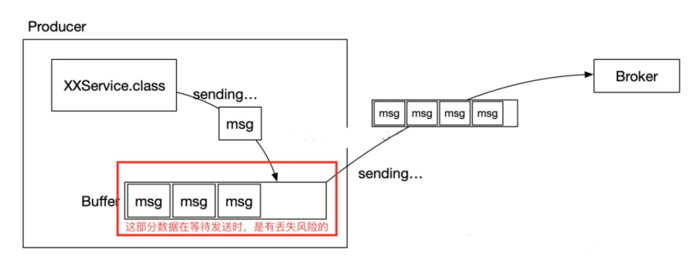

# 说说你对kafka的理解

kafka是一个流式数据处理平台，他具有消息系统的能力，也有实时流式数据处理分析能力，只是我们更多的偏向于把他当做消息队列系统来使用。

如果说按照容易理解来分层的话，大致可以分为3层：

第一层是**Zookeeper**，相当于注册中心，他负责kafka集群元数据的管理，以及集群的协调工作，在每个kafka服务器启动的时候去连接到Zookeeper，把自己注册到Zookeeper当中，kafka2.8之后渐渐抛弃Zookeeper，使用kraft模式在kafka自己的系统里管理元数据

第二层里是kafka的核心层，这里就会包含很多kafka的基本概念在内：

**record**：代表消息

**topic**：主题，消息都会由一个主题方式来组织，可以理解为对于消息的一个分类

**producer**：生产者，负责发送消息

**consumer**：消费者，负责消费消息

**broker**：kafka服务器

**partition**：分区，主题会由多个分区组成，通常每个分区的消息都是按照顺序读取的，不同的分区无法保证顺序性，分区也就是我们常说的数据分片sharding机制，主要目的就是为了提高系统的伸缩能力，通过分区，消息的读写可以负载均衡到多个不同的节点上

**Leader/Follower**：分区的副本。为了保证高可用，分区都会有一些副本，每个分区都会有一个Leader主副本负责读写数据，Follower从副本只负责和Leader副本保持数据同步，不对外提供任何服务

**offset**：偏移量，分区中的每一条消息都会根据时间先后顺序有一个递增的序号，这个序号就是offset偏移量

**Consumer group**：消费者组，由多个消费者组成，一个组内只会由一个消费者去消费一个分区的消息

**Coordinator**：协调者，主要是为消费者组分配分区以及重平衡Rebalance操作

**Controller**：控制器，其实就是一个broker而已，用于协调和管理整个Kafka集群，他会负责分区Leader选举、主题管理等工作，在Zookeeper第一个创建临时节点/controller的就会成为控制器

**第三层则是存储层，用来保存kafka的核心数据，他们都会以日志的形式最终写入磁盘中。**


# 消息队列模型知道吗？kafka是怎么做到支持这两种模型的？


对于传统的消息队列系统支持两个模型：

1. 点对点：也就是消息只能被一个消费者消费，消费完后消息删除
2. 发布订阅：相当于广播模式，消息可以被所有消费者消费

上面也说到过，kafka其实就是通过Consumer Group同时支持了这两个模型。

如果说所有消费者都属于一个Group，消息只能被同一个Group内的一个消费者消费，那就是点对点模式。

如果每个消费者都是一个单独的Group，那么就是发布订阅模式。

实际上，Kafka通过消费者分组的方式灵活的支持了这两个模型。


# 能说说kafka通信过程原理吗？

1. 首先kafka broker启动的时候，会去向Zookeeper注册自己的ID（创建临时节点），这个ID可以配置也可以自动生成，同时会去订阅Zookeeper的`brokers/ids`路径，当有新的broker加入或者退出时，可以得到当前所有broker信息
2. 生产者启动的时候会指定`bootstrap.servers`，通过指定的broker地址，Kafka就会和这些broker创建TCP连接（通常我们不用配置所有的broker服务器地址，否则kafka会和配置的所有broker都建立TCP连接）
3. 随便连接到任何一台broker之后，然后再发送请求获取元数据信息（包含有哪些主题、主题都有哪些分区、分区有哪些副本，分区的Leader副本等信息）
4. 接着就会创建和所有broker的TCP连接
5. 之后就是发送消息的过程
6. 消费者和生产者一样，也会指定`bootstrap.servers`属性，然后选择一台broker创建TCP连接，发送请求找到**协调者**所在的broker
7. 然后再和协调者broker创建TCP连接，获取元数据
8. 根据分区Leader节点所在的broker节点，和这些broker分别创建连接
9. 最后开始消费消息


# 那么发送消息时如何选择分区的？

主要有两种方式：

1. 轮询，按照顺序消息依次发送到不同的分区
2. 随机，随机发送到某个分区

**如果消息指定key，那么会根据消息的key进行hash，然后对partition分区数量取模，决定落在哪个分区上，所以，对于相同key的消息来说，总是会发送到同一个分区上，也是我们常说的消息分区有序性。**

很常见的场景就是我们希望下单、支付消息有顺序，这样以订单ID作为key发送消息就达到了分区有序性的目的。

如果没有指定key，会执行默认的轮询负载均衡策略，比如第一条消息落在P0，第二条消息落在P1，然后第三条又在P1。

除此之外，对于一些特定的业务场景和需求，还可以通过实现`Partitioner`接口，重写`configure`和`partition`方法来达到自定义分区的效果。

# 好，那你觉得为什么需要分区？有什么好处？

这个问题很简单，如果说不分区的话，我们发消息写数据都只能保存到一个节点上，这样的话就算这个服务器节点性能再好最终也支撑不住。

实际上分布式系统都面临这个问题，要么收到消息之后进行数据切分，要么提前切分，kafka正是选择了前者，通过分区可以把数据均匀地分布到不同的节点。

**分区带来了负载均衡和横向扩展的能力。**

发送消息时可以根据分区的数量落在不同的Kafka服务器节点上，提升了并发写消息的性能，消费消息的时候又和消费者绑定了关系，可以从不同节点的不同分区消费消息，提高了读消息的能力。

另外一个就是分区又引入了副本，冗余的副本保证了Kafka的高可用和高持久性。

# 详细说说消费者组和消费者重平衡？

Kafka中的消费者组订阅topic主题的消息，**一般来说消费者的数量最好要和所有主题分区的数量保持一致最好**（举例子用一个主题，实际上当然是可以订阅多个主题）。

当消费者数量小于分区数量的时候，那么必然会有一个消费者消费多个分区的消息。

而消费者数量超过分区的数量的时候，那么必然会有消费者没有分区可以消费。

所以，消费者组的好处一方面在上面说到过，可以支持多种消息模型，另外的话根据消费者和分区的消费关系，支撑横向扩容伸缩。


当我们知道消费者如何消费分区的时候，就显然会有一个问题出现了，消费者消费的分区是怎么分配的，有先加入的消费者时候怎么办？

旧版本的重平衡过程主要通过ZK监听器的方式来触发，每个消费者客户端自己去执行分区分配算法。

新版本则是通过协调者来完成，每一次新的消费者加入都会发送请求给**协调者**去获取分区的分配，这个分区分配的算法逻辑由协调者来完成。

而重平衡Rebalance就是指的有新消费者加入的情况，比如刚开始我们只有消费者A在消费消息，过了一段时间消费者B和C加入了，这时候分区就需要重新分配，这就是重平衡，也可以叫做再平衡，但是重平衡的过程和我们的GC时候STW很像，会导致整个消费群组停止工作，重平衡期间都无法消息消息。

另外，发生重平衡并不是只有这一种情况，因为消费者和分区总数是存在绑定关系的，上面也说了，消费者数量最好和所有主题的分区总数一样。

那只要**消费者数量**、**主题数量**（比如用的正则订阅的主题）、**分区数量**任何一个发生改变，都会触发重平衡。

# 重平衡的过程

重平衡的机制依赖消费者和协调者之间的心跳来维持，消费者会有一个独立的线程去定时发送心跳给协调者，这个可以通过参数`heartbeat.interval.ms`来控制发送心跳的间隔时间。

1. 每个消费者第一次加入组的时候都会向协调者发送`JoinGroup`请求，第一个发送这个请求的消费者会成为“群主”，协调者会返回组成员列表给群主
2. 群主执行分区分配策略，然后把分配结果通过`SyncGroup`请求发送给协调者，协调者收到分区分配结果
3. 其他组内成员也向协调者发送`SyncGroup`，协调者把每个消费者的分区分配分别响应给他们


# 分区分配策略？

## **Range**

这个是默认的策略。大概意思就是对分区进行排序，排序越靠前的consumer能够分配到更多的分区。


但是这个分配策略会有点小问题，他是根据主题进行分配，所以如果消费者组订阅了多个主题，那就有可能导致分区分配不均衡。

比如下图中两个主题的P0\P1都被分配给了A，这样A有4个分区，而B只有2个，如果这样的主题数量越多，那么不均衡就越严重。


## **RoundRobin**

也就是我们常说的轮询了，这个就比较简单了，不画图你也能很容易理解。

这个会根据所有的主题进行轮询分配，不会出现Range那种主题越多可能导致分区分配不均衡的问题。

P0->A，P1->B，P1->A。。。以此类推


## **Sticky**

这个从字面看来意思就是粘性策略，大概是这个意思。主要考虑的是在分配均衡的前提下，让分区的分配更小的改动。

比如之前P0\P1分配给消费者A，那么下一次尽量还是分配给A。

这样的好处就是连接可以复用，要消费消息总是要和broker去连接的，如果能够保持上一次分配的分区的话，那么就不用频繁的销毁创建连接了。


# Kafka消息的可靠性如何保证

三个方面来阐述：

## 生产者消息丢失

kafka支持3种方式发送消息，这也是常规的3种方式，发送后不管结果、同步发送、异步发送，基本上所有的消息队列都是这样玩的。

1. 发送并忘记，直接调用发送send方法，不管结果，虽然可以开启自动重试，但是肯定会有消息丢失的可能
2. 同步发送，同步发送返回Future对象，我们可以知道发送结果，然后进行处理
3. 异步发送，发送消息，同时指定一个回调函数，根据结果进行相应的处理

为了保险起见，一般我们都会使用异步发送带有回调的方式进行发送消息，再设置参数为发送消息失败不停地重试。


关于消息是否被发送成功，kafka服务端收到生产者消息时有3钟回复策略（`acks=all`，这个参数有可以配置0|1|all。）- 

- 0：表示生产者写入消息不管服务器的响应，可能消息还在网络缓冲区，服务器根本没有收到消息，当然会丢失消息。
- 1：表示至少有一个副本收到消息才认为成功，一个副本那肯定就是集群的Leader副本了，但是如果刚好Leader副本所在的节点挂了，Follower没有同步这条消息，消息仍然丢失了。
- all：表示所有ISR都写入成功才算成功，那除非所有ISR里的副本全挂了，消息才会丢失。


**当我们配置为异步发送且broker响应模式为all时，仍然有可能发生消息丢失**

这样的情况发生在**生产者客户端**。

为了提升效率，减少IO，producer在发送数据时可以将多个请求进行合并后发送。被合并的请求咋发送一线缓存在本地buffer中。producer可以将请求打包成“块”或者按照时间间隔，将buffer中的数据发出。通过buffer我们可以将生产者改造为异步的方式，而这可以提升我们的发送效率。

但是，buffer中的数据就是危险的。**在正常情况下，客户端的异步调用可以通过callback来处理消息发送失败或者超时的情况，但是，一旦producer被非法的停止了，那么buffer中的数据将丢失，broker将无法收到该部分数据**。又或者，当Producer客户端内存不够时，如果采取的策略是丢弃消息（另一种策略是block阻塞），消息也会被丢失。抑或，消息产生（异步产生）过快，导致挂起线程过多，内存不足，导致程序崩溃，消息丢失。



如果消息的产生，是多线程异步产生，则线程会被挂起等待，占用内存。可能造成内存满了以后程序挂死导致消息丢失。

根据上图，可以想到几个解决的思路：

1. 或者service产生消息时，使用阻塞的线程池，并且线程数有一定上限。整体思路是控制消息产生速度。
2. 扩大Buffer的容量配置。这种方式可以缓解该情况的出现，但不能杜绝。
3. service不直接将消息发送到buffer（内存），而是将消息写到本地的磁盘中（数据库或者文件），由另一个（或少量）生产线程进行消息发送。相当于是在buffer和service之间又加了一层空间更加富裕的缓冲层。


## Kafka自身存储消息丢失

kafka因为消息写入是**通过PageCache异步写入**磁盘的，因此仍然存在丢失消息的可

因此针对kafka自身丢失的可能设置参数：

`replication.factor=N`，设置一个比较大的值，保证至少有2个或者以上的副本。

`min.insync.replicas=N`，代表消息如何才能被认为是写入成功，设置大于1的数，保证至少写入1个或者以上的副本才算写入消息成功。

`unclean.leader.election.enable=false`，这个设置意味着没有完全同步的分区副本不能成为Leader副本，如果是`true`的话，那些没有完全同步Leader的副本成为Leader之后，就会有消息丢失的风险。

## 消费者消息丢失

消费者丢失的可能就比较简单，**关闭自动提交位移即可**，改为业务处理成功手动提交。

因为重平衡发生的时候，消费者会去读取上一次提交的偏移量，自动提交默认是每5秒一次，这会导致重复消费或者丢失消息。

`enable.auto.commit=false`，设置为手动提交。


# Kafka副本与它的同步原理

Kafka中的数据存储由（`replication.factor=N`）指定副本个数，副本又分为leader和follower，和其他的比如Mysql不一样的是，Kafka中只有Leader副本会对外提供服务，Follower副本只是单纯地和Leader保持数据同步，作为数据冗余容灾的作用。

在Kafka中我们把所有副本的集合统称为**AR（Assigned Replicas）**，和Leader副本保持同步的副本集合称为**ISR（InSyncReplicas）**。

ISR是一个动态的集合，维持这个集合会通过`replica.lag.time.max.ms`参数来控制，这个代表落后Leader副本的最长时间，默认值10秒，所以只要Follower副本没有落后Leader副本超过10秒以上，就可以认为是和Leader同步的（简单可以认为就是同步时间差）。

另外还有两个关键的概念用于副本之间的同步：

**HW（High Watermark）**：高水位，也叫做复制点，表示副本间同步的位置。如下图所示，0~4绿色表示已经提交的消息，这些消息已经在副本之间进行同步，消费者可以看见这些消息并且进行消费，4~6黄色的则是表示未提交的消息，可能还没有在副本间同步，这些消息对于消费者是不可见的。

**LEO（Log End Offset）**：下一条待写入消息的位移


消息还在继续写入，Leader的LEO值又发生了变化，两个Follower也各自拉取到了自己的消息，于是更新自己的LEO值，但是这时候Leader的HW依然没有改变。


此时，Follower再次向Leader拉取数据，这时候Leader会更新自己的HW值，取Follower中的最小的LEO值来更新。


之后，Leader响应自己的HW给Follower，Follower更新自己的HW值，因为又拉取到了消息，所以再次更新LEO，流程以此类推。


# 高版本Kafka为什么舍弃了Zookeeper

## Zookeeper的缺陷

**Kafka 2.8**版本引入一个重大改进：KRaft模式。这个功能一直处于实验阶段。
2022年10月3日，**Kafka 3.3.1**发布，正式宣告**KRaft**模式可以用于生产环境。
在KRaft模式下，所有集群元数据都存储在Kafka内部主题中，由kafka自行管理，不再依赖zookeeper。

KRaft 模式有很多优点：

- **简化集群部署和管理** – 不在需要zookeeper，简化了kafka集群的部署和管理工作。资源占用更小。
- **提高可扩展性和弹性** – 单个集群中的分区数量可以扩展到数百万个。集群重启和故障恢复时间更短。
- **更高效的元数据传播** – 基于日志、事件驱动的元数据传播提高了 Kafka 许多核心功能的性能。

每个集群都有一个broker作为控制器(controller)。控制器不仅仅承担broker的工作，还负责维护集群的元数据，如broker id、主题、分区、领导者和同步副本集(ISR) ，以及其他信息。控制器将这些信息保存在 ZooKeeper中，ZooKeeper的大部分读写流量都是由控制器完成的。当元数据发生变化，控制器将最新的元数据传播给其他broker。


Zookeeper相当于工单系统，controller是工单系统的管理员，负责安排工作，broker负责干活，采用AB角工作制度(leader、follower)。
Controller有以下作用：

- 监控broker是否存活（broker在zookeeper中打卡上线，controller统计在线人数）
- 如果topic、partition、replica或broker发生变化，必要时，为partition选出新的leader，更新follower列表(工单或者人员发生变动，controller重新分配工作)
- 使用RPC请求通知相关broker成为leader或follower(通知相关人员开始干活)
- 将最新的元数据写入zookeeper，并发送给其他broker(更新工单系统，知会其他人员最新的工作安排)

问题：

- 随着节点和分区数量线性增长，元数据越来越大，控制器将元数据传播给broker时间变长。
- ZooKeeper 不适合保存大量的数据，频繁的数据变更可能会带来性能瓶颈。另外，Znode的大小限制和最大观察者数量都可能会成为制约因素。
- 元数据保存在ZooKeeper中，每个broker从controller获取最新的元数据，并缓存到自己的内存中，当更新延迟或重新排序时，数据可能不一致，需要额外的验证检查确保数据一致。
- 当Controller发生故障或者重启时，新的controller需要从Zookeeper上重新拉取所有的元数据，当集群内的分区变得非常多(几十万甚至几百万)的时候，加载元数据的时间会变得很⻓，在此之间Controller是无法响应和工作的，会影响整个集群的可用性。

## Kraft模式

从kafka诞生之初，就离不开zookeeper，随着kafka的发展，zookeeper的弊端逐渐显现出来。
最开始的时候，kafka将元数据和消费者的消费位置(**offset**偏移量)都保存在zookeeper中。

### 偏移量管理

消费位置是一个频繁更新的数据，对zookeeper而言，写操作代价比较昂贵，频繁的写入可能会带来性能问题。写操作全部交给leader执行，无法水平扩展。
从**0.8.2**版本开始，消费者的消费位置不再写入zookeeper，而是记录到kafka的内部主题 **`__comsumer_offsets`** 中，默认创建50个分区，以<消费者group.id、主题、分区号>作为消息的key，可以同时由多个broker处理请求，因此具有更高的写入性能和扩展性。kafka同时将最新消费位置的视图缓存到内存中，可以快速读取偏移量。

### 元数据管理

#### zookeeper模式

在kafka 3.3.0版本之前，元数据存放在zookeeper中，结构如下：


每个集群都有一个broker作为控制器(controller)。控制器不仅仅承担broker的工作，还负责维护集群的元数据，如broker id、主题、分区、领导者和同步副本集(ISR) ，以及其他信息。控制器将这些信息保存在 ZooKeeper中，ZooKeeper的大部分读写流量都是由控制器完成的。当元数据发生变化，控制器将最新的元数据传播给其他broker。


> 注意：每个broker都可以直接与zookeeper通信。上图省略了其他的连线。
> 例如，broker启动时会在zookeeper中创建一个临时节点/brokers/ids/{id}，每个分区的leader也会更新正在同步的副本集(ISR)信息。

Zookeeper相当于工单系统，controller是工单系统的管理员，负责安排工作，broker负责干活，采用AB角工作制度(leader、follower)。
Controller有以下作用：

- 监控broker是否存活（broker在zookeeper中打卡上线，controller统计在线人数）
- 如果topic、partition、replica或broker发生变化，必要时，为partition选出新的leader，更新follower列表(工单或者人员发生变动，controller重新分配工作)
- **使用RPC请求通知相关broker成为leader或follower**(通知相关人员开始干活)
- 将最新的元数据写入zookeeper，并发送给其他broker(更新工单系统，知会其他人员最新的工作安排)

> 注意：选择新的leader不是靠投票，而是选择ISR集合中的第一个为leader。这种按顺位选择的方式具有更高的容错性。例如，在 2N+1 个副本的情况下，最多允许 2N 副本个失效，而选举的方式最多只能允许N个失效。

#### 问题

- 随着节点和分区数量线性增长，元数据越来越大，控制器将元数据传播给broker时间变长。
- ZooKeeper 不适合保存大量的数据，频繁的数据变更可能会带来性能瓶颈。另外，Znode的大小限制和最大观察者数量都可能会成为制约因素。
- 元数据保存在ZooKeeper中，每个broker从controller获取最新的元数据，并缓存到自己的内存中，当更新延迟或重新排序时，数据可能不一致，需要额外的验证检查确保数据一致。
- 当Controller发生故障或者重启时，新的controller需要从Zookeeper上重新拉取所有的元数据，当集群内的分区变得非常多(几十万甚至几百万)的时候，加载元数据的时间会变得很⻓，在此之间Controller是无法响应和工作的，会影响整个集群的可用性。

> 注意：当Controller发生故障或者重启时，其他broker作为观察者会收到通知，每个broker都尝试在ZooKeeper中创建/controller节点，谁先创建成功，谁就成为新的controller。

## KRaft模式


Kafka集群中存在一些控制器，和普通的Broker

### 元数据管理


KRaft 基于 Raft 共识协议，通过仲裁(quorom)机制选举出一个主控制器(active controller)，所有**元数据的写入操作**都由主控制器处理，主控制器将元数据的变更记录写入到 `__cluster_metadata`内部主题中，**为了保证写入顺序，这个主题只有一个分区**，主控制器是这个分区的leader，其他的控制器作为follower，将数据同步到本地日志中，超过一半数量的控制器同步完成后，则认为数据写入成功，主控制器返消息给客户端。

所有控制器都将本地的元数据日志缓存在**内存**中，并保持动态更新,当主控制发生故障时，其他控制器可以立即成为新的主控制器，随时接管。

除了控制器之外，每个broker作为观察者(Observer)，也都同步元数据到本地的副本中，并缓存到内存中。

```bash
docker run -it --rm --network=kraft_net \
           bitnami/kafka:3.3.1 \
           /opt/bitnami/kafka/bin/kafka-metadata-quorum.sh \
           --bootstrap-server kafka-1:9092,kafka-2:9093 \
           describe --replication
```


**元数据传播方式由原来的RPC请求转变为同步元数据日志，无需再担心数据存在差异**，每个broker本地的元数据物化视图最终将是一致的，因为它们来自同一个日志。我们也可以通过时间戳和偏移量轻易的追踪和消除差异。


Controller和broker会定期将内存中的元数据快照写入到检查点(checkpoint)文件中，checkpoint文件名中包含快照最后的消费位置和控制器的ID，当我们重启controller或broker时，无需从头读取元数据，直接将本地最新的检查点文件加载到内存，然后从检查点文件中最后的消费位置开始读区数据，这样就缩短了启动时间。