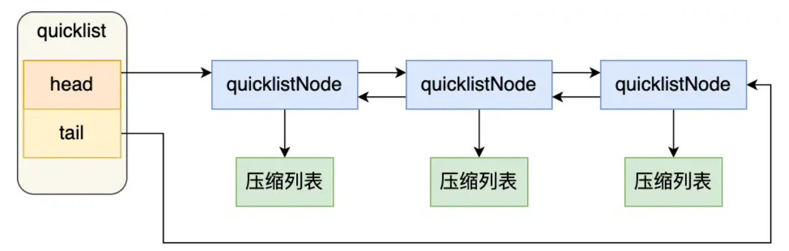

# OverView


可以看到，有些数据类型可以由两种 数据结构实现，比如：

- List 数据类型底层数据结构由「双向链表」或「压缩表列表」实现；
- Hash 数据类型底层数据结构由「压缩列表」或「哈希表」实现；
- Set 数据类型底层数据结构由「哈希表」或「整数集合」实现；
- Zset 数据类型底层数据结构由「压缩列表」或「跳表」实现；


# SDS

字符串在 Redis 中是很常用的，键值对中的键是字符串，值有时也是字符串。

Redis 是用 C 语言实现的，但是它没有直接使用 C 语言的 char* 字符数组来实现字符串，而是自己封装了一个名为简单动态字符串（simple dynamic string，SDS） 的数据结构来表示字符串，也就是 Redis 的 String 数据类型的底层数据结构是 SDS。

## C 语言字符串的缺陷

C 语言的字符串其实就是一个字符数组，即数组中每个元素是字符串中的一个字符。

比如，下图就是字符串“xiaolin”的 char* 字符数组的结构：


在 C 语言里，对字符串操作时，char * 指针只是指向字符数组的起始位置，而**字符数组的结尾位置就用“\0”表示，意思是指字符串的结束**。

- 获取字符串长度的时间复杂度为  O（N）；

- 字符串的结尾是以 “\0” 字符标识，而且字符必须符合某种编码（比如ASCII），只能保存文本数据，不能保存二进制数据；

- 字符串操作函数不高效且不安全，比如可能会发生缓冲区溢出，从而造成程序运行终止；

  

## SDS 结构设计


- **len，SDS 所保存的字符串长度**。这样获取字符串长度的时候，只需要返回这个变量值就行，时间复杂度只需要 O（1）。
- **alloc，分配给字符数组的空间长度**。这样在修改字符串的时候，可以通过 `alloc - len` 计算 出剩余的空间大小，然后用来判断空间是否满足修改需求，如果不满足的话，就会自动将 SDS  的空间扩展至执行修改所需的大小，然后才执行实际的修改操作，所以使用 SDS 既不需要手动修改 SDS 的空间大小，也不会出现前面所说的缓冲区益处的问题
- **flags，SDS 类型，用来表示不同类型的 SDS**。一共设计了 5 种类型，分别是 sdshdr5、sdshdr8、sdshdr16、sdshdr32 和 sdshdr64，（这 5 种类型的主要**区别就在于，它们数据结构中的 len 和 alloc 成员变量的数据类型不同**，）
- **buf[]，字节数组，用来保存实际数据**。不需要用 “\0” 字符来标识字符串结尾了，而是直接将其作为二进制数据处理，可以用来保存图片等二进制数据。它即可以保存文本数据，也可以保存二进制数据，所以叫字节数组会更好点。

总的来说，Redis 的 SDS 结构在原本字符数组之上，增加了三个元数据：len、alloc、flags，用来解决 C 语言字符串的缺陷。


# 链表

除了数组之外，相信大家最熟悉的数据结构就是链表了。

Redis 的 list 数据类型的底层实现之一就是链表。C 语言本身也是没有链表这个数据结构的，所以 Redis 自己设计了一个链表数据结构。

## 链表节点结构设计

```c
typedef struct listNode {
    //前置节点
    struct listNode *prev;
    //后置节点
    struct listNode *next;
    //节点的值
    void *value;
} listNode;
```

有前置节点和后置节点，可以看的出，这个是一个双向链表。


## 链表结构设计

不过，Redis 在 listNode 结构体基础上又封装了 list 这个数据结构，这样操作起来会更方便，链表结构如下：

```c
typedef struct list {
    //链表头节点
    listNode *head;
    //链表尾节点
    listNode *tail;
    //节点值复制函数
    void *(*dup)(void *ptr);
    //节点值释放函数
    void (*free)(void *ptr);
    //节点值比较函数
    int (*match)(void *ptr, void *key);
    //链表节点数量
    unsigned long len;
} list;
```

举个例子，下面是由 list 结构和 3 个 listNode 结构组成的链表。


Redis 的链表实现优点如下：

- listNode 链表节点带有 prev 和 next 指针，**获取某个节点的前置节点或后置节点的时间复杂度只需O(1)，而且这两个指针都可以指向 NULL，所以链表是无环链表**；
- list 结构因为提供了表头指针 head 和表尾节点 tail，所以**获取链表的表头节点和表尾节点的时间复杂度只需O(1)**；
- list 结构因为提供了链表节点数量 len，所以**获取链表中的节点数量的时间复杂度只需O(1)**；

链表的缺陷也是有的**，链表每个节点之间的内存都是不连续的，意味着无法很好利用 CPU 缓存。**

能很好利用 CPU 缓存的数据结构就是数组，因为数组的内存是连续的，这样就可以充分利用 CPU 缓存来加速访问。

因此，Redis 的 list 数据类型在数据量比较少的情况下，会采用「**压缩列表**」作为底层数据结构的实现，压缩列表就是由数组实现的，下面我们会细说压缩列表。

# 压缩列表

压缩列表是 Redis 为了节约内存而开发的，它是**由连续内存块组成的顺序型数据结构**，有点类似于数组。


压缩列表在表头有三个字段：

- **zlbytes**，记录整个压缩列表占用对内存字节数；
- **zltail**，记录压缩列表「尾部」节点距离起始地址由多少字节，也就是列表尾的偏移量；
- **zllen**，记录压缩列表包含的节点数量；
- **zlend**，标记压缩列表的结束点，特殊值 OxFF（十进制255）。

在压缩列表中，如果我们要查找定位**第一个元素和最后一个元素，可以通过表头三个字段的长度直接定位，复杂度是 O(1)。**而查找其他元素时，就没有这么高效了，只能逐个查找，此时的复杂度就是 O(N) 了。

另外，压缩列表节点（entry）的构成如下：

压缩列表节点包含三部分内容：

- **prevlen**，记录了**前**一个节点的长度；
- **encoding**，记录了**当前节点**实际数据的**类型**以及**长度**；
- **data**，记录了当前节点的实际数据；

当我们往压缩列表中插入数据时，压缩列表 就会根据数据是字符串还是整数，以及它们的大小会在 prevlen 和 encoding 这两个元素里保存不同的信息，这种根据数据大小进行对应信息保存的设计思想，正是 Redis 为了节省内存而采用的。

## 连锁更新

压缩列表除了查找复杂度高的问题，压缩列表在插入元素时，如果内存空间不够了，压缩列表还需要重新分配一块连续的内存空间，而这可能会引发**连锁更新**的问题。

压缩列表里的每个节点中的  prevlen 属性都记录了「前一个节点的长度」，而且 prevlen 属性的空间大小跟前一个节点长度值有关，比如：

- 如果前一个**节点的长度小于 254 字节**，那么 prevlen 属性需要用 **1 字节的空间**来保存这个长度值；
- 如果前一个**节点的长度大于等于 254 字节**，那么 prevlen 属性需要用 **5 字节的空间**来保存这个长度值；


那么请考虑这种情况，ziplist中有多个250~253字节的节点，因为这些节点长度值小于 254 字节，所以 prevlen 属性需要用 1 字节的空间来保存这个长度值。

这时，如果将一个长度大于等于 254 字节的新节点加入到压缩列表的表头节点，即新节点将成为 e1 的前置节点

因为 e1 节点的 prevlen 属性只有 1 个字节大小，无法保存新节点的长度，此时就需要对压缩列表的空间重分配操作，并将 e1 节点的 prevlen 属性从原来的 1 字节大小扩展为 5 字节大小。多米诺牌的效应就此开始。


**这种在特殊情况下产生的连续多次空间扩展操作就叫做「连锁更新」**

因此，**压缩列表只会用于保存的节点数量不多的场景**，只要节点数量足够小，即使发生连锁更新，也是能接受的。


# Hash表

哈希表是一种保存键值对（key-value）的数据结构。

在讲压缩列表的时候，提到过 Redis 的 hash 数据类型的底层实现之一是压缩列表。hash 数据类型的另外一个底层实现就是哈希表。

当一个哈希键**包含的 key-value 比较多，或者 key-value 中元素都是比较长多字符串**时，Redis 就会使用哈希表作为哈希键的底层实现。

Hash 表优点在于，它**能以 O(1) 的复杂度快速查询数据**。主要是通过 Hash 函数的计算，就能定位数据在表中的位置，紧接着可以对数据进行操作，这就使得数据操作非常快。

但是存在的风险也是有，在哈希表大小固定的情况下，随着数据不断增多，那么**哈希冲突**的可能性也会越高。

解决哈希冲突的方式，有很多种。**Redis 采用了链式哈希**，在不扩容哈希表的前提下，将具有相同哈希值的数据链接起来，以便这些数据在表中仍然可以被查询到。（就类似于java的hash map中的数组+链表）

不过，链式哈希局限性也很明显，随着链表长度的增加，在查询这一位置上的数据的耗时就会增加，毕竟链表的查询的时间复杂度是 **O（n）。**

要想解决这一问题，就需要进行 rehash，就是对哈希表的大小进行扩展。

## rehash

Redis 会使用了两个全局哈希表进行 rehash。

在正常服务请求阶段，插入的数据，都会写入到「哈希表 1」，此时的「哈希表 2 」 并没有被分配空间。

- 给「哈希表 2」 分配空间，一般会比「哈希表 1」 **大 2 倍**；
- 将「哈希表 1 」的数据迁移到「哈希表 2」 中；
- 迁移完成后，「哈希表 1 」的空间会被释放，并把「哈希表 2」 设置为「哈希表 1」，然后在「哈希表 2」 新创建一个空白的哈希表，为下次 rehash 做准备。

相当于用两个数组循环扩容


这个过程看起来简单，但是其实第二步很有问题，如果「哈希表 1 」的数据量非常大，那么在迁移至「哈希表 2 」的时候，因为会涉及大量的数据拷贝，**此时可能会对 Redis 造成阻塞，无法服务其他请求。**


## 渐进式Rehash

为了避免 rehash 在数据迁移过程中，因拷贝数据的耗时，影响 Redis 性能的情况，所以 Redis 采用了**渐进式 rehash**，也就是将数据的迁移的工作不再是一次性迁移完成，而是分**多次迁移。**

步骤如下：

- 给「哈希表 2」 分配空间；
- **在 rehash 进行期间，每次哈希表元素进行新增、删除、查找或者更新操作时，Redis 除了会执行对应的操作之外，还会顺序将「哈希表 1 」中索引位置上的所有 key-value 迁移到「哈希表 2」 上**；
- 随着处理客户端发起的哈希表操作请求数量越多，最终会把「哈希表 1 」的所有 key-value 迁移到「哈希表 2」，从而完成 rehash 操作。

在进行渐进式 rehash 的过程中，会有两个哈希表，所以在渐进式 rehash 进行期间，哈希表元素的删除、查找、更新等操作都会在这两个哈希表进行

另外，在渐进式 rehash 进行期间，新增一个 key-value 时，会被保存到「哈希表 2 」里面，而「哈希表 1」 则不再进行任何添加操作，这样保证了「哈希表 1 」的 key-value 数量只会减少，随着 rehash 操作的完成，最终「哈希表 1 」就会变成空表。


## Rehash的触发条件

rehash 的触发条件跟**负载因子（load factor）**有关系。


- **当负载因子大于等于 1 ，并且 Redis 没有在执行 bgsave 命令或者 bgrewiteaof 命令，也就是没有执行 RDB 快照或没有进行 AOF 重写的时候，就会进行 rehash 操作。**

- **当负载因子大于等于 5 时，此时说明哈希冲突非常严重了，不管有没有有在执行 RDB 快照或 AOF 重写，都会强制进行 rehash 操作。**


# 跳表

跳跃表（skiplist）是一种随机化的数据结构，由 **William Pugh** 在论文《Skip lists: a probabilistic alternative to balanced trees》中提出，是一种可以与平衡树媲美的层次化链表结构——**查找、删除、添加等操作都可以在对数期望时间下完成**，以下是一个典型的跳跃表例子：


## 使用跳表的原因

首先，因为 zset 要支持随机的插入和删除，所以它 **不宜使用数组来实现**

关于排序问题，我们也很容易就想到 **红黑树/ 平衡树** 这样的树形结构，为什么 Redis 不使用这样一些结构呢？

1. **性能考虑：** 在高并发的情况下，树形结构需要执行一些类似于 rebalance 这样的可能涉及整棵树的操作，相对来说跳跃表的变化只涉及局部 *(下面详细说)*；
2. **实现考虑：** 在复杂度与红黑树相同的情况下，跳跃表实现起来更简单，看起来也更加直观；

## 本质是解决查找问题

我们先来看一个普通的链表结构：


我们需要这个链表按照 score 值进行排序，这也就意味着，当我们需要添加新的元素时，我们需要定位到插入点，这样才可以继续保证链表是有序的，通常我们会使用 **二分查找法**，但二分查找是有序数组的，链表没办法进行位置定位，我们除了遍历整个找到第一个比给定数据大的节点为止 *（时间复杂度 O(n))* 似乎没有更好的办法。

但假如我们每相邻两个节点之间就增加一个指针，让指针指向下一个节点，如下图：


这样所有新增的指针连成了一个新的链表，但它包含的数据却只有原来的一半 *（图中的为 3，11）*。

现在假设我们想要查找数据时，可以根据这条新的链表查找，如果碰到比待查找数据大的节点时，再回到原来的链表中进行查找，比如，我们想要查找 7，查找的路径则是沿着下图中标注出的红色指针所指向的方向进行的：


这是一个略微极端的例子，但我们仍然可以看到，通过新增加的指针查找，我们不再需要与链表上的每一个节点逐一进行比较，这样改进之后需要比较的节点数大概只有原来的一半。

利用同样的方式，我们可以在新产生的链表上，继续为每两个相邻的节点增加一个指针，从而产生第三层链表：


在这个新的三层链表结构中，我们试着 **查找 13**，那么沿着最上层链表首先比较的是 11，发现 11 比 13 小，于是我们就知道只需要到 11 后面继续查找，**从而一下子跳过了 11 前面的所有节点。**

可以想象，当链表足够长，这样的多层链表结构可以帮助我们跳过很多下层节点，从而加快查找的效率。

## 更进一步的跳跃表

**跳跃表 skiplist** 就是受到这种多层链表结构的启发而设计出来的。**按照上面生成链表的方式，上面每一层链表的节点个数，是下面一层的节点个数的一半，这样查找过程就非常类似于一个二分查找，使得查找的时间复杂度可以降低到 *O(logn)*。**

但是，这种方法在插入数据的时候有很大的问题。新插入一个节点之后，就会打乱上下相邻两层链表上节点个数严格的 2:1 的对应关系。如果要维持这种对应关系，就必须把新插入的节点后面的所有节点 *（也包括新插入的节点）* 重新进行调整，这会让时间复杂度重新蜕化成 *O(n)*。删除数据也有同样的问题。

**skiplist** 为了避免这一问题，它不要求上下相邻两层链表之间的节点个数有严格的对应关系，而是 **为每个节点随机出一个层数(level)**。比如，一个节点随机出的层数是 3，那么就把它链入到第 1 层到第 3 层这三层链表中。为了表达清楚，下图展示了如何通过一步步的插入操作从而形成一个 skiplist 的过程：


从上面的创建和插入的过程中可以看出，每一个节点的层数（level）是随机出来的，而且新插入一个节点并不会影响到其他节点的层数，因此，**插入操作只需要修改节点前后的指针，而不需要对多个节点都进行调整**，这就降低了插入操作的复杂度。

现在我们假设从我们刚才创建的这个结构中查找 23 这个不存在的数，那么查找路径会如下图：


# 跳表的实现

## 数据结构

Redis 中的跳跃表由 `server.h/zskiplistNode` 和 `server.h/zskiplist` 两个结构定义，前者为跳跃表节点，后者则保存了跳跃节点的相关信息，同之前的 `集合 list` 结构类似，其实只有 `zskiplistNode` 就可以实现了，但是引入后者是为了更加方便的操作：

```C
/* ZSETs use a specialized version of Skiplists */
typedefstruct zskiplistNode {
    // value
    sds ele;
    // 分值
    double score;
    // 后退指针
    struct zskiplistNode *backward;
    // 层
    struct zskiplistLevel {
        // 前进指针
        struct zskiplistNode *forward;
        // 跨度
        unsignedlong span;
    } level[];
} zskiplistNode;

typedefstruct zskiplist {
    // 跳跃表头指针
    struct zskiplistNode *header, *tail;
    // 表中节点的数量
    unsignedlong length;
    // 表中层数最大的节点的层数
    int level;
} zskiplist;
```

正如文章开头画出来的那张标准的跳跃表那样。

## 随机层数

对于每一个新插入的节点，都需要调用一个随机算法给它分配一个合理的层数，源码在 `t_zset.c/zslRandomLevel(void)` 中被定义：

```C
int zslRandomLevel(void) {
    int level = 1;
    while ((random()&0xFFFF) < (ZSKIPLIST_P * 0xFFFF))
        level += 1;
    return (level<ZSKIPLIST_MAXLEVEL) ? level : ZSKIPLIST_MAXLEVEL;
}
```

直观上期望的目标是 50% 的概率被分配到 `Level 1`，25% 的概率被分配到 `Level 2`，12.5% 的概率被分配到 `Level 3`，以此类推...有 2-63 的概率被分配到最顶层，因为这里每一层的晋升率都是 50%。

**Redis 跳跃表默认允许最大的层数是 32**，被源码中 `ZSKIPLIST_MAXLEVEL` 定义，当 `Level[0]` 有 264 个元素时，才能达到 32 层，所以定义 32 完全够用了。

## 创建跳跃表

这个过程比较简单，在源码中的 `t_zset.c/zslCreate` 中被定义：

```C
zskiplist *zslCreate(void) {
    int j;
    zskiplist *zsl;

    // 申请内存空间
    zsl = zmalloc(sizeof(*zsl));
    // 初始化层数为 1
    zsl->level = 1;
    // 初始化长度为 0
    zsl->length = 0;
    // 创建一个层数为 32，分数为 0，没有 value 值的跳跃表头节点
    zsl->header = zslCreateNode(ZSKIPLIST_MAXLEVEL,0,NULL);
    
    // 跳跃表头节点初始化
    for (j = 0; j < ZSKIPLIST_MAXLEVEL; j++) {
        // 将跳跃表头节点的所有前进指针 forward 设置为 NULL
        zsl->header->level[j].forward = NULL;
        // 将跳跃表头节点的所有跨度 span 设置为 0
        zsl->header->level[j].span = 0;
    }
    // 跳跃表头节点的后退指针 backward 置为 NULL
    zsl->header->backward = NULL;
    // 表头指向跳跃表尾节点的指针置为 NULL
    zsl->tail = NULL;
    return zsl;
}
```

即执行完之后创建了如下结构的初始化跳跃表：


## 插入节点实现

这几乎是最重要的一段代码了，但总体思路也比较清晰简单，如果理解了上面所说的跳跃表的原理，那么很容易理清楚插入节点时发生的几个动作 *（几乎跟链表类似）*：

1. 找到当前我需要插入的位置 *（其中包括相同 score 时的处理）*；
2. 创建新节点，调整前后的指针指向，完成插入；

为了方便阅读，我把源码 `t_zset.c/zslInsert` 定义的插入函数拆成了几个部分

### 第一部分：声明需要存储的变量

```C
// 存储搜索路径
zskiplistNode *update[ZSKIPLIST_MAXLEVEL], *x;
// 存储经过的节点跨度
unsignedint rank[ZSKIPLIST_MAXLEVEL];
int i, level;
```

### 第二部分：搜索当前节点插入位置

```C
serverAssert(!isnan(score));
x = zsl->header;
// 逐步降级寻找目标节点，得到 "搜索路径"
for (i = zsl->level-1; i >= 0; i--) {
    /* store rank that is crossed to reach the insert position */
    rank[i] = i == (zsl->level-1) ? 0 : rank[i+1];
    // 如果 score 相等，还需要比较 value 值
    while (x->level[i].forward &&
            (x->level[i].forward->score < score ||
                (x->level[i].forward->score == score &&
                sdscmp(x->level[i].forward->ele,ele) < 0)))
    {
        rank[i] += x->level[i].span;
        x = x->level[i].forward;
    }
    // 记录 "搜索路径"
    update[i] = x;
}
```

### 第三部分：生成插入节点

```c
/* we assume the element is not already inside, since we allow duplicated
 * scores, reinserting the same element should never happen since the
 * caller of zslInsert() should test in the hash table if the element is
 * already inside or not. */
level = zslRandomLevel();
// 如果随机生成的 level 超过了当前最大 level 需要更新跳跃表的信息
if (level > zsl->level) {
    for (i = zsl->level; i < level; i++) {
        rank[i] = 0;
        update[i] = zsl->header;
        update[i]->level[i].span = zsl->length;
    }
    zsl->level = level;
}
// 创建新节点
x = zslCreateNode(level,score,ele);
```

### 第四部分：重排前向指针

```c
for (i = 0; i < level; i++) {
    x->level[i].forward = update[i]->level[i].forward;
    update[i]->level[i].forward = x;

    /* update span covered by update[i] as x is inserted here */
    x->level[i].span = update[i]->level[i].span - (rank[0] - rank[i]);
    update[i]->level[i].span = (rank[0] - rank[i]) + 1;
}

/* increment span for untouched levels */
for (i = level; i < zsl->level; i++) {
    update[i]->level[i].span++;
}
```

### 第五部分：重排后向指针并返回

```c
x->backward = (update[0] == zsl->header) ? NULL : update[0];
if (x->level[0].forward)
    x->level[0].forward->backward = x;
else
    zsl->tail = x;
zsl->length++;
return x;
```

## 节点删除实现

删除过程由源码中的 `t_zset.c/zslDeleteNode` 定义，和插入过程类似，都需要先把这个 **"搜索路径"** 找出来，然后对于每个层的相关节点重排一下前向后向指针，同时还要注意更新一下最高层数 `maxLevel`，直接放源码 *(如果理解了插入这里还是很容易理解的)*：

```c
/* Internal function used by zslDelete, zslDeleteByScore and zslDeleteByRank */
void zslDeleteNode(zskiplist *zsl, zskiplistNode *x, zskiplistNode **update) {
    int i;
    for (i = 0; i < zsl->level; i++) {
        if (update[i]->level[i].forward == x) {
            update[i]->level[i].span += x->level[i].span - 1;
            update[i]->level[i].forward = x->level[i].forward;
        } else {
            update[i]->level[i].span -= 1;
        }
    }
    if (x->level[0].forward) {
        x->level[0].forward->backward = x->backward;
    } else {
        zsl->tail = x->backward;
    }
    while(zsl->level > 1 && zsl->header->level[zsl->level-1].forward == NULL)
        zsl->level--;
    zsl->length--;
}

/* Delete an element with matching score/element from the skiplist.
 * The function returns 1 if the node was found and deleted, otherwise
 * 0 is returned.
 *
 * If 'node' is NULL the deleted node is freed by zslFreeNode(), otherwise
 * it is not freed (but just unlinked) and *node is set to the node pointer,
 * so that it is possible for the caller to reuse the node (including the
 * referenced SDS string at node->ele). */
int zslDelete(zskiplist *zsl, double score, sds ele, zskiplistNode **node) {
    zskiplistNode *update[ZSKIPLIST_MAXLEVEL], *x;
    int i;

    x = zsl->header;
    for (i = zsl->level-1; i >= 0; i--) {
        while (x->level[i].forward &&
                (x->level[i].forward->score < score ||
                    (x->level[i].forward->score == score &&
                     sdscmp(x->level[i].forward->ele,ele) < 0)))
        {
            x = x->level[i].forward;
        }
        update[i] = x;
    }
    /* We may have multiple elements with the same score, what we need
     * is to find the element with both the right score and object. */
    x = x->level[0].forward;
    if (x && score == x->score && sdscmp(x->ele,ele) == 0) {
        zslDeleteNode(zsl, x, update);
        if (!node)
            zslFreeNode(x);
        else
            *node = x;
        return1;
    }
    return0; /* not found */
}
```

## 节点更新实现

当我们调用 `ZADD` 方法时，如果对应的 value 不存在，那就是插入过程，如果这个 value 已经存在，只是调整一下 score 的值，那就需要走一个更新流程。

假设这个新的 score 值并不会带来排序上的变化，那么就不需要调整位置，直接修改元素的 score 值就可以了，但是如果排序位置改变了，那就需要调整位置，该如何调整呢？

从源码 `t_zset.c/zsetAdd` 函数 `1350` 行左右可以看到，Redis 采用了一个非常简单的策略：

```c
/* Remove and re-insert when score changed. */
if (score != curscore) {
    zobj->ptr = zzlDelete(zobj->ptr,eptr);
    zobj->ptr = zzlInsert(zobj->ptr,ele,score);
    *flags |= ZADD_UPDATED;
}
```

**先删除后插入**

跳跃表本身是有序的，Redis 在 skiplist 的 forward 指针上进行了优化，给每一个 forward 指针都增加了 `span` 属性，用来 **表示从前一个节点沿着当前层的 forward 指针跳到当前这个节点中间会跳过多少个节点**。在上面的源码中我们也可以看到 Redis 在插入、删除操作时都会小心翼翼地更新 `span` 值的大小。

所以，沿着 **"搜索路径"**，把所有经过节点的跨度 `span` 值进行累加就可以算出当前元素的最终 rank 值了：

# quicklist

在 Redis 3.0 之前，List 对象的底层数据结构是双向链表或者压缩列表。然后在 Redis 3.2 的时候，List 对象的底层改由 quicklist 数据结构实现。

其实 **quicklist 就是「双向链表 + 压缩列表」组合**，因为一个 quicklist 就是一个链表，而链表中的每个元素又是一个压缩列表。



在前面讲压缩列表的时候，我也提到了压缩列表的不足，虽然压缩列表是通过紧凑型的内存布局节省了内存开销，但是因为它的结构设计，如果保存的元素数量增加，或者元素变大了，压缩列表会有「连锁更新」的风险，一旦发生，会造成性能下降。

quicklist 解决办法，**通过控制每个链表节点中的压缩列表的大小或者元素个数，来规避连锁更新的问题。因为压缩列表元素越少或越小，连锁更新带来的影响就越小，从而提供了更好的访问性能。**	