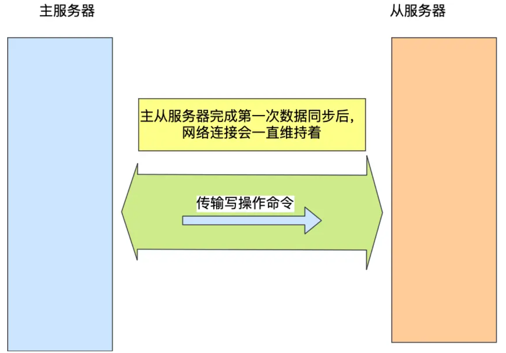

# Redis 常见面试题

**Redis 具备「高性能」和「高并发」两种特性**。


## Redis 数据结构

### Redis 数据类型以及使用场景分别是什么？

Redis 提供了丰富的数据类型，常见的有五种数据类型：**String（字符串），Hash（哈希），List（列表），Set（集合）、Zset（有序集合）**。

- String 类型的应用场景：缓存对象、常规计数、分布式锁、共享 session 信息等。
- List 类型的应用场景：消息队列（但是有两个问题：1. 生产者需要自行实现全局唯一 ID；2. 不能以消费组形式消费数据）等。
- Hash 类型：缓存对象、购物车等。
- Set 类型：聚合计算（并集、交集、差集）场景，比如点赞、共同关注、抽奖活动等。
- Zset 类型：排序场景，比如排行榜、电话和姓名排序等。

Redis 后续版本又支持四种数据类型，它们的应用场景如下：

- BitMap（2.2 版新增）：二值状态统计的场景，比如签到、判断用户登陆状态、连续签到用户总数等；
- HyperLogLog（2.8 版新增）：海量数据基数统计的场景，比如百万级网页 UV 计数等；
- GEO（3.2 版新增）：存储地理位置信息的场景，比如滴滴叫车；
- Stream（5.0 版新增）：消息队列，相比于基于 List 类型实现的消息队列，有这两个特有的特性：自动生成全局唯一消息ID，支持以消费组形式消费数据。

## Redis 线程模型

### Redis 是单线程吗？

**Redis 单线程指的是「接收客户端请求->解析请求 ->进行数据读写等操作->发送数据给客户端」这个过程是由一个线程（主线程）来完成的**，这也是我们常说 Redis 是单线程的原因。

但是，**Redis 程序并不是单线程的**，Redis 在启动的时候，是会**启动后台线程**（BIO）的：

- **Redis 在 2.6 版本**，会启动 2 个后台线程，分别处理关闭文件、AOF 刷盘这两个任务；
- **Redis 在 4.0 版本之后**，新增了一个新的后台线程，用来异步释放 Redis 内存，也就是 lazyfree 线程。例如执行 unlink key / flushdb async / flushall async 等命令，会把这些删除操作交给后台线程来执行，好处是不会导致 Redis 主线程卡顿。因此，当我们要删除一个大 key 的时候，不要使用 del 命令删除，因为 del 是在主线程处理的，这样会导致 Redis 主线程卡顿，因此我们应该使用 unlink 命令来异步删除大key。

后台线程相当于一个消费者，生产者把耗时任务丢到任务队列中，消费者（BIO）不停轮询这个队列，拿出任务就去执行对应的方法即可。


### Redis 单线程模式是怎样的？


图中的蓝色部分是一个事件循环，是由主线程负责的，可以看到网络 I/O 和命令处理都是单线程。 Redis 初始化的时候，会做下面这几件事情：

- 首先，调用 epoll_create() 创建一个 epoll 对象和调用 socket() 创建一个服务端 socket
- 然后，调用 bind() 绑定端口和调用 listen() 监听该 socket；
- 然后，将调用 epoll_ctl() 将 listen socket 加入到 epoll，同时注册「连接事件」处理函数。

初始化完后，主线程就进入到一个**事件循环函数**，主要会做以下事情：

- 首先，先调用**处理发送队列函数**，看是发送队列里是否有任务，如果有发送任务，则通过 write 函数将客户端发送缓存区里的数据发送出去，如果这一轮数据没有发送完，就会注册写事件处理函数，等待 epoll_wait 发现可写后再处理 。
- 接着，调用 epoll_wait 函数等待事件的到来：
  - 如果是**连接事件**到来，则会调用**连接事件处理函数**，该函数会做这些事情：调用 accpet 获取已连接的 socket -> 调用 epoll_ctl 将已连接的 socket 加入到 epoll -> 注册「读事件」处理函数；
  - 如果是**读事件**到来，则会调用**读事件处理函数**，该函数会做这些事情：调用 read 获取客户端发送的数据 -> 解析命令 -> 处理命令 -> 将客户端对象添加到发送队列 -> 将执行结果写到发送缓存区等待发送；
  - 如果是**写事件**到来，则会调用**写事件处理函数**，该函数会做这些事情：通过 write 函数将客户端发送缓存区里的数据发送出去，如果这一轮数据没有发送完，就会继续注册写事件处理函数，等待 epoll_wait 发现可写后再处理 。

### Redis 采用单线程为什么还这么快？

官方使用基准测试的结果是，**单线程的 Redis 吞吐量可以达到 10W/每秒**，如下图所示：


之所以 Redis 采用单线程（网络 I/O 和执行命令）那么快，有如下几个原因：

- Redis 的大部分操作**都在内存中完成**，并且采用了高效的数据结构，因此 **Redis 瓶颈**可能是机器的内存或者网络带宽，而**并非 CPU**，既然 CPU 不是瓶颈，那么自然就采用单线程的解决方案了；

- Redis 采用单线程模型可以**避免了多线程之间的竞争**，省去了多线程切换带来的时间和性能上的开销，而且也不会导致死锁问题。

- Redis 采用了 **I/O 多路复用机制**处理大量的客户端 Socket 请求，IO 多路复用机制是指一个线程处理多个 IO 流，就是我们经常听到的 select/epoll 机制。简单来说，在 Redis 只运行单线程的情况下，该机制允许内核中，同时存在多个监听 Socket 和已连接 Socket。内核会一直监听这些 Socket 上的连接请求或数据请求。一旦有请求到达，就会交给 Redis 线程处理，这就实现了一个 Redis 线程处理多个 IO 流的效果。

## Redis 持久化

### Redis 如何实现数据不丢失？

- **AOF 日志**：每执行一条写操作命令，就把该命令以追加的方式写入到一个文件里；
- **RDB 快照**：将某一时刻的内存数据，以二进制的方式写入磁盘；
- **混合持久化方式**：Redis 4.0 新增的方式，集成了 AOF 和 RBD 的优点；

### AOF 日志是如何实现的？

Redis 在执行完一条写操作命令后，就会把该命令以追加的方式写入到一个文件里，然后 Redis 重启时，会读取该文件记录的命令，然后逐一执行命令的方式来进行数据恢复。


> 
> AOF 写回策略有几种？

先来看看，Redis 写入 AOF 日志的过程，如下图：


Redis 提供了 3 种写回硬盘的策略，控制的就是上面说的第三步的过程。 在 Redis.conf 配置文件中的 appendfsync 配置项可以有以下 3 种参数可填：

- **Always**，这个单词的意思是「总是」，所以它的意思是每次写操作命令执行完后，同步将 AOF 日志数据写回硬盘；
- **Everysec**，这个单词的意思是「每秒」，所以它的意思是每次写操作命令执行完后，先将命令写入到 AOF 文件的内核缓冲区，然后每隔一秒将缓冲区里的内容写回到硬盘；
- **No**，意味着不由 Redis 控制写回硬盘的时机，转交给操作系统控制写回的时机，也就是每次写操作命令执行完后，先将命令写入到 AOF 文件的内核缓冲区，再由操作系统决定何时将缓冲区内容写回硬盘。

> AOF 日志过大，会触发什么机制？

所以，Redis 为了避免 AOF 文件越写越大，提供了 **AOF 重写机制**，当 AOF 文件的大小超过所设定的阈值后，Redis 就会启用 AOF 重写机制，来压缩 AOF 文件。

**在使用重写AOF后，就会扫描数据库中所有数据，逐一把内存数据的键值对转换成一条命令，再将命令记录到重写日志（历史修改就被删除了），重写工作完成后，就会将新的 AOF 文件覆盖现有的 AOF 文件，这就相当于压缩了 AOF 文件，使得 AOF 文件体积变小了。**

>
> 重写 AOF 日志的过程是怎样的？

Redis 的**重写 AOF 过程是由后台子进程 \*bgrewriteaof\* 来完成的**，这么做可以达到两个好处：

1. 不会阻塞主进程，主进程可以继续处理命令请求
2. 因为如果是使用线程，多线程之间会共享内存，那么在修改共享内存数据的时候，需要通过加锁来保证数据的安全，而这样就会降低性能

> 因为重写的时候主线程仍然在处理数据，怎么解决？

为了解决这种数据不一致问题，Redis 设置了一个 **AOF 重写缓冲区**，这个缓冲区在创建 bgrewriteaof 子进程之后开始使用。


也就是说，在 bgrewriteaof 子进程执行 AOF 重写期间，主进程需要执行以下三个工作:

- 执行客户端发来的命令；
- 将执行后的写命令追加到 「AOF 缓冲区」；
- 将执行后的写命令追加到 「AOF 重写缓冲区」；

然后当重写文件完成时再从AOF重写缓冲区写入追加的内容，最后新的 AOF 的文件进行改名，覆盖现有的 AOF 文件。

### RDB 快照是如何实现的呢？

AOF 日志记录的是操作命令，RDB 快照就是记录某一个瞬间的内存数据

Redis 提供了两个命令来生成 RDB 文件，分别是 save 和 bgsave，他们的区别就在于是否在「主线程」里执行：

- 执行了 save 命令，就会在主线程生成 RDB 文件，由于和执行操作命令在同一个线程，所以如果写入 RDB 文件的时间太长，**会阻塞主线程**；
- 执行了 bgsave 命令，会创建一个子进程来生成 RDB 文件，这样可以**避免主线程的阻塞**；

>  RDB 在执行快照的时候，数据能修改吗？

可以的，执行 bgsave 过程中，Redis 依然**可以继续处理操作命令**的，也就是数据是能被修改的，关键的技术就在于**写时复制技术（Copy-On-Write, COW）。**

执行 bgsave 命令的时候，会通过 fork() 创建子进程，此时子进程和父进程是共享同一片内存数据的，因为创建子进程的时候，会复制父进程的页表，但是页表指向的物理内存还是一个，此时如果主线程执行读操作，则主线程和 bgsave 子进程互相不影响。


如果主线程执行写操作，则被修改的数据会复制一份副本，然后 bgsave 子进程会把该副本数据写入 RDB 文件，在这个过程中，主线程仍然可以直接修改原来的数据。


## Redis 集群

### Redis 如何实现服务高可用？

要想设计一个高可用的 Redis 服务，一定要从 Redis 的多服务节点来考虑，比如 Redis 的主从复制、哨兵模式、切片集群。

> 主从复制

主从复制是 Redis 高可用服务的最基础的保证，实现方案就是将从前的一台 Redis 服务器，同步数据到多台从 Redis 服务器上，即一主多从的模式，且主从服务器之间采用的是「读写分离」的方式。	


也就是说，所有的数据修改只在主服务器上进行，然后将最新的数据同步给从服务器，这样就使得主从服务器的数据是一致的。

注意，主从服务器之间的命令复制是**异步**进行的。

所以，无法实现强一致性保证（主从数据时时刻刻保持一致），**数据不一致是难以避免的。**


> 哨兵模式

在使用 Redis 主从服务的时候，会有一个问题，就是当 Redis 的主从服务器出现故障宕机时，需要手动进行恢复。

为了解决这个问题，Redis 增加了哨兵模式（**Redis Sentinel**），因为哨兵模式做到了可以监控主从服务器，并且提供**主从节点故障转移的功能。**


> 切片集群模式

当 Redis 缓存数据量大到一台服务器无法缓存时，就需要使用 **Redis 切片集群**（Redis Cluster ）方案，它将数据分布在不同的服务器上，以此来降低系统对单主节点的依赖，从而提高 Redis 服务的读写性能。

Redis Cluster 方案采用哈希槽（Hash Slot），来处理数据和节点之间的映射关系。在 Redis Cluster 方案中，**一个切片集群共有 16384 个哈希槽**，这些哈希槽类似于数据分区，每个键值对都会根据它的 key，被映射到一个哈希槽中，具体执行过程分为两大步：

- 根据键值对的 key，按照 [CRC16 算法 (opens new window)](https://en.wikipedia.org/wiki/Cyclic_redundancy_check)计算一个 16 bit 的值。
- 再用 16bit 值对 16384 取模，得到 0~16383 范围内的模数，每个模数代表一个相应编号的哈希槽。

接下来的问题就是，这些哈希槽怎么被映射到具体的 Redis 节点上的呢？有两种方案：

- **平均分配：** 在使用 cluster create 命令创建 Redis 集群时，Redis 会自动把所有哈希槽平均分布到集群节点上。比如集群中有 9 个节点，则每个节点上槽的个数为 16384/9 个。
- **手动分配：** 可以使用 cluster meet 命令手动建立节点间的连接，组成集群，再使用 cluster addslots 命令，指定每个节点上的哈希槽个数。


需要注意的是，在手动分配哈希槽时，需要把 16384 个槽都分配完，否则 Redis 集群无法正常工作。

### 集群脑裂导致数据丢失怎么办？

> 什么是脑裂？

由于网络问题，集群节点之间失去联系。主从数据不同步；重新平衡选举，产生两个主服务。等网络恢复，旧主节点会降级为从节点，再与新主节点进行同步复制的时候，由于会从节点会清空自己的缓冲区，所以导致之前客户端写入的数据丢失了。

> 解决方案

当主节点发现从节点下线或者通信超时的总数量小于阈值时，那么禁止主节点进行写数据，直接把错误返回给客户端。

在 Redis 的配置文件中有两个参数我们可以设置：

- min-slaves-to-write x，主节点必须要有至少 x 个从节点连接，如果小于这个数，主节点会禁止写数据。
- min-slaves-max-lag x，主从数据复制和同步的延迟不能超过 x 秒，如果超过，主节点会禁止写数据。

这两个配置项组合后的要求是，主库连接的从库中至少有 N 个从库，和主库进行数据复制时的 ACK 消息延迟不能超过 T 秒，否则，主库就不会再接收客户端的写请求了。

即使原主库是假故障，它在假故障期间也无法响应哨兵心跳，也不能和从库进行同步，自然也就无法和从库进行 ACK 确认了。这样一来，min-slaves-to-write 和 min-slaves-max-lag 的组合要求就无法得到满足，**原主库就会被限制接收客户端写请求，客户端也就不能在原主库中写入新数据了**。

**等到新主库上线时，就只有新主库能接收和处理客户端请求，此时，新写的数据会被直接写到新主库中。而原主库会被哨兵降为从库，即使它的数据被清空了，也不会有新数据丢失。**

## Redis 过期删除与内存淘汰

### Redis 使用的过期删除策略是什么？

Redis 是可以对 key 设置过期时间的，因此需要有相应的机制将已过期的键值对删除，而做这个工作的就是过期键值删除策略。

每当我们对一个 key 设置了过期时间时，Redis 会把该 key 带上过期时间存储到一个**过期字典**（expires dict）中，也就是说「过期字典」保存了数据库中所有 key 的过期时间。


## Redis主从复制

### 第一次同步

**replicaof ** 命令形成主服务器和从服务器的关系。

比如，现在有服务器 A 和 服务器 B，我们在服务器 B 上执行下面这条命令：

```text
# 服务器 B 执行这条命令
replicaof <服务器 A 的 IP 地址> <服务器 A 的 Redis 端口号>
```

接着，服务器 B 就会变成服务器 A 的「从服务器」，然后与主服务器进行第一次同步。

主从服务器间的第一次同步的过程可分为三个阶段：

- 第一阶段是建立链接、协商同步；
- 第二阶段是主服务器同步数据给从服务器；
- 第三阶段是主服务器发送新写操作命令给从服务器。


*第一阶段：建立链接、协商同步*

执行了 replicaof 命令后，从服务器就会给主服务器发送 `psync` 命令，表示要进行数据同步。

psync 命令包含两个参数，分别是**主服务器的 runID** 和**复制进度 offset**。

- runID，每个 Redis 服务器在启动时都会自动生产一个随机的 ID 来唯一标识自己。当从服务器和主服务器第一次同步时，因为不知道主服务器的 run ID，所以将其设置为 "?"。
- offset，表示复制的进度，第一次同步时，其值为 -1。

主服务器收到 psync 命令后，会用 `FULLRESYNC` 作为响应命令返回给对方。


*第二阶段：主服务器同步数据给从服务器*

接着，主服务器会执行 bgsave 命令来生成 RDB 文件，然后把文件发送给从服务器。

从服务器收到 RDB 文件后，会先清空当前的数据，然后载入 RDB 文件。

为了保证主从服务器的数据一致性，**主服务器在下面这三个时间间隙中将收到的写操作命令，写入到 replication buffer 缓冲区里**：

- 主服务器生成 RDB 文件期间；
- 主服务器发送 RDB 文件给从服务器期间；
- 「从服务器」加载 RDB 文件期间；


*第三阶段：主服务器发送新写操作命令给从服务器*

主服务器将 replication buffer 缓冲区里所记录的写操作命令发送给从服务器，从服务器执行来自主服务器 replication buffer 缓冲区里发来的命令，这时主从服务器的数据就一致了。


### 命令传播

主从服务器在完成第一次同步后，双方之间就会维护一个 TCP 连接。



上面的这个过程被称为**基于长连接的命令传播**，通过这种方式来保证第一次同步后的主从服务器的数据一致性。

### 分摊主服务器的压力

主服务器会做两件耗时的操作：生成 RDB 文件和传输 RDB 文件。

主服务器是可以有多个从服务器的，如果从服务器数量非常多，而且都与主服务器进行全量同步的话，就会带来两个问题：

- 由于是通过 bgsave 命令来生成 RDB 文件的，那么主服务器就会忙于使用 fork() 创建子进程，如果主服务器的内存数据非大，在执行 fork() 函数时是会阻塞主线程的，从而使得 Redis 无法正常处理请求；
- 传输 RDB 文件会占用主服务器的网络带宽，会对主服务器响应命令请求产生影响。

要解决这个问题，老板就需要设立经理职位，由经理管理多名普通员工，然后老板只需要管理经理就好


通过这种方式，**主服务器生成 RDB 和传输 RDB 的压力可以分摊到充当经理角色的从服务器**。

### 增量复制

主从服务器在完成第一次同步后，就会基于长连接进行命令传播。

可是，网络总是不按套路出牌的嘛，说延迟就延迟，说断开就断开。

如果主从服务器间的网络连接断开了，那么就无法进行命令传播了，这时从服务器的数据就没办法和主服务器保持一致了，客户端就可能从「从服务器」读到旧的数据。


从 Redis 2.8 开始，网络断开又恢复后，从主从服务器会采用**增量复制**的方式继续同步，也就是只会把网络断开期间主服务器接收到的写操作命令，同步给从服务器。


主要有三个步骤：

- 从服务器在恢复网络后，会发送 psync 命令给主服务器，此时的 psync 命令里的 offset 参数不是 -1；
- 主服务器收到该命令后，然后用 CONTINUE 响应命令告诉从服务器接下来采用增量复制的方式同步数据；
- 然后主服务将主从服务器断线期间，所执行的写命令发送给从服务器，然后从服务器执行这些命令。

那么关键的问题来了，**主服务器怎么知道要将哪些增量数据发送给从服务器呢？**

答案藏在这两个东西里：

- **repl_backlog_buffer**，是一个「**环形**」缓冲区，用于主从服务器断连后，从中找到差异的数据；
- **replication offset**，标记上面那个缓冲区的同步进度，主从服务器都有各自的偏移量，主服务器使用 master_repl_offset 来记录自己「*写*」到的位置，从服务器使用 slave_repl_offset 来记录自己「*读*」到的位置。

那 repl_backlog_buffer 缓冲区是什么时候写入的呢？

在主服务器进行命令传播时，不仅会将写命令发送给从服务器，还会将写命令写入到 repl_backlog_buffer 缓冲区里，因此 这个缓冲区里会保存着最近传播的写命令。

网络断开后，当从服务器重新连上主服务器时，从服务器会通过 psync 命令将自己的复制偏移量 slave_repl_offset 发送给主服务器，主服务器根据自己的 master_repl_offset 和 slave_repl_offset 之间的差距，然后来决定对从服务器执行哪种同步操作：

- 如果判断出从服务器要读取的数据还在 repl_backlog_buffer 缓冲区里，那么主服务器将采用**增量同步**的方式；
- 相反，如果判断出从服务器要读取的数据已经不存在 repl_backlog_buffer 缓冲区里，那么主服务器将采用**全量同步**的方式。

当主服务器在 repl_backlog_buffer 中找到主从服务器差异（增量）的数据后，就会将增量的数据写入到 replication buffer 缓冲区，这个缓冲区我们前面也提到过，它是缓存将要传播给从服务器的命令。


repl_backlog_buffer 缓行缓冲区的默认大小是 1M，并且由于它是一个环形缓冲区，所以当缓冲区写满后，主服务器继续写入的话，就会覆盖之前的数据。因此，当主服务器的写入速度远超于从服务器的读取速度，缓冲区的数据一下就会被覆盖。

那么在网络恢复时，如果从服务器想读的数据已经被覆盖了，主服务器就会采用全量同步，这个方式比增量同步的性能损耗要大很多。

因此，**为了避免在网络恢复时，主服务器频繁地使用全量同步的方式，我们应该调整下 repl_backlog_buffer 缓冲区大小，尽可能的大一些**，减少出现从服务器要读取的数据被覆盖的概率，从而使得主服务器采用增量同步的方式。

### 总结

主从复制共有三种模式：**全量复制、基于长连接的命令传播、增量复制**。

主从服务器第一次同步的时候，就是采用全量复制，此时主服务器会两个耗时的地方，分别是生成 RDB 文件和传输 RDB 文件。为了避免过多的从服务器和主服务器进行全量复制，可以把一部分从服务器升级为「经理角色」，让它也有自己的从服务器，通过这样可以分摊主服务器的压力。

第一次同步完成后，主从服务器都会维护着一个长连接，主服务器在接收到写操作命令后，就会通过这个连接将写命令传播给从服务器，来保证主从服务器的数据一致性。

如果遇到网络断开，增量复制就可以上场了，不过这个还跟 repl_backlog_size 这个大小有关系。

如果它配置的过小，主从服务器网络恢复时，可能发生「从服务器」想读的数据已经被覆盖了，那么这时就会导致主服务器采用全量复制的方式。所以为了避免这种情况的频繁发生，要调大这个参数的值，以降低主从服务器断开后全量同步的概率。

## 为什么要有哨兵？


在 Redis 的主从架构中，由于主从模式是读写分离的，如果主节点（master）挂了，那么将没有主节点来服务客户端的写操作请求，也没有主节点给从节点（slave）进行数据同步了。


这时如果要恢复服务的话，需要人工介入，选择一个「从节点」切换为「主节点」，然后让其他从节点指向新的主节点，同时还需要通知上游那些连接 Redis 主节点的客户端，将其配置中的主节点 IP 地址更新为「新主节点」的 IP 地址。

这样也不太“智能”了，要是有一个节点能监控「主节点」的状态，当发现主节点挂了 ，它自动将一个「从节点」切换为「主节点」的话，那么可以节省我们很多事情啊！

Redis 在 2.8 版本以后提供的**哨兵（\*Sentinel\*）机制**，它的作用是实现**主从节点故障转移**。它会监测主节点是否存活，如果发现主节点挂了，它就会选举一个从节点切换为主节点，并且把新主节点的相关信息通知给从节点和客户端。

### 哨兵机制是如何工作的？

哨兵其实是一个运行在特殊模式下的 Redis 进程，所以它也是一个节点。从“哨兵”这个名字也可以看得出来，它相当于是“观察者节点”，观察的对象是主从节点。

当然，它不仅仅是观察那么简单，在它观察到有异常的状况下，会做出一些“动作”，来修复异常状态。

哨兵节点主要负责三件事情：**监控、选主、通知**。


所以，我们重点要学习这三件事情：

- 哨兵节点是如何监控节点的？又是如何判断主节点是否真的故障了？
- 根据什么规则选择一个从节点切换为主节点？
- 怎么把新主节点的相关信息通知给从节点和客户端呢？

### 如何判断主节点真的故障了？

哨兵会**每隔 1 秒给所有主从节点发送 PING 命令**，当主从节点收到 PING 命令后，会发送一个响应命令给哨兵，这样就可以判断它们是否在正常运行。


**如果主节点或者从节点没有在规定的时间内响应哨兵的 PING 命令**，哨兵就会将它们标记为「**主观下线**」。这个「规定的时间」是配置项 `down-after-milliseconds` 参数设定的，单位是毫秒。

> 
> 主观下线？难道还有客观下线？

是的没错，客观下线只适用于主节点。

之所以针对「主节点」设计「主观下线」和「客观下线」两个状态，是因为有可能「主节点」其实并没有故障，可能只是因为主节点的系统压力比较大或者网络发送了拥塞，导致主节点没有在规定时间内响应哨兵的 PING 命令。

所以，为了减少误判的情况，哨兵在部署的时候不会只部署一个节点，而是用多个节点部署成**哨兵集群**（*最少需要**三台**机器来部署哨兵集群*），**通过多个哨兵节点一起判断，就可以就可以避免单个哨兵因为自身网络状况不好，而误判主节点下线的情况**。同时，多个哨兵的网络同时不稳定的概率较小，由它们一起做决策，误判率也能降低。

### 由哪个哨兵进行主从故障转移？

哪个哨兵节点判断主节点为「客观下线」，这个哨兵节点就是候选者，所谓的候选者就是想当 Leader 的哨兵。

举个例子，假设有三个哨兵。当哨兵 B 先判断到主节点「主观下线后」，就会给其他实例发送 is-master-down-by-addr 命令。接着，其他哨兵会根据自己和主节点的网络连接情况，做出赞成投票或者拒绝投票的响应。


### 主从故障转移的过程是怎样的？

在哨兵集群中通过投票的方式，选举出了哨兵 leader 后，就可以进行主从故障转移的过程了，如下图：


主从故障转移操作包含以下四个步骤：

- 第一步：在已下线主节点（旧主节点）属下的所有「从节点」里面，挑选出一个从节点，并将其转换为主节点。
- 第二步：让已下线主节点属下的所有「从节点」修改复制目标，修改为复制「新主节点」；
- 第三步：将新主节点的 IP 地址和信息，通过「发布者/订阅者机制」通知给客户端；
- 第四步：继续监视旧主节点，当这个旧主节点重新上线时，将它设置为新主节点的从节点；

#### 步骤一：选出新主节点

那么多「从节点」，到底选择哪个从节点作为新主节点的？

1. 首先过滤掉网络连接状态不好的节点
2. 哨兵首先会根据从节点的优先级来进行排序，优先级越小排名越靠前
3. 如果优先级相同，则查看复制的下标，哪个从「主节点」接收的复制数据多，哪个就靠前。
4. 如果优先级和下标都相同，就选择从节点 ID 较小的那个。

#### 步骤二：将从节点指向新主节点

当新主节点出现之后，哨兵 leader 下一步要做的就是，让已下线主节点属下的所有「从节点」指向「新主节点」，这一动作可以通过向「从节点」发送 `SLAVEOF` 命令来实现。

#### 步骤三：通知客户的主节点已更换

这主要**通过 Redis 的发布者/订阅者机制来实现**的。每个哨兵节点提供发布者/订阅者机制，客户端可以从哨兵订阅消息。

客户端和哨兵建立连接后，客户端会订阅哨兵提供的频道。**主从切换完成后，哨兵就会向 `+switch-master` 频道发布新主节点的 IP 地址和端口的消息，这个时候客户端就可以收到这条信息，然后用这里面的新主节点的 IP 地址和端口进行通信了**。

#### 步骤四：将旧主节点变为从节点

故障转移操作最后要做的是，继续监视旧主节点，当旧主节点重新上线时，哨兵集群就会向它发送 `SLAVEOF` 命令，让它成为新主节点的从节点

### 哨兵集群是如何组成的？

前面提到了 Redis 的发布者/订阅者机制，那就不得不提一下哨兵集群的组成方式，因为它也用到了这个技术。

在我第一次搭建哨兵集群的时候，当时觉得很诧异。因为在配置哨兵的信息时，竟然只需要填下面这几个参数，设置主节点名字、主节点的 IP 地址和端口号以及 quorum 值。

```c
sentinel monitor <master-name> <ip> <redis-port> <quorum> 
```

不需要填其他哨兵节点的信息，我就好奇它们是如何感知对方的，又是如何组成哨兵集群的？

后面才了解到，**哨兵节点之间是通过 Redis 的发布者/订阅者机制来相互发现的**。

在主从集群中，主节点上有一个名为`__sentinel__:hello`的频道，不同哨兵就是通过它来相互发现，实现互相通信的。

在下图中，哨兵 A 把自己的 IP 地址和端口的信息发布到`__sentinel__:hello` 频道上，哨兵 B 和 C 订阅了该频道。那么此时，哨兵 B 和 C 就可以从这个频道直接获取哨兵 A 的 IP 地址和端口号。然后，哨兵 B、C 可以和哨兵 A 建立网络连接。


### 总结

Redis 在 2.8 版本以后提供的**哨兵（\*Sentinel\*）机制**，它的作用是实现**主从节点故障转移**。它会监测主节点是否存活，如果发现主节点挂了，它就会选举一个从节点切换为主节点，并且把新主节点的相关信息通知给从节点和客户端。

哨兵一般是以集群的方式部署，至少需要 3 个哨兵节点，哨兵集群主要负责三件事情：**监控、选主、通知**。

哨兵节点通过 Redis 的发布者/订阅者机制，哨兵之间可以相互感知，相互连接，然后组成哨兵集群，同时哨兵又通过 INFO 命令，在主节点里获得了所有从节点连接信息，于是就能和从节点建立连接，并进行监控了。

*1、第一轮投票：判断主节点下线*

当哨兵集群中的某个哨兵判定主节点下线（主观下线）后，就会向其他哨兵发起命令，其他哨兵收到这个命令后，就会根据自身和主节点的网络状况，做出赞成投票或者拒绝投票的响应。

当这个哨兵的赞同票数达到哨兵配置文件中的 quorum 配置项设定的值后，这时主节点就会被该哨兵标记为「客观下线」。

*2、第二轮投票：选出哨兵leader*

某个哨兵判定主节点客观下线后，该哨兵就会发起投票，告诉其他哨兵，它想成为 leader，想成为 leader 的哨兵节点，要满足两个条件：

- 第一，拿到半数以上的赞成票；
- 第二，拿到的票数同时还需要大于等于哨兵配置文件中的 quorum 值。

*3、由哨兵 leader 进行主从故障转移*

选举出了哨兵 leader 后，就可以进行主从故障转移的过程了。该操作包含以下四个步骤：

- 第一步：在已下线主节点（旧主节点）属下的所有「从节点」里面，挑选出一个从节点，并将其转换为主节点，选择的规则：
  - 过滤掉已经离线的从节点；
  - 过滤掉历史网络连接状态不好的从节点；
  - 将剩下的从节点，进行三轮考察：优先级、复制进度、ID 号。在每一轮考察过程中，如果找到了一个胜出的从节点，就将其作为新主节点。
- 第二步：让已下线主节点属下的所有「从节点」修改复制目标，修改为复制「新主节点」；
- 第三步：将新主节点的 IP 地址和信息，通过「发布者/订阅者机制」通知给客户端；
- 第四步：继续监视旧主节点，当这个旧主节点重新上线时，将它设置为新主节点的从节点；