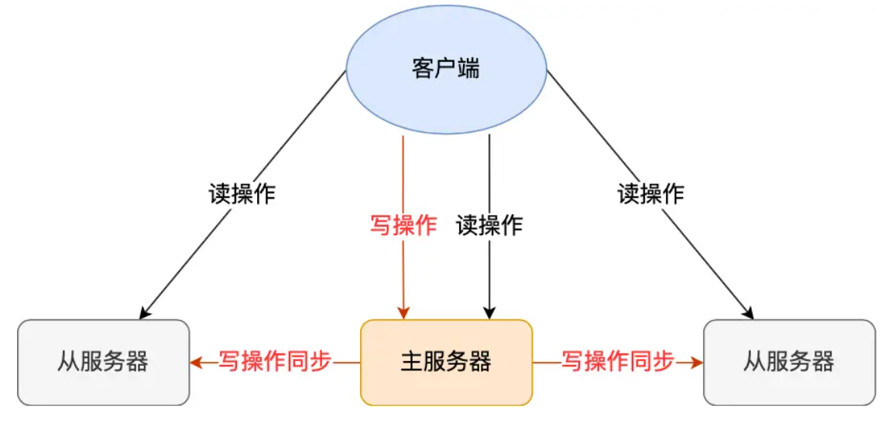

# 主从复制是怎么实现的？

Redis 提供了**主从复制模式**

这个模式可以保证多台服务器的数据一致性，且主从服务器之间采用的是「读写分离」的方式。

主服务器可以进行读写操作，当发生写操作时自动将写操作同步给从服务器，而从服务器一般是只读，并接受主服务器同步过来写操作命令，然后执行这条命令。

也就是说，所有的数据修改只在主服务器上进行，然后将最新的数据同步给从服务器，这样就使得主从服务器的数据是一致的。

同步这两个字说的简单，但是这个同步过程并没有想象中那么简单，要考虑的事情不是一两个。

我们先来看看，主从服务器间的第一次同步是如何工作的？