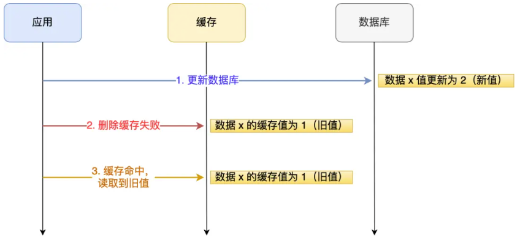

## 数据库和缓存如何保证一致性？

### 先更新数据库，还是先更新缓存？


结论：**无论是「先更新数据库，再更新缓存」，还是「先更新缓存，再更新数据库」，这两个方案都存在并发问题，当两个请求并发更新同一条数据的时候，可能会出现缓存和数据库中的数据不一致的现象**。


### 先更新数据库，还是先删除缓存？


结论：**先更新数据库，再删除缓存**


用「读 + 写」请求的并发的场景来分析。

假如某个用户数据在缓存中不存在，请求 A 读取数据时从数据库中查询到年龄为 20，在未写入缓存中时另一个请求 B 更新数据。它更新数据库中的年龄为 21，并且清空缓存。这时请求 A 把从数据库中读到的年龄为 20 的数据写入到缓存中。


最终，该用户年龄在缓存中是 20（旧值），在数据库中是 21（新值），缓存和数据库数据不一致。

从上面的理论上分析，先更新数据库，再删除缓存也是会出现数据不一致性的问题，

**但是在实际中，这个问题出现的概率并不高**。**因为缓存的写入通常要远远快于数据库的写入**

所以，**「先更新数据库 + 再删除缓存」的方案，是可以保证数据一致性的**。


但是这种情况也可以避免：针对「先删除缓存，再更新数据库」方案在「读 + 写」并发请求而造成缓存不一致的解决办法是「**延迟双删**」。

```java
#删除缓存
redis.delKey(X)
#更新数据库
db.update(X)
#睡眠
Thread.sleep(N)
#再删除缓存
redis.delKey(X)
```

加了个睡眠时间，主要是为了确保请求 A 在睡眠的时候，请求 B 能够在这这一段时间完成「从数据库读取数据，再把缺失的缓存写入缓存」的操作，然后请求 A 睡眠完，再删除缓存。

所以，请求 A 的睡眠时间就需要大于请求 B 「从数据库读取数据 + 写入缓存」的时间。

但是具体睡眠多久其实是个**玄学**，很难评估出来，所以这个方案也只是**尽可能**保证一致性而已，极端情况下，依然也会出现缓存不一致的现象。

因此，还是比较建议用「先更新数据库，再删除缓存」的方案。

### 如何保证两个操作都能执行成功？

这次用户的投诉是因为在删除缓存（第二个操作）的时候失败了，导致缓存还是旧值，而数据库是最新值，造成数据库和缓存数据不一致的问题，会对敏感业务造成影响。

举个例子，来说明下。

应用要把数据 X 的值从 1 更新为 2，先成功更新了数据库，然后在 Redis 缓存中删除 X 的缓存，但是这个操作却失败了，这个时候数据库中 X 的新值为 2，Redis 中的 X 的缓存值为 1，出现了数据库和缓存数据不一致的问题。



其实不管是先操作数据库，还是先操作缓存，只要第二个操作失败都会出现数据一致的问题。

问题原因知道了，该怎么解决呢？有两种方法：

- **重试机制。**
- **订阅 MySQL binlog，再操作缓存。**

先来说第一种。

#### 重试机制

我们可以引入**消息队列**，将第二个操作（删除缓存）要操作的数据加入到消息队列，由消费者来操作数据。

- 如果应用**删除缓存失败**，可以从消息队列中重新读取数据，然后再次删除缓存，这个就是**重试机制**。当然，如果重试超过的一定次数，还是没有成功，我们就需要向业务层发送报错信息了。
- 如果**删除缓存成功**，就要把数据从消息队列中移除，避免重复操作，否则就继续重试。


#### 订阅 MySQL binlog，再操作缓存

「**先更新数据库，再删缓存**」的策略的第一步是更新数据库，那么更新数据库成功，就会产生一条变更日志，记录在 binlog 里。

于是我们就可以通过订阅 binlog 日志，拿到具体要操作的数据，然后再执行缓存删除，阿里巴巴开源的 **Canal 中间件**就是基于这个实现的。

下图是 Canal 的工作原理：


所以，**如果要想保证「先更新数据库，再删缓存」策略第二个操作能执行成功，我们可以使用「消息队列来重试缓存的删除」，或者「订阅 MySQL binlog 再操作缓存」，这两种方法有一个共同的特点，都是采用异步操作缓存。**