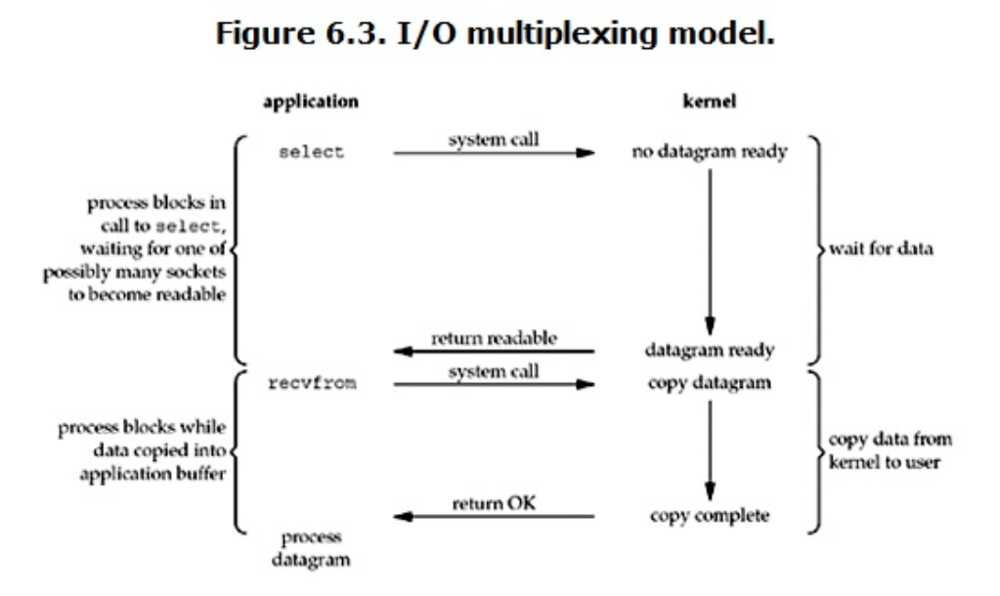

## 文件描述符 fd
文件描述符（File descriptor）是计算机科学中的一个术语，是一个用于表述指向文件的引用的抽象化概念。

文件描述符在形式上是一个非负整数。实际上，它是一个索引值，指向内核为每一个进程所维护的该进程打开文件的记录表。当程序打开一个现有文件或者创建一个新文件时，内核向进程返回一个文件描述符。在程序设计中，一些涉及底层的程序编写往往会围绕着文件描述符展开。但是文件描述符这一概念往往只适用于 UNIX、Linux 这样的操作系统。


## I/O 多路复用（ IO multiplexing）
IO multiplexing 就是我们说的 select，poll，epoll，有些地方也称这种 IO 方式为 event driven IO。select/epoll 的好处就在于单个 process 就可以同时处理多个网络连接的 IO。它的基本原理就是 select，poll，epoll 这个 function 会不断的轮询所负责的所有 socket，当某个 socket 有数据到达了，就通知用户进程。



当用户进程调用了 **select**，那么整个进程会被 **block**，而同时，**kernel 会 “监视” 所有 select 负责的 socket，当任何一个 socket 中的数据准备好了，select 就会返回**。这个时候用户进程再调用 read 操作，将数据从 kernel 拷贝到用户进程。

> 所以，I/O 多路复用的特点是通过一种机制一个进程能同时等待多个文件描述符，而这些文件描述符（套接字描述符）其中的任意一个进入读就绪状态，select () 函数就可以返回。

这个图和 blocking IO 的图其实并没有太大的不同，事实上，还更差一些。因为这里需要使用两个 system call (select 和 recvfrom)，而 blocking IO 只调用了一个 system call (recvfrom)。但是，用 **select 的优势在于它可以同时处理多个 connection**。

所以，如果处理的连接数不是很高的话，使用 select/epoll 的 web server 不一定比使用 multi-threading + blocking IO 的 web server 性能更好，可能延迟还更大。select/epoll 的优势并不是对于单个连接能处理得更快，而是在于能处理更多的连接。）

在 IO multiplexing Model 中，实际中，对于每一个 socket，一般都设置成为 non-blocking，但是，如上图所示，整个用户的 process 其实是一直被 block 的。只不过 process 是被 select 这个函数 block，而不是被 socket IO 给 block。

## I/O 多路复用之 select、poll、epoll 详解

首先我们了解一下什么是I/O复用。**I/O就是指网络中的I/O（即输入输出），多路是指多个TCP连接，复用是指一个或少量线程被重复使用。**连起来理解就是，用少量的线程来处理网络上大量的TCP连接中的I/O。一个进程可以监视多个描述符，一旦某个描述符就绪（一般是读就绪或者写就绪），能够通知程序进行相应的读写操作。常见的I/O复用有以下三种：

1. select
2. poll
3. epoll


### select

select函数声明：

```c++
#include<sys/select.h>
#include<sys/time.h>
int select(int maxfdpl,fd_set *readset,fd_set *writeset,fd_set *exceptset,const struct timeval *timeout);
```

函数**第一个参数**是被监听的**描述符的最大值+1**，select底层的数据结构是位数组，因此必须知道被监听的最大描述符才可以确定描述符的范围，否则就需要将整个数组遍历一遍。**当 select 函数返回后，可以 通过遍历 fdset，来找到就绪的描述符**

函数第**二、三、四**个参数是被监听的事件，分别是**读、写、异常**事件。

函数的**最后一个参数**是**监听的时间**（NULL、0、正值）

**select缺点：**

select 目前几乎在所有的平台上支持，其良好跨平台支持也是它的一个优点。select 的一 个缺点在于单个进程能够监视的文件描述符的数量存在最大限制，在 Linux 上一般为 1024，可以通过修改宏定义甚至重新编译内核的方式提升这一限制，但 是这样也会造成效率的降低。

### poll

```
int poll (struct pollfd *fds, unsigned int nfds, int timeout);
```

不同与 select 使用三个位图来表示三个 fdset 的方式，poll 使用一个 pollfd 的指针实现。

```c++
struct pollfd {
    int fd; /* file descriptor */
    short events; /* requested events to watch */
    short revents; /* returned events witnessed */
};
```

pollfd 结构包含了要监视的 event 和发生的 event，不再使用 select “参数 - 值” 传递的方式。同时，pollfd 并没有最大数量限制（但是数量过大后性能也是会下降）。 和 select 函数一样，poll 返回后，需要轮询 pollfd 来获取就绪的描述符。

从上面看，**select 和 poll 都需要在返回后，通过遍历文件描述符来获取已经就绪的 socket**。事实上，同时连接的大量客户端在一时刻可能只有很少的处于就绪状态，因此随着监视的描述符数量的增长，其效率也会线性下降。

### epoll

epoll 是在 2.6 内核中提出的，是之前的 select 和 poll 的增强版本。相对于 select 和 poll 来说，epoll 更加灵活，没有描述符限制。epoll 使用一个文件描述符管理多个描述符，将用户关系的文件描述符的事件存放到内核的一个事件表中，这样在用户空间和内核空间的 copy 只需一次。

epoll 操作过程需要三个接口，分别如下：

```c++
int epoll_create(int size)；//创建一个epoll的句柄，size用来告诉内核这个监听的数目一共有多大
int epoll_ctl(int epfd, int op, int fd, struct epoll_event *event)；
int epoll_wait(int epfd, struct epoll_event * events, int maxevents, int timeout);
```

1. int epoll_create(int size); 创建一个 epoll 的句柄，size 用来告诉内核这个监听的数目一共有多大，这个参数不同于 select () 中的第一个参数，给出最大监听的 fd+1 的值，参数 size 并不是限制了 epoll 所能监听的描述符最大个数，只是对内核初始分配内部数据结构的一个建议。当创建好 epoll 句柄后，它就会占用一个 fd 值，在 linux 下如果查看 /proc/ 进程 id/fd/，是能够看到这个 fd 的，所以在使用完 epoll 后，必须调用 close () 关闭，否则可能导致 fd 被耗尽。

2. int epoll_ctl(int epfd, int op, int fd, struct epoll_event *event)；函数是对指定描述符 fd 执行 op 操作。
   - epfd：是 epoll_create () 的返回值。
   - op：表示 op 操作，用三个宏来表示：添加 EPOLL_CTL_ADD，删除 EPOLL_CTL_DEL，修改 EPOLL_CTL_MOD。分别添加、删除和修改对 fd 的监听事件。
   - fd：是需要监听的 fd（文件描述符）
   - epoll_event：是告诉内核需要监听什么事，struct epoll_event 结构如下：

```c++
struct epoll_event {
  __uint32_t events;  /* Epoll events */
  epoll_data_t data;  /* User data variable */
};
```

3. int epoll_wait(int epfd, struct epoll_event * events, int maxevents, int timeout); 等待 epfd 上的 io 事件，最多返回 maxevents 个事件。参数 events 用来从内核得到事件的集合，maxevents 告之内核这个 events 有多大，这个 maxevents 的值不能大于创建 epoll_create () 时的 size，参数 timeout 是超时时间（毫秒，0 会立即返回，-1 将不确定，也有说法说是永久阻塞）。该函数返回需要处理的事件数目，如返回 0 表示已超时。

### epoll的工作模式

epoll 对文件描述符的操作有两种模式：**LT（level trigger）**和 **ET（edge trigger）**。LT 模式是默认模式，LT 模式与 ET 模式的区别如下：

- **LT 模式**：当 epoll_wait 检测到描述符事件发生并将此事件通知应用程序，应用程序**可以不立即处理该事件。下次调用 epoll_wait 时，会再次响应应用程序并通知此事件。**LT (level triggered) 是缺省的工作方式，并且同时支持 **block 和 no-block socket**. 在这种做法中，内核告诉你一个文件描述符是否就绪了，然后你可以对这个就绪的 fd 进行 IO 操作。如果你不作任何操作，内核还是会继续通知你的。

- **ET 模式**：当 epoll_wait 检测到描述符事件发生并将此事件通知应用程序，**应用程序必须立即处理该事件。如果不处理，下次调用 epoll_wait 时，不会再次响应应用程序并通知此事件。**ET (edge-triggered) 是高速工作方式，只支持 **no-block socket**。在这种模式下，当描述符从未就绪变为就绪时，内核通过 epoll 告诉你。然后它会假设你知道文件描述符已经就绪，并且不会再为那个文件描述符发送更多的就绪通知，直到你做了某些操作导致那个文件描述符不再为就绪状态了 (比如，你在发送，接收或者接收请求，或者发送接收的数据少于一定量时导致了一个 EWOULDBLOCK 错误）。

  

  

  

  ET 模式在很大程度上减少了 epoll 事件被重复触发的次数，因此效率要比 LT 模式高。epoll 工作在 ET 模式的时候，必须使用非阻塞套接口，以避免由于一个文件句柄的阻塞读 / 阻塞写操作把处理多个文件描述符的任务饿死。

  

###  epoll 总结
在 select/poll 中，进程只有在调用一定的方法后，内核才对所有监视的文件描述符进行扫描，而 epoll 事先通过 epoll_ctl () 来注册一 个文件描述符，一旦基于某个文件描述符就绪时，内核会采用类似 callback 的回调机制，迅速激活这个文件描述符，当进程调用 epoll_wait () 时便得到通知。(此处去掉了遍历文件描述符，而是通过监听回调的的机制。这正是 epoll 的魅力所在。)

epoll 的优点主要是以下个方面：1. 监视的描述符数量不受限制，它所支持的 FD 上限是最大可以打开文件的数目，这个数字一般远大于 2048, 举个例子，在 1GB 内存的机器上大约是 10 万左 右，具体数目可以 cat /proc/sys/fs/file-max 查看，一般来说这个数目和系统内存关系很大。select 的最大缺点就是进程打开的 fd 是有数量限制的。这对 于连接数量比较大的服务器来说根本不能满足。虽然也可以选择多进程的解决方案 (Apache 就是这样实现的)，不过虽然 linux 上面创建进程的代价比较小，但仍旧是不可忽视的，加上进程间数据同步远比不上线程间同步的高效，所以也不是一种完美的方案。

IO 的效率不会随着监视 fd 的数量的增长而下降。epoll 不同于 select 和 poll 轮询的方式，而是通过每个 fd 定义的回调函数来实现的。只有就绪的 fd 才会执行回调函数。
如果没有大量的 idle -connection 或者 dead-connection，epoll 的效率并不会比 select/poll 高很多，但是当遇到大量的 idle- connection，就会发现 epoll 的效率大大高于 select/poll。

