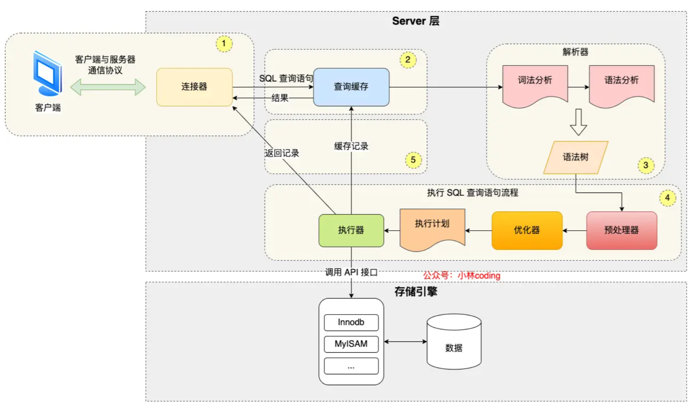

# 1 MySQL 执行流程

下面就是 MySQL 执行一条 SQL 查询语句的流程，也从图中可以看到 MySQL 内部架构里的各个功能模块。

## 1.1 连接器

用于连接 MySQL 服务

> 空闲连接会一直占用着吗？不是,最大空闲时长默认值是 8 小时

> MySQL 的连接数有限制吗？最大连接数由 max_connections 参数控制,默认是 151 个

> 怎么解决长连接占用内存的问题？1. **定期断开长连接** 2. **客户端主动重置连接**

## 1.2 查询缓存

MySQL 8.0 版本直接将查询缓存删掉了

## 1. 3 解析 SQL

在正式执行 SQL 查询语句之前， MySQL 会先对 SQL 语句做解析，这个工作交由「解析器」来完成。

解析器会做如下两件事情。

第一件事情，**词法分析**。MySQL 会根据你输入的字符串识别出关键字出来，构建出 SQL 语法树，这样方便后面模块获取 SQL 类型、表名、字段名、 where 条件等等。

第二件事情，**语法分析**。根据词法分析的结果，语法解析器会根据语法规则，判断你输入的这个 SQL 语句是否满足 MySQL 语法。

如果我们输入的 SQL 语句语法不对，就会在解析器这个阶段报错。

## 1.4 执行 SQL

经过解析器后，接着就要进入执行 SQL 查询语句的流程了，每条`SELECT` 查询语句流程主要可以分为下面这三个阶段：

- prepare 阶段，也就是预处理阶段；
- optimize 阶段，也就是优化阶段；
- execute 阶段，也就是执行阶段；

### 1.4.1 预处理器

- 检查 SQL 查询语句中的表或者字段是否存在；
- 将 `select *` 中的 `*` 符号，扩展为表上的所有列；

### 1.4.2 优化器

**优化器主要负责将 SQL 查询语句的执行方案确定下来**，比如在表里面有多个索引的时候，优化器会基于查询成本的考虑，来决定选择使用哪个索引。

### 1.4.3 执行器

经历完优化器后，就确定了执行方案，接下来 MySQL 就真正开始执行语句了，这个工作是由「执行器」完成的。在执行的过程中，执行器就会和存储引擎交互了，交互是以记录为单位的。

## 1.5 总结

执行一条 SQL 查询语句，期间发生了什么？

- 连接器：建立连接，管理连接、校验用户身份；
- 查询缓存：查询语句如果命中查询缓存则直接返回，否则继续往下执行。MySQL 8.0 已删除该模块；
- 解析 SQL，通过解析器对 SQL 查询语句进行词法分析、语法分析，然后构建语法树，方便后续模块读取表名、字段、语句类型；
- 执行 SQL：执行 SQL 共有三个阶段：
  - 预处理阶段：检查表或字段是否存在；将 `select *` 中的 `*` 符号扩展为表上的所有列。
  - 优化阶段：基于查询成本的考虑， 选择查询成本最小的执行计划；
  - 执行阶段：根据执行计划执行 SQL 查询语句，从存储引擎读取记录，返回给客户端；

# 2 MySQL 一行记录是怎么存储的？

## 2.1 MySQL 的数据存放在哪个文件？

- db.opt，用来存储当前数据库的默认字符集和字符校验规则。
- t_order.frm ，t_order 的**表结构**会保存在这个文件。在 MySQL 中建立一张表都会生成一个.frm 文件，该文件是用来保存每个表的元数据信息的，主要包含表结构定义。
- t_order.ibd，t_order 的**表数据**会保存在这个文件。表数据既可以存在共享表空间文件（文件名：ibdata1）里，也可以存放在独占表空间文件（文件名：表名字.ibd）。这个行为是由参数 innodb_file_per_table 控制的，若设置了参数 innodb_file_per_table 为 1，则会将存储的数据、索引等信息单独存储在一个独占表空间，从 MySQL 5.6.6 版本开始，它的默认值就是 1 了，因此从这个版本之后， MySQL 中每一张表的数据都存放在一个独立的 .ibd 文件。

## 2.2 表空间文件的结构是怎么样的？

**表空间由段（segment）、区（extent）、页（page）、行（row）组成**，InnoDB存储引擎的逻辑存储结构大致如下图：

### 行（row）

数据库表中的记录都是按行（row）进行存放的，每行记录根据不同的行格式，有不同的存储结构。

记录是按照行来存储的，但是数据库的读取并不以「行」为单位，否则一次读取（也就是一次 I/O 操作）只能处理一行数据，效率会非常低。

### 页（page）

记录是按照行来存储的，但是数据库的读取并不以「行」为单位，否则一次读取（也就是一次 I/O 操作）只能处理一行数据，效率会非常低。

因此，**InnoDB 的数据是按「页」为单位来读写的**，也就是说，当需要读一条记录的时候，并不是将这个行记录从磁盘读出来，而是以页为单位，将其整体读入内存。

**默认每个页的大小为 16KB**，也就是最多能保证 16KB 的连续存储空间。

### 区（extent）

**在表中数据量大的时候，为某个索引分配空间的时候就不再按照页为单位分配了，而是按照区（extent）为单位分配。每个区的大小为 1MB，对于 16KB 的页来说，连续的 64 个页会被划为一个区，这样就使得链表中相邻的页的物理位置也相邻，就能使用顺序 I/O 了**。

### 段（segment）

段是由多个区（extent）组成的。段一般分为数据段、索引段和回滚段等。

- 索引段：存放 B + 树的非叶子节点的区的集合；
- 数据段：存放 B + 树的叶子节点的区的集合；
- 回滚段：存放的是回滚数据的区的集合，之前讲[事务隔离 (opens new window)](https://xiaolincoding.com/mysql/transaction/mvcc.html)的时候就介绍到了 MVCC 利用了回滚段实现了多版本查询数据。

InnoDB 提供了 4 种行格式，分别是 Redundant、Compact、Dynamic和 Compressed 行格式。其中Compact主要使用

## 2.3 COMPACT 行格式长什么样？

### 2.3.1 记录的额外信息

记录的额外信息包含 3 个部分：变长字段长度列表、NULL 值列表、记录头信息。

#### 1. 变长字段长度列表

「变长字段长度列表」只出现在数据表有变长字段的时候。

「变长字段长度列表」中的信息之所以要逆序存放，是因为这样可以**使得位置靠前的记录的真实数据和数据对应的字段长度信息可以同时在一个 CPU Cache Line 中，这样就可以提高 CPU Cache 的命中率**。

#### 2. NULL 值列表

- 二进制位的值为`1`时，代表该列的值为NULL。
- 二进制位的值为`0`时，代表该列的值不为NULL。

此时NULL值列表如下图所示：

####  3. 记录头信息

记录头信息中包含的内容很多，我就不一一列举了，这里说几个比较重要的：

- delete_mask ：标识此条数据是否被删除。从这里可以知道，我们执行 detele 删除记录的时候，并不会真正的删除记录，只是将这个记录的 delete_mask 标记为 1。
- next_record：下一条记录的位置。从这里可以知道，记录与记录之间是通过链表组织的。在前面我也提到了，指向的是下一条记录的「记录头信息」和「真实数据」之间的位置，这样的好处是向左读就是记录头信息，向右读就是真实数据，比较方便。
- record_type：表示当前记录的类型，0表示普通记录，1表示B+树非叶子节点记录，2表示最小记录，3表示最大记录

### 2.3.2 记录的真实数据

记录真实数据部分除了我们定义的字段，还有三个隐藏字段，分别为：row_id、trx_id、roll_pointer，我们来看下这三个字段是什么。

- row_id

如果我们建表的时候指定了主键或者唯一约束列，那么就没有 row_id 隐藏字段了。如果既没有指定主键，又没有唯一约束，那么 InnoDB 就会为记录添加 row_id 隐藏字段。row_id不是必需的，占用 6 个字节。

- trx_id

事务id，表示这个数据是由哪个事务生成的。 trx_id是必需的，占用 6 个字节。

- roll_pointer

这条记录上一个版本的指针。roll_pointer 是必需的，占用 7 个字节。

如果你熟悉 MVCC 机制，你应该就清楚 trx_id 和 roll_pointer 的作用了，如果你还不知道 MVCC 机制，可以看完[这篇文章 (opens new window)](https://xiaolincoding.com/mysql/transaction/mvcc.html)，一定要掌握，面试也很经常问 MVCC 是怎么实现的。

##  2.4 varchar(n) 中 n 最大取值为多少？

我们要清楚一点，**MySQL 规定除了 TEXT、BLOBs 这种大对象类型之外，其他所有的列（不包括隐藏列和记录头信息）占用的字节长度加起来不能超过 65535 个字节**。

也就是说，一行记录除了 TEXT、BLOBs 类型的列，限制最大为 65535 字节，注意是一行的总长度，不是一列。

### 2.4.1 单字段的情况

**一行数据的最大字节数 65535，其实是包含「变长字段长度列表」和 「NULL 值列表」所占用的字节数的**。

所以， 我们在算 varchar(n) 中 n 最大值时，需要减去「变长字段长度列表」和 「NULL 值列表」所占用的字节数的。

**在数据库表只有一个 varchar(n) 字段且字符集是 ascii 的情况下，varchar(n) 中 n 最大值 = 65535 - 2 - 1 = 65532**。

### 2.4.2 多字段的情况

**如果有多个字段的话，要保证所有字段的长度 + 变长字段字节数列表所占用的字节数 + NULL值列表所占用的字节数 <= 65535**。

MySQL 中磁盘和内存交互的基本单位是页，一个页的大小一般是 `16KB`，也就是 `16384字节`，而一个 varchar(n) 类型的列最多可以存储 `65532字节`，一些大对象如 TEXT、BLOB 可能存储更多的数据，这时一个页可能就存不了一条记录。这个时候就会**发生行溢出，多的数据就会存到另外的「溢出页」中**。

如果一个数据页存不了一条记录，InnoDB 存储引擎会自动将溢出的数据存放到「溢出页」中。在一般情况下，InnoDB 的数据都是存放在 「数据页」中。但是当发生行溢出时，溢出的数据会存放到「溢出页」中。

当发生行溢出时，在记录的真实数据处只会保存该列的一部分数据，而把剩余的数据放在「溢出页」中，然后真实数据处用 **20 字节**存储指向溢出页的地址，从而可以找到剩余数据所在的页。大致如下图所示。

