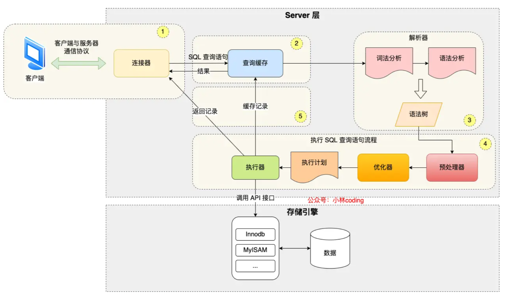

## 1 MySQL 执行流程

下面就是 MySQL 执行一条 SQL 查询语句的流程，也从图中可以看到 MySQL 内部架构里的各个功能模块。

## 1.1 连接器

用于连接 MySQL 服务

> 空闲连接会一直占用着吗？不是,最大空闲时长默认值是 8 小时

> MySQL 的连接数有限制吗？最大连接数由 max_connections 参数控制,默认是 151 个

> 怎么解决长连接占用内存的问题？1. **定期断开长连接** 2. **客户端主动重置连接**

## 1.2 查询缓存

MySQL 8.0 版本直接将查询缓存删掉了

## 1. 3 解析 SQL

在正式执行 SQL 查询语句之前， MySQL 会先对 SQL 语句做解析，这个工作交由「解析器」来完成。

解析器会做如下两件事情。

第一件事情，**词法分析**。MySQL 会根据你输入的字符串识别出关键字出来，构建出 SQL 语法树，这样方便后面模块获取 SQL 类型、表名、字段名、 where 条件等等。

第二件事情，**语法分析**。根据词法分析的结果，语法解析器会根据语法规则，判断你输入的这个 SQL 语句是否满足 MySQL 语法。

如果我们输入的 SQL 语句语法不对，就会在解析器这个阶段报错。

## 1.4 执行 SQL

经过解析器后，接着就要进入执行 SQL 查询语句的流程了，每条`SELECT` 查询语句流程主要可以分为下面这三个阶段：

- prepare 阶段，也就是预处理阶段；
- optimize 阶段，也就是优化阶段；
- execute 阶段，也就是执行阶段；

### 预处理器

- 检查 SQL 查询语句中的表或者字段是否存在；
- 将 `select *` 中的 `*` 符号，扩展为表上的所有列；

### 优化器

**优化器主要负责将 SQL 查询语句的执行方案确定下来**，比如在表里面有多个索引的时候，优化器会基于查询成本的考虑，来决定选择使用哪个索引。

### 执行器

经历完优化器后，就确定了执行方案，接下来 MySQL 就真正开始执行语句了，这个工作是由「执行器」完成的。在执行的过程中，执行器就会和存储引擎交互了，交互是以记录为单位的。