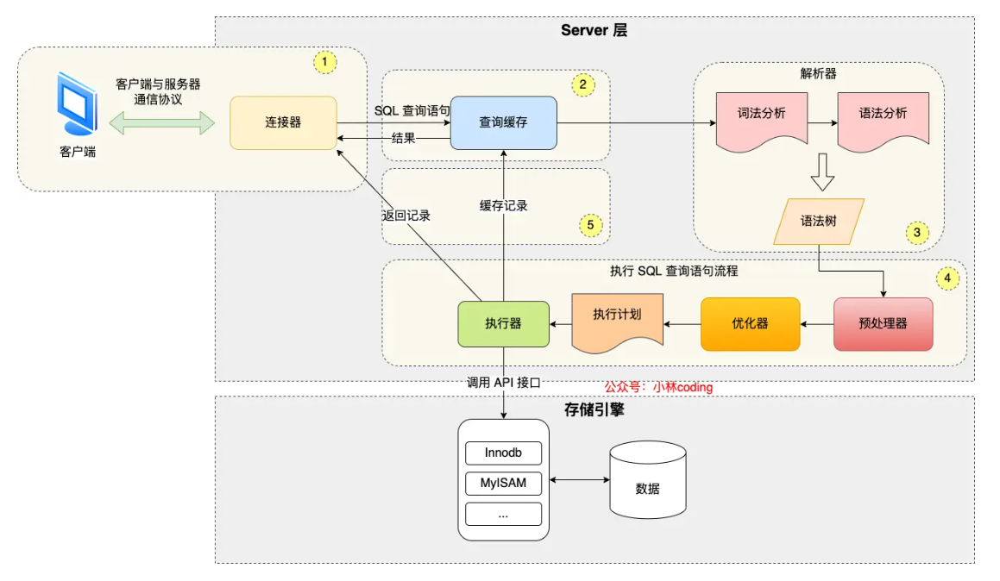
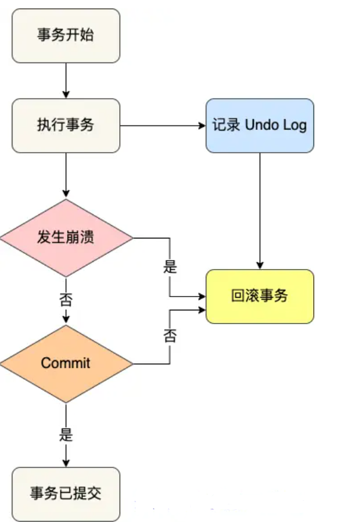
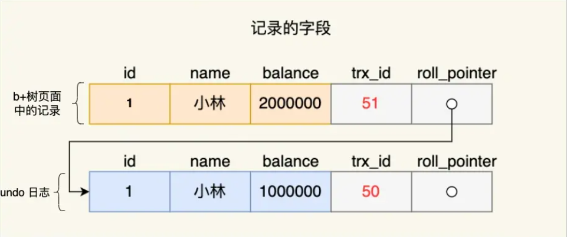
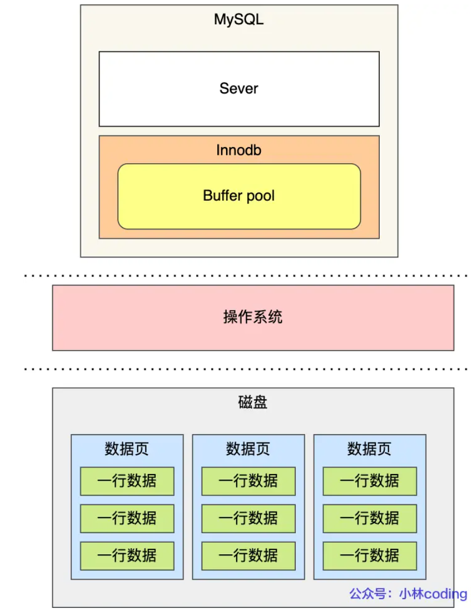
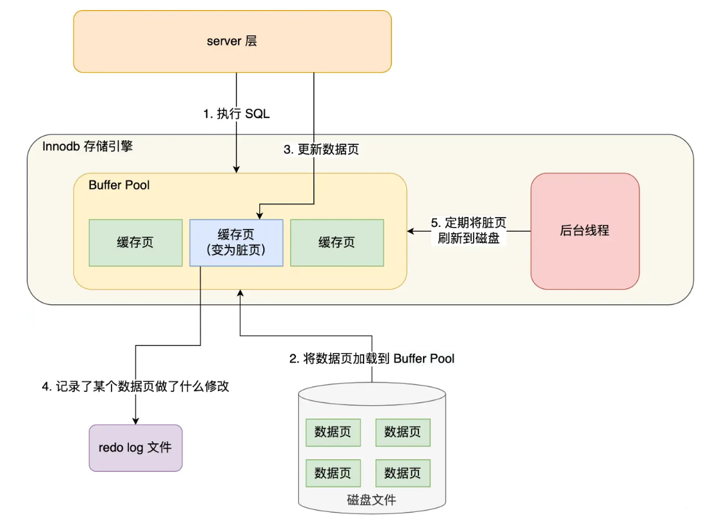
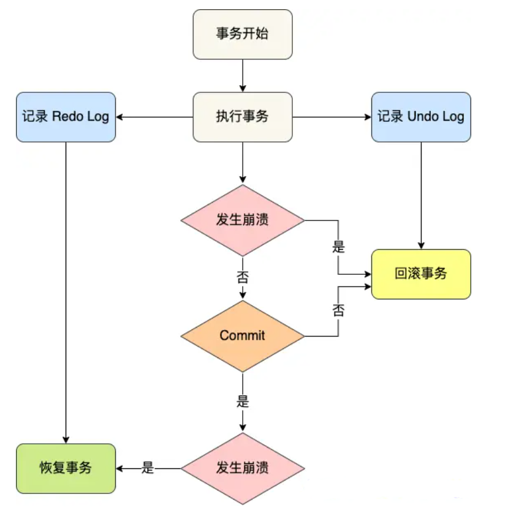
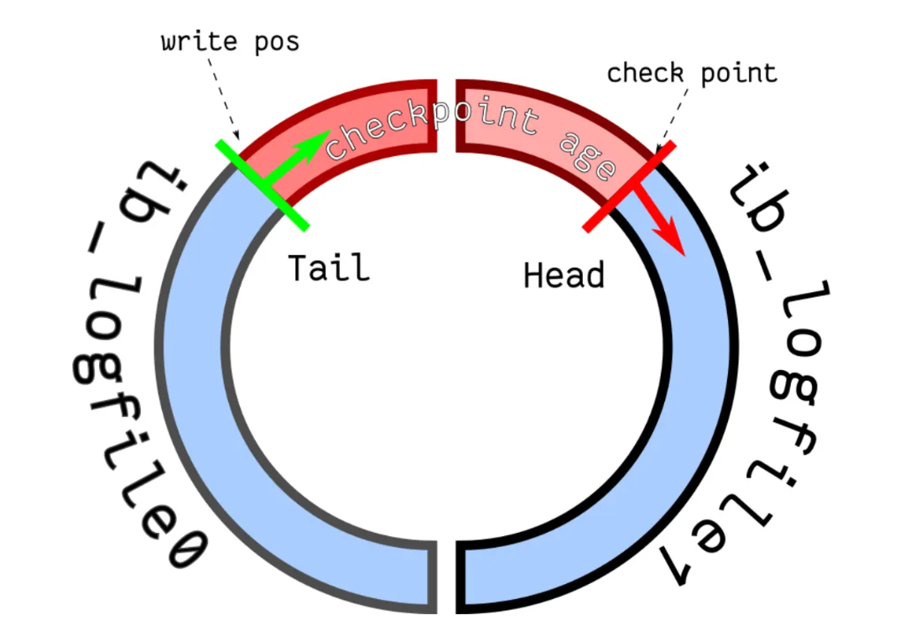
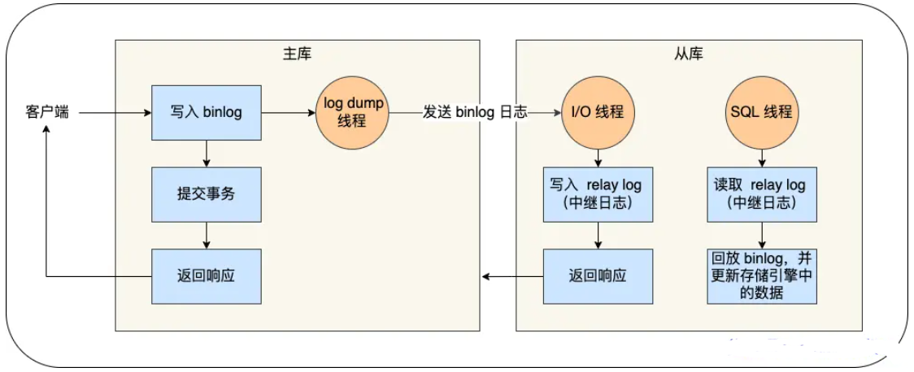
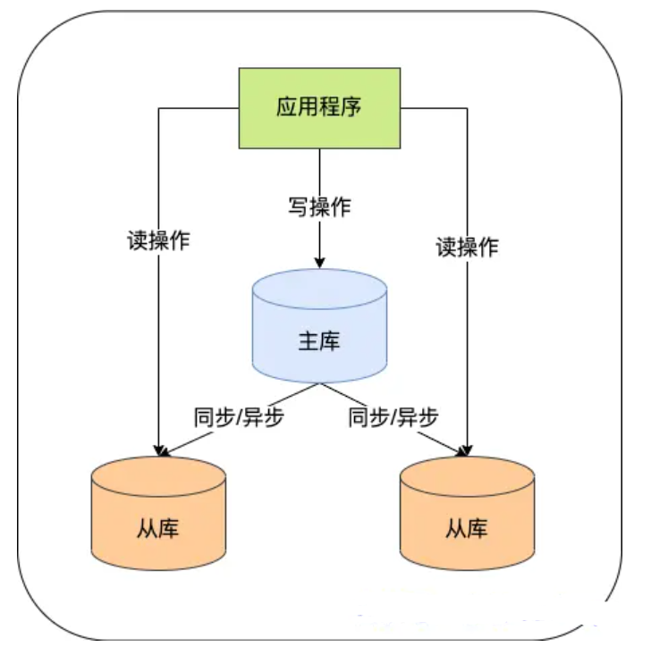

# MySQL 日志：undo log、redo log、binlog 有什么用？



从上图，我们得知了执行一条查询语句期间会发生什么，那如果是update语句呢？

```sql
UPDATE t_user SET name = 'xiaolin' WHERE id = 1;
```

查询语句的那一套流程，更新语句也是同样会走一遍：

- 客户端先通过连接器建立连接，连接器自会判断用户身份；
- 因为这是一条 update 语句，所以不需要经过查询缓存，但是表上有更新语句，是会把整个表的查询缓存清空的，所以说查询缓存很鸡肋，在 MySQL 8.0 就被移除这个功能了；
- 解析器会通过词法分析识别出关键字 update，表名等等，构建出语法树，接着还会做语法分析，判断输入的语句是否符合 MySQL 语法；
- 预处理器会判断表和字段是否存在；
- 优化器确定执行计划，因为 where 条件中的 id 是主键索引，所以决定要使用 id 这个索引；
- 执行器负责具体执行，找到这一行，然后更新。


不过，更新语句的流程会涉及到 undo log（回滚日志）、redo log（重做日志） 、binlog （归档日志）这三种日志：

- **undo log（回滚日志）**：是 Innodb 存储引擎层生成的日志，实现了事务中的**原子性**，主要**用于事务回滚和 MVCC**。

- **redo log（重做日志）**：是 Innodb 存储引擎层生成的日志，实现了事务中的**持久性**，主要**用于掉电等故障恢复**；

- **binlog （归档日志）**：是 Server 层生成的日志，主要**用于数据备份和主从复制**；


## 为什么需要 undo log？

我们在执行执行一条“增删改”语句的时候，虽然没有输入 begin 开启事务和 commit 提交事务，但是 MySQL 会**隐式开启事务**来执行“增删改”语句的，执行完就自动提交事务的，这样就保证了执行完“增删改”语句后，我们可以及时在数据库表看到“增删改”的结果了。


如果我们每次在事务执行过程中，都记录下回滚时需要的信息到一个日志里，那么在事务执行中途发生了 MySQL 崩溃后，就不用担心无法回滚到事务之前的数据，我们可以通过这个日志回滚到事务之前的数据。

实现这一机制就是 **undo log（回滚日志），它保证了事务的 ACID 特性中的原子性（Atomicity）**。

undo log 是一种用于撤销回退的日志。在事务没提交之前，MySQL 会先记录更新前的数据到 undo log 日志文件里面，当事务回滚时，可以利用 undo log 来进行回滚。如下图：



每当 InnoDB 引擎对一条记录进行操作（修改、删除、新增）时，要把回滚时需要的信息都记录到 undo log 里，比如：

- 在**插入**一条记录时，要把这条记录的主键值记下来，这样之后回滚时只需要把这个主键值对应的记录**删掉**就好了；
- 在**删除**一条记录时，要把这条记录中的内容都记下来，这样之后回滚时再把由这些内容组成的记录**插入**到表中就好了；
- 在**更新**一条记录时，要把被更新的列的旧值记下来，这样之后回滚时再把这些列**更新为旧值**就好了。

一条记录的每一次更新操作产生的 undo log 格式都有一个 roll_pointer 指针和一个 trx_id 事务id：

- 通过 trx_id 可以知道该记录是被哪个事务修改的；
- 通过 roll_pointer 指针可以将这些 undo log 串成一个链表，这个链表就被称为版本链；

版本链如下图：




另外，**undo log 还有一个作用，通过 ReadView + undo log 实现 MVCC（多版本并发控制）**。

对于「读提交」和「可重复读」隔离级别的事务来说，它们的快照读（普通 select 语句）是通过 Read View + undo log 来实现的，它们的区别在于创建 Read View 的时机不同：

- 「读提交」隔离级别是在每个 select 都会生成一个新的 Read View，也意味着，事务期间的多次读取同一条数据，前后两次读的数据可能会出现不一致，因为可能这期间另外一个事务修改了该记录，并提交了事务。
- 「可重复读」隔离级别是启动事务时生成一个 Read View，然后整个事务期间都在用这个 Read View，这样就保证了在事务期间读到的数据都是事务启动前的记录。

因此，undo log 两大作用：

- **实现事务回滚，保障事务的原子性**。事务处理过程中，如果出现了错误或者用户执 行了 ROLLBACK 语句，MySQL 可以利用 undo log 中的历史数据将数据恢复到事务开始之前的状态。
- **实现 MVCC（多版本并发控制）关键因素之一**。MVCC 是通过 ReadView + undo log 实现的。undo log 为每条记录保存多份历史数据，MySQL 在执行快照读（普通 select 语句）的时候，会根据事务的 Read View 里的信息，顺着 undo log 的版本链找到满足其可见性的记录。


## 为什么需要 Buffer Pool？

MySQL 的数据都是存在磁盘中的，那么我们要更新一条记录的时候，得先要从磁盘读取该记录，然后在内存中修改这条记录。那修改完这条记录是选择直接写回到磁盘，还是选择缓存起来呢？

当然是缓存起来好，这样下次有查询语句命中了这条记录，直接读取缓存中的记录，就不需要从磁盘获取数据了。

为此，Innodb 存储引擎设计了一个**缓冲池（Buffer Pool）**，来提高数据库的读写性能。




有了 Buffer Pool 后：

- 当读取数据时，如果数据**存在**于 Buffer Pool 中，客户端就会**直接读取** Buffer Pool 中的数据，否则再去磁盘中读取。
- 当修改数据时，如果数据存在于 Buffer Pool 中，那**直接修改 Buffer Pool 中数据所在的页**，然后将其页设置为**脏页**（该页的内存数据和磁盘上的数据已经不一致），为了减少磁盘I/O，**不会立即将脏页写入磁盘**，后续由后台线程选择一个合适的时机将脏页写入到磁盘。

### Buffer Pool 缓存什么？

InnoDB 会把存储的数据划分为若干个「页」，以页作为磁盘和内存交互的基本单位，一个页的默认大小为 16KB。因此，Buffer Pool 同样需要按「页」来划分。

在 MySQL 启动的时候，**InnoDB 会为 Buffer Pool 申请一片连续的内存空间，然后按照默认的`16KB`的大小划分出一个个的页， Buffer Pool 中的页就叫做缓存页**。此时这些缓存页都是空闲的，之后随着程序的运行，才会有磁盘上的页被缓存到 Buffer Pool 中。

所以，MySQL 刚启动的时候，你会观察到使用的虚拟内存空间很大，而使用到的物理内存空间却很小，这是因为只有这些虚拟内存被访问后，操作系统才会触发缺页中断，申请物理内存，接着将虚拟地址和物理地址建立映射关系。

Buffer Pool 除了缓存「索引页」和「数据页」，还包括了 Undo 页，插入缓存、自适应哈希索引、锁信息等等。


> Undo 页是记录什么？

开启事务后，InnoDB 层更新记录前，首先要记录相应的 undo log，如果是更新操作，需要把被更新的列的旧值记下来，也就是要生成一条 undo log，undo log 会写入 Buffer Pool 中的 Undo 页面。

> 查询一条记录，就只需要缓冲一条记录吗？

不是的。

当我们查询一条记录时，**InnoDB 是会把整个页的数据加载到 Buffer Pool 中**，将页加载到 Buffer Pool 后，再通过页里的「页目录」去定位到某条具体的记录。


## 为什么需要 redo log ？

Buffer Pool 是提高了读写效率没错，但是问题来了，Buffer Pool 是基于内存的，而内存总是不可靠，万一断电重启，还没来得及落盘的脏页数据就会丢失。

为了防止断电导致数据丢失的问题，当有一条记录需要更新的时候，InnoDB 引擎就会先更新内存（同时标记为脏页），然后将本次对这个页的修改以 redo log 的形式记录下来，**这个时候更新就算完成了**。

后续，InnoDB 引擎会在适当的时候，由后台线程将缓存在 Buffer Pool 的脏页刷新到磁盘里，这就是 **WAL （Write-Ahead Logging）技术**。

**WAL 技术指的是， MySQL 的写操作并不是立刻写到磁盘上，而是先写日志，然后在合适的时间再写到磁盘上**。



> 什么是 redo log？

redo log 是物理日志，记录了某个数据页做了什么修改，比如**对 XXX 表空间中的 YYY 数据页 ZZZ 偏移量的地方做了AAA 更新**，每当执行一个事务就会产生这样的一条或者多条物理日志。

在事务提交时，只要先将 redo log 持久化到磁盘即可，可以不需要等到将缓存在 Buffer Pool 里的脏页数据持久化到磁盘。

当系统崩溃时，虽然脏页数据没有持久化，但是 redo log 已经持久化，接着 MySQL 重启后，可以根据 redo log 的内容，将所有数据恢复到最新的状态。


> 被修改 Undo 页面，需要记录对应 redo log 吗？

需要的。

开启事务后，InnoDB 层更新记录前，首先要记录相应的 undo log，如果是更新操作，需要把被更新的列的旧值记下来，也就是要生成一条 undo log，undo log 会写入 Buffer Pool 中的 Undo 页面。

不过，**在内存修改该 Undo 页面后，需要记录对应的 redo log**。


> redo log 和 undo log 区别在哪？

这两种日志是属于 InnoDB 存储引擎的日志，它们的区别在于：

- redo log 记录了此次事务「**完成后**」的数据状态，记录的是更新**之后**的值；
- undo log 记录了此次事务「**开始前**」的数据状态，记录的是更新**之前**的值；

事务提交之前发生了崩溃，重启后会通过 undo log 回滚事务，事务提交之后发生了崩溃，重启后会通过 redo log 恢复事务，如下图：



> 
> 产生的 redo log 是直接写入磁盘的吗？

不是的。

实际上， 执行一个事务的过程中，产生的 redo log 也不是直接写入磁盘的，因为这样会产生大量的 I/O 操作，而且磁盘的运行速度远慢于内存。

所以，redo log 也有自己的缓存—— **redo log buffer**，每当产生一条 redo log 时，会先写入到 redo log buffer，后续在持久化到磁盘如下图：


### redo log 什么时候刷盘？

主要有下面几个时机：

- MySQL **正常关闭**时；
- 当 redo log buffer 中记录的写入量**大于** redo log buffer 内存空间的**一半**时，会触发落盘；
- InnoDB 的后台线程每隔 **1 秒**，将 redo log buffer 持久化到磁盘。
- 每次**事务提交**时都将缓存在 redo log buffer 里的 redo log 直接持久化到磁盘（这个策略可由 innodb_flush_log_at_trx_commit 参数控制，下面会说）。

除此之外，InnoDB 还提供了另外两种策略，由参数 `innodb_flush_log_at_trx_commit` 参数控制，可取的值有：0、1、2，默认值为 1，这三个值分别代表的策略如下：

- 当设置该**参数为 0 时**，表示每次事务提交时 ，还是**将 redo log 留在 redo log buffer 中** ，该模式下在事务提交时不会主动触发写入磁盘的操作。
- 当设置该**参数为 1 时**，表示每次事务提交时，都**将缓存在 redo log buffer 里的 redo log 直接持久化到磁盘**，这样可以保证 MySQL 异常重启之后数据不会丢失。
- 当设置该**参数为 2 时**，表示每次事务提交时，都只是缓存在 redo log buffer 里的 redo log **写到 redo log 文件，注意写入到「 redo log 文件」并不意味着写入到了磁盘**，因为操作系统的文件系统中有个 Page Cache（如果你想了解 Page Cache，可以看[这篇 (opens new window)](https://xiaolincoding.com/os/6_file_system/pagecache.html)），Page Cache 是专门用来缓存文件数据的，所以写入「 redo log文件」意味着写入到了操作系统的文件缓存。


### redo log 文件写满了怎么办？

默认情况下， InnoDB 存储引擎有 1 个重做日志文件组( redo log Group），「重做日志文件组」由有 2 个 redo log 文件组成，这两个 redo 日志的文件名叫 ：`ib_logfile0` 和 `ib_logfile1` 。


在重做日志组中，每个 redo log File 的大小是固定且一致的，假设每个 redo log File 设置的上限是 1 GB，那么总共就可以记录 2GB 的操作。

重做日志文件组是以**循环写**的方式工作的，从头开始写，写到末尾就又回到开头，相当于一个环形。

所以 InnoDB 存储引擎会先写 ib_logfile0 文件，当 ib_logfile0 文件被写满的时候，会切换至 ib_logfile1 文件，当 ib_logfile1 文件也被写满时，会切换回 ib_logfile0 文件。


我们知道 redo log 是为了防止 Buffer Pool 中的脏页丢失而设计的，那么如果随着系统运行，Buffer Pool 的脏页刷新到了磁盘中，那么 redo log 对应的记录也就没用了，这时候我们擦除这些旧记录，以腾出空间记录新的更新操作。

redo log 是循环写的方式，相当于一个环形，InnoDB 用 write pos 表示 redo log 当前记录写到的位置，用 checkpoint 表示当前要擦除的位置，如下图：



- write pos 和 checkpoint 的移动都是顺时针方向；
- write pos ～ checkpoint 之间的部分（图中的红色部分），用来记录新的更新操作；
- check point ～ write pos 之间的部分（图中蓝色部分）：待落盘的脏数据页记录；

如果 write pos 追上了 checkpoint，就意味着 **redo log 文件满了，这时 MySQL 不能再执行新的更新操作，也就是说 MySQL 会被阻塞**（*因此所以针对并发量大的系统，适当设置 redo log 的文件大小非常重要*），此时**会停下来将 Buffer Pool 中的脏页刷新到磁盘中，然后标记 redo log 哪些记录可以被擦除，接着对旧的 redo log 记录进行擦除，等擦除完旧记录腾出了空间，checkpoint 就会往后移动（图中顺时针）**，然后 MySQL 恢复正常运行，继续执行新的更新操作。

所以，一次 checkpoint 的过程就是脏页刷新到磁盘中变成干净页，然后标记 redo log 哪些记录可以被覆盖的过程

## 为什么需要 binlog ？

前面介绍的 undo log 和 redo log 这两个日志都是 Innodb 存储引擎生成的。

MySQL 在完成一条更新操作后，Server 层还会生成一条 binlog，等之后事务提交的时候，会将该事物执行过程中产生的所有 binlog 统一写 入 binlog 文件。

binlog 文件是记录了所有数据库表结构变更和表数据修改的日志，不会记录查询类的操作，比如 SELECT 和 SHOW 操作。

### redo log 和 binlog 有什么区别？

这两个日志有四个区别。

*1、**适用对象不同：***

- binlog 是 MySQL 的 Server 层实现的日志，所有存储引擎都可以使用；
- redo log 是 Innodb 存储引擎实现的日志；

*2、**文件格式不同：***

- binlog 有 3 种格式类型，分别是 STATEMENT（默认格式）、ROW、 MIXED，区别如下：
  - STATEMENT：每一条修改数据的 SQL 都会被记录到 binlog 中（相当于记录了逻辑操作，所以针对这种格式， binlog 可以称为逻辑日志），主从复制中 slave 端再根据 SQL 语句重现。但 STATEMENT 有动态函数的问题，比如你用了 uuid 或者 now 这些函数，你在主库上执行的结果并不是你在从库执行的结果，这种随时在变的函数会导致复制的数据不一致；
  - ROW：记录行数据最终被修改成什么样了（这种格式的日志，就不能称为逻辑日志了），不会出现 STATEMENT 下动态函数的问题。但 ROW 的缺点是每行数据的变化结果都会被记录，比如执行批量 update 语句，更新多少行数据就会产生多少条记录，使 binlog 文件过大，而在 STATEMENT 格式下只会记录一个 update 语句而已；
  - MIXED：包含了 STATEMENT 和 ROW 模式，它会根据不同的情况自动使用 ROW 模式和 STATEMENT 模式；
- redo log 是物理日志，记录的是在某个数据页做了什么修改，比如对 XXX 表空间中的 YYY 数据页 ZZZ 偏移量的地方做了AAA 更新；

***写入方式不同：***

- binlog 是追加写，写满一个文件，就创建一个新的文件继续写，不会覆盖以前的日志，保存的是全量的日志。
- redo log 是循环写，日志空间大小是固定，全部写满就从头开始，保存未被刷入磁盘的脏页日志。

***用途不同：***

- binlog 用于备份恢复、主从复制；
- redo log 用于掉电等故障恢复。


> 如果不小心整个数据库的数据被删除了，能使用 redo log 文件恢复数据吗？

不可以使用 redo log 文件恢复，只能使用 binlog 文件恢复。

因为 redo log 文件是**循环写，是会边写边擦除日志的**，只记录未被刷入磁盘的数据的物理日志，已经刷入磁盘的数据都会从 redo log 文件里擦除。

**binlog 文件保存的是全量的日志**，也就是保存了所有数据变更的情况，理论上只要记录在 binlog 上的数据，都可以恢复，所以如果不小心整个数据库的数据被删除了，得用 binlog 文件恢复数据。

### 主从复制是怎么实现？

MySQL 的主从复制依赖于 binlog ，也就是记录 MySQL 上的所有变化并以二进制形式保存在磁盘上。**复制的过程就是将 binlog 中的数据从主库传输到从库上。**

这个过程一般是**异步**的，也就是主库上执行事务操作的线程不会等待复制 binlog 的线程同步完成。




MySQL 集群的主从复制过程梳理成 3 个阶段：

- **写入 Binlog**：主库写 binlog 日志，提交事务，并更新本地存储数据。
- **同步 Binlog**：把 binlog 复制到所有从库上，每个从库把 binlog 写到暂存日志中。
- **回放 Binlog**：回放 binlog，并更新存储引擎中的数据。


在完成主从复制之后，你就可以在写数据时只写主库，在读数据时只读从库，这样即使写请求会锁表或者锁记录，也不会影响读请求的执行。



> 
> MySQL 主从复制还有哪些模型？

主要有三种：

- **同步复制**：MySQL 主库提交事务的线程要等待**所有**从库的复制成功响应，才返回客户端结果。这种方式在实际项目中，基本上没法用，原因有两个：一是**性能很差**，因为要复制到所有节点才返回响应；二是**可用性也很差**，主库和所有从库任何一个数据库出问题，都会影响业务。
- **异步复制**（默认模型）：MySQL 主库提交事务的线程并**不会等待** binlog 同步到各从库，就返回客户端结果。这种模式一旦主库宕机，数据就会发生丢失。
- **半同步复制**：MySQL 5.7 版本之后增加的一种复制方式，介于两者之间，事务线程不用等待所有的从库复制成功响应，只要**一部分复制成功响应回来就行**，比如一主二从的集群，只要数据成功复制到任意一个从库上，主库的事务线程就可以返回给客户端。这种**半同步复制的方式，兼顾了异步复制和同步复制的优点，即使出现主库宕机，至少还有一个从库有最新的数据，不存在数据丢失的风险**。

## update 语句的执行过程

> 三个日志讲完了，至此我们可以先小结下，update 语句的执行过程。

当优化器分析出成本最小的执行计划后，执行器就按照执行计划开始进行更新操作。

具体更新一条记录 `UPDATE t_user SET name = 'xiaolin' WHERE id = 1;` 的流程如下:

1. 执行器负责具体执行，会调用存储引擎的接口，通过主键索引树搜索获取 id = 1 这一行记录：
   - 如果 id=1 这一行所在的数据页本来就在 buffer pool 中，就直接返回给执行器更新；
   - 如果记录不在 buffer pool，将数据页从磁盘读入到 buffer pool，返回记录给执行器。
2. 执行器得到聚簇索引记录后，会看一下更新前的记录和更新后的记录是否一样：
   - 如果一样的话就不进行后续更新流程；
   - 如果不一样的话就把更新前的记录和更新后的记录都当作参数传给 InnoDB 层，让 InnoDB 真正的执行更新记录的操作；
3. 开启事务， InnoDB 层更新记录前，首先要记录相应的 undo log，因为这是更新操作，需要把被更新的列的旧值记下来，也就是要生成一条 undo log，undo log 会写入 Buffer Pool 中的 Undo 页面，不过在内存修改该 Undo 页面后，需要记录对应的 redo log。
4. InnoDB 层开始更新记录，会先更新内存（同时标记为脏页），然后将记录写到 redo log 里面，这个时候更新就算完成了。为了减少磁盘I/O，不会立即将脏页写入磁盘，后续由后台线程选择一个合适的时机将脏页写入到磁盘。这就是 **WAL 技术**，MySQL 的写操作并不是立刻写到磁盘上，而是先写 redo 日志，然后在合适的时间再将修改的行数据写到磁盘上。
5. 至此，一条记录更新完了。
6. 在一条更新语句执行完成后，然后开始记录该语句对应的 binlog，此时记录的 binlog 会被保存到 binlog cache，并没有刷新到硬盘上的 binlog 文件，在事务提交时才会统一将该事务运行过程中的所有 binlog 刷新到硬盘。
7. 事务提交，剩下的就是「两阶段提交」的事情了，接下来就讲这个

## MySQL 磁盘 I/O 很高，有什么优化的方法？

现在我们知道事务在提交的时候，需要将 binlog 和 redo log 持久化到磁盘，那么如果出现 MySQL 磁盘 I/O 很高的现象，我们可以通过控制以下参数，**来 “延迟” binlog 和 redo log 刷盘的时机，从而降低磁盘 I/O 的频率：**

- 设置组提交的两个参数： binlog_group_commit_sync_delay 和 binlog_group_commit_sync_no_delay_count 参数，延迟 binlog 刷盘的时机，从而减少 binlog 的刷盘次数。这个方法是基于“额外的故意等待”来实现的，因此可能会增加语句的响应时间，但即使 MySQL 进程中途挂了，也没有丢失数据的风险，因为 binlog 早被写入到 page cache 了，只要系统没有宕机，缓存在 page cache 里的 binlog 就会被持久化到磁盘。
- 将 sync_binlog 设置为大于 1 的值（比较常见是 100~1000），表示每次提交事务都 write，但累积 N 个事务后才 fsync，相当于延迟了 binlog 刷盘的时机。但是这样做的风险是，主机掉电时会丢 N 个事务的 binlog 日志。
- 将 innodb_flush_log_at_trx_commit 设置为 2。表示每次事务提交时，都只是缓存在 redo log buffer 里的 redo log 写到 redo log 文件，注意写入到「 redo log 文件」并不意味着写入到了磁盘，因为操作系统的文件系统中有个 Page Cache，专门用来缓存文件数据的，所以写入「 redo log文件」意味着写入到了操作系统的文件缓存，然后交由操作系统控制持久化到磁盘的时机。但是这样做的风险是，主机掉电的时候会丢数据。