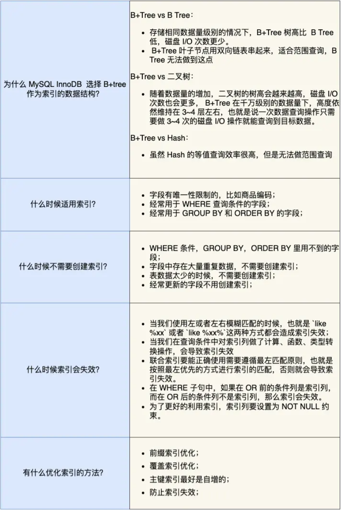
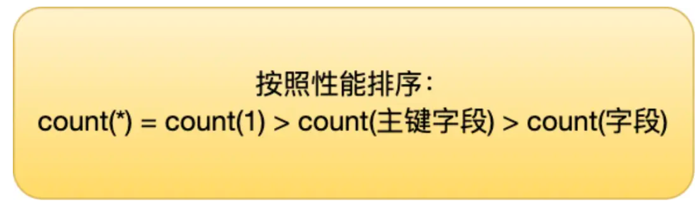

# 索引常见面试题




## 索引失效

今天给大家介绍了 6 种会发生索引失效的情况：

- 当我们使用**左或者左右**模糊匹配的时候，也就是 `like %xx` 或者 `like %xx%`这两种方式都会造成索引失效；
- 当我们在查询条件中对**索引列使用函数**，就会导致索引失效。
- 当我们在查询条件中对**索引列进行表达式计算**，也是无法走索引的。
- MySQL 在遇到字符串和数字比较的时候，会自动把字符串转为数字，然后再进行比较。如果字符串是索引列，而条件语句中的输入参数是数字的话，那么索引列会发生隐式类型转换，由于**隐式类型转换**是通过 CAST 函数实现的，等同于对索引列使用了函数，所以就会导致索引失效。
- 联合索引要能正确使用需要遵循**最左匹配原则**，也就是按照最左优先的方式进行索引的匹配，否则就会导致索引失效。
- 在 WHERE 子句中，如果在 **OR** 前的条件列是索引列，而在 OR 后的条件列不是索引列，那么索引会失效。


##  count函数解析



### count() 是什么？

count() 是一个聚合函数，函数的参数不仅可以是字段名，也可以是其他任意表达式，该函数作用是**统计符合查询条件的记录中，函数指定的参数不为 NULL 的记录有多少个**。


例1：

> t_order 表中，name 字段不为 NULL 的记录   有多少行

```sql
select count(name) from t_order;
```


例2：

> t_order 表中，1 这个表达式不为 NULL 的记录   有多少行

```sql
select count(1) from t_order;
```


解释：

**count(`\*`) 其实等于 count(`0`)**，也就是说，当你使用 count(`*`) 时，MySQL 会将 `*` 参数转化为参数 0 来处理。

所以count(*)和count(1)是一样的，在进行count计算时不会读取数据，只统计行数

然而 count(主键) 会走索引，读取主键值并判断是否为null，所以会慢一点

最差是count(字段) ,走的是全表扫描，读取该字段并判断是否为null，最慢


count(1)、 count(*)、 count(主键字段)在执行的时候，如果表里存在二级索引，优化器就会选择二级索引进行扫描。(因为二级索引存的是主键值，空间需求更小)


所以，如果要执行 count(1)、 count(*)、 count(主键字段) 时，尽量在数据表上建立二级索引，这样优化器会自动采用 key_len 最小的二级索引进行扫描，相比于扫描主键索引效率会高一些。

再来，就是不要使用 count(字段) 来统计记录个数，因为它的效率是最差的，会采用全表扫描的方式来统计。**如果你非要统计表中该字段不为 NULL 的记录个数，建议给这个字段建立一个二级索引。**