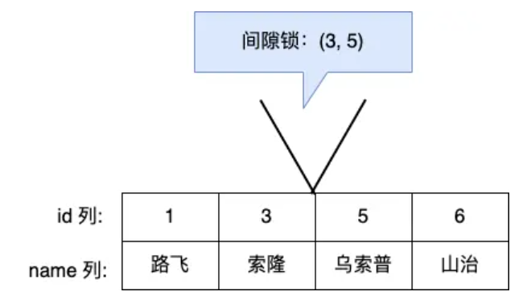
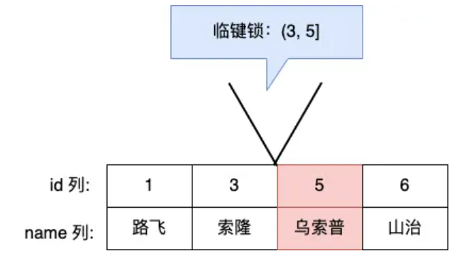
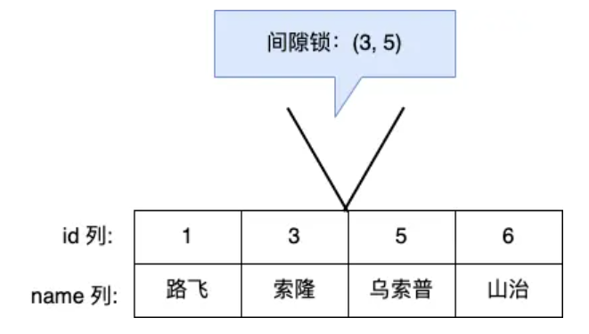

# MySQL 有哪些锁？

在 MySQL 里，根据加锁的范围，可以分为**全局锁、表级锁和行锁**三类。

## 全局锁

要使用全局锁，则要执行这条命令：

```sql
flush tables with read lock
```

执行后，**整个数据库就处于只读状态了**，这时其他线程执行以下操作，都会被阻塞：

- 对数据的增删改操作，比如 insert、delete、update等语句；
- 对表结构的更改操作，比如 alter table、drop table 等语句。

如果要释放全局锁，则要执行这条命令：

```sql
unlock tables
```

当然，当会话断开了，全局锁会被自动释放。

> 全局锁应用场景是什么？

全局锁主要应用于做**全库逻辑备份**，这样在备份数据库期间，不会因为数据或表结构的更新，而出现备份文件的数据与预期的不一样。

## 表级锁

- 表锁；
- 元数据锁（MDL）;
- 意向锁；
- AUTO-INC 锁；


### 表锁

如果我们想对学生表（t_student）加表锁，可以使用下面的命令：

```sql
//表级别的共享锁，也就是读锁；
lock tables t_student read;

//表级别的独占锁，也就是写锁；
lock tables t_stuent write;
```

需要注意的是，表锁除了会限制别的线程的读写外，也会限制本线程接下来的读写操作。

要释放表锁，可以使用下面这条命令，会释放当前会话的所有表锁：

```sql
unlock tables
```

### 元数据锁

我们不需要显示的使用 MDL，因为当我们对数据库表进行操作时，会自动给这个表加上 MDL：

- 对一张表进行 CRUD 操作时，加的是 **MDL 读锁**；
- 对一张表做结构变更操作的时候，加的是 **MDL 写锁**；

MDL 是为了保证当用户对表执行 CRUD 操作时，防止其他线程对这个表结构做了变更。

### 意向锁

接着，说说**意向锁**。

- 在使用 InnoDB 引擎的表里对某些**记录加上「共享锁」之前**，需要先在**表级别**加上一个「意向共享锁」；
- 在使用 InnoDB 引擎的表里对某些**纪录加上「独占锁」之前**，需要先在**表级别**加上一个「意向独占锁」；

也就是，当执行插入、更新、删除操作，需要先对表加上「意向独占锁」，然后对该记录加独占锁。

而普通的 select 是不会加行级锁的，普通的 select 语句是利用 MVCC 实现一致性读，是无锁的。

不过，select 也是可以对记录加共享锁和独占锁的，具体方式如下：

```sql
//先在表上加上意向共享锁，然后对读取的记录加共享锁
select ... lock in share mode;

//先表上加上意向独占锁，然后对读取的记录加独占锁
select ... for update;
```

**意向共享锁和意向独占锁是表级锁，不会和行级的共享锁和独占锁发生冲突，而且意向锁之间也不会发生冲突，只会和共享表锁（\*lock tables ... read\*）和独占表锁（\*lock tables ... write\*）发生冲突。**


所以，**意向锁的目的是为了快速判断表里是否有记录被加锁**。

### AUTO-INC 锁

表里的主键通常都会设置成自增的，这是通过对主键字段声明 `AUTO_INCREMENT` 属性实现的。

之后可以在插入数据时，可以不指定主键的值，数据库会自动给主键赋值递增的值，这主要是通过 **AUTO-INC 锁**实现的。

AUTO-INC 锁是特殊的表锁机制，锁**不是再一个事务提交后才释放，而是再执行完插入语句后就会立即释放**。

**在插入数据时，会加一个表级别的 AUTO-INC 锁**，然后为被 `AUTO_INCREMENT` 修饰的字段赋值递增的值，等插入语句执行完成后，才会把 AUTO-INC 锁释放掉。

那么，一个事务在持有 AUTO-INC 锁的过程中，其他事务的如果要向该表插入语句都会被阻塞，从而保证插入数据时，被 `AUTO_INCREMENT` 修饰的字段的值是连续递增的。

## 行级锁

InnoDB 引擎是支持行级锁的，而 MyISAM 引擎并不支持行级锁。

前面也提到，普通的 select 语句是不会对记录加锁的，因为它属于快照读。如果要在查询时对记录加行锁，可以使用下面这两个方式，这种查询会加锁的语句称为**锁定读**。

```sql
//对读取的记录加共享锁
select ... lock in share mode;

//对读取的记录加独占锁
select ... for update;
```

上面这两条语句**必须在一个事务**中，**因为当事务提交了，锁就会被释放**，所以在使用这两条语句的时候，要加上 begin、start transaction 或者 set autocommit = 0。

共享锁（S锁）满足读读共享，读写互斥。独占锁（X锁）满足写写互斥、读写互斥。

### Record Lock

Record Lock 称为记录锁，锁住的是一条记录。而且记录锁是有 S 锁和 X 锁之分的：

- 当一个事务对一条记录加了 S 型记录锁后，其他事务也可以继续对该记录加 S 型记录锁（S 型与 S 锁兼容），但是不可以对该记录加 X 型记录锁（S 型与 X 锁不兼容）;
- 当一个事务对一条记录加了 X 型记录锁后，其他事务既不可以对该记录加 S 型记录锁（S 型与 X 锁不兼容），也不可以对该记录加 X 型记录锁（X 型与 X 锁不兼容）。

### Gap Lock

Gap Lock 称为间隙锁，只存在于可重复读隔离级别，目的是为了解决可重复读隔离级别下幻读的现象。

假设，表中有一个范围 id 为（3，5）间隙锁，那么其他事务就无法插入 id = 4 这条记录了，这样就有效的防止幻读现象的发生。



间隙锁虽然存在 X 型间隙锁和 S 型间隙锁，但是并没有什么区别，**间隙锁之间是兼容的，即两个事务可以同时持有包含共同间隙范围的间隙锁，并不存在互斥关系，因为间隙锁的目的是防止插入幻影记录而提出的**。

### Next-Key Lock

Next-Key Lock 称为临键锁，是 Record Lock + Gap Lock 的组合，锁定一个范围，并且锁定记录本身。

假设，表中有一个范围 id 为（3，5] 的 next-key lock，那么其他事务即不能插入 id = 4 记录，也不能修改 id = 5 这条记录。

	

所以，next-key lock 即能保护该记录，又能阻止其他事务将新纪录插入到被保护记录前面的间隙中。

**next-key lock 是包含间隙锁+记录锁的，如果一个事务获取了 X 型的 next-key lock，那么另外一个事务在获取相同范围的 X 型的 next-key lock 时，是会被阻塞的**。

### 插入意向锁

一个事务在插入一条记录的时候，需要判断插入位置是否已被其他事务加了间隙锁（next-key lock 也包含间隙锁）。

如果有的话，插入操作就会发生**阻塞**，直到拥有间隙锁的那个事务提交为止（释放间隙锁的时刻），在此期间会生成一个**插入意向锁**，表明有事务想在某个区间插入新记录，但是现在处于等待状态。

举个例子，假设事务 A 已经对表加了一个范围 id 为（3，5）间隙锁。



当事务 A 还没提交的时候，事务 B 向该表插入一条 id = 4 的新记录，这时会判断到插入的位置已经被事务 A 加了间隙锁，于是事物 B 会生成一个插入意向锁，然后将锁的状态设置为等待状态（*PS：MySQL 加锁时，是先生成锁结构，然后设置锁的状态，如果锁状态是等待状态，并不是意味着事务成功获取到了锁，只有当锁状态为正常状态时，才代表事务成功获取到了锁*），此时事务 B 就会发生阻塞，直到事务 A 提交了事务。

插入意向锁名字虽然有意向锁，但是它并**不是意向锁，它是一种特殊的间隙锁，属于行级别锁**。

如果说间隙锁锁住的是一个区间，那么「插入意向锁」锁住的就是一个点。因而从这个角度来说，插入意向锁确实是一种特殊的间隙锁。

插入意向锁与间隙锁的另一个非常重要的差别是：尽管「插入意向锁」也属于间隙锁，但两个事务却不能在同一时间内，一个拥有间隙锁，另一个拥有该间隙区间内的插入意向锁（当然，插入意向锁如果不在间隙锁区间内则是可以的）。


## 加锁规则

总的来说，mysql的加锁是先考虑加next-key lock,如果退化成record lock或gap lock后不会造成幻读，那么就退化


详细如下：

这次我以 **MySQL 8.0.26** 版本，在可重复读隔离级别之下，做了几个实验，让大家了解了唯一索引和非唯一索引的行级锁的加锁规则。

我这里总结下， MySQL 行级锁的加锁规则。

1. **唯一索引等值查询**：

- 当查询的记录是「存在」的，在索引树上定位到这一条记录后，将该记录的索引中的 next-key lock 会**退化成「记录锁」**。
- 当查询的记录是「不存在」的，在索引树找到第一条大于该查询记录的记录后，将该记录的索引中的 next-key lock 会**退化成「间隙锁」**。

2. **非唯一索引等值查询**：

- 当查询的记录「存在」时，由于不是唯一索引，所以肯定存在索引值相同的记录，于是非唯一索引等值查询的过程是一个扫描的过程，直到扫描到第一个不符合条件的二级索引记录就停止扫描，然后在扫描的过程中，对**扫描到的二级索引记录加的是 next-key 锁**，而对于第一个**不符合条件**的二级索引记录，该二级索引的 next-key 锁会退化成**间隙锁**。同时，**在符合查询条件的记录的主键索引上加记录锁。**
- 当查询的记录「不存在」时，扫描到第一条不符合条件的二级索引记录，该二级索引的 **next-key 锁会退化成间隙锁**。因为不存在满足查询条件的记录，所以**不会对主键索引加锁。**

非唯一索引和主键索引的范围查询的加锁规则不同之处在于：

- 唯一索引在满足一些条件的时候，索引的 next-key lock 退化为间隙锁或者记录锁。
- 非唯一索引范围查询，索引的 next-key lock 不会退化为间隙锁和记录锁。

其实理解 MySQL 为什么要这样加锁，主要要以避免幻读角度去分析，这样就很容易理解这些加锁的规则了。

还有一件很重要的事情，在线上在执行 update、delete、select ... for update 等具有加锁性质的语句，一定要检查语句是否走了索引，**如果是全表扫描的话，会对每一个索引加 next-key 锁，相当于把整个表锁住了**，这是挺严重的问题。