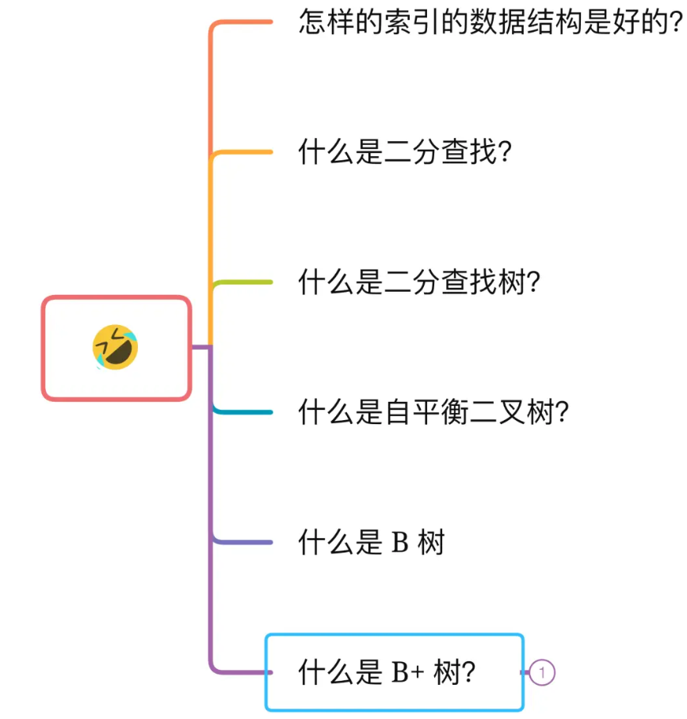

#  为什么 MySQL 采用 B+ 树作为索引？

## 总结

MySQL 是会将数据持久化在硬盘，而存储功能是由 MySQL 存储引擎实现的，所以讨论 MySQL 使用哪种数据结构作为索引，实际上是在讨论存储引使用哪种数据结构作为索引，InnoDB 是 MySQL 默认的存储引擎，它就是采用了 B+ 树作为索引的数据结构。

要设计一个 MySQL 的索引数据结构，不仅仅考虑数据结构增删改的时间复杂度，更重要的是要考虑**磁盘 I/0 的操作次数**。因为索引和记录都是存放在硬盘，硬盘是一个非常慢的存储设备，我们在查询数据的时候，**最好能在尽可能少的磁盘 I/0 的操作次数内完成。**

**二分查找树**虽然是一个天然的二分结构，能很好的利用二分查找快速定位数据，**但是它存在一种极端的情况，每当插入的元素都是树内最大的元素，就会导致二分查找树退化成一个链表，此时查询复杂度就会从 O(logn)降低为 O(n)。**

为了解决二分查找树退化成链表的问题，就出现了自**平衡二叉树**，保证了查询操作的时间复杂度就会一直维持在 O(logn) 。但是它本质上还是一个二叉树，**每个节点只能有 2 个子节点，随着元素的增多，树的高度会越来越高。**

而树的高度决定于磁盘 I/O 操作的次数，因为树是存储在磁盘中的，访问每个节点，都对应一次磁盘 I/O 操作，也就是说树的高度就等于每次查询数据时磁盘 IO 操作的次数，所以树的高度越高，就会影响查询性能。

B 树和 B+ 都是通过多叉树的方式，会将树的高度变矮，所以这两个数据结构非常适合检索存于磁盘中的数据。

但是 MySQL 默认的存储引擎 InnoDB 采用的是 B+ 作为索引的数据结构，原因有：

- B+ 树的非叶子节点不存放实际的记录数据，仅存放索引，因此数据量相同的情况下，相比存储即存索引又存记录的 B 树，B+树的非叶子节点可以存放更多的索引，因此 **B+ 树可以比 B 树更「矮胖」**，查询底层节点的磁盘 I/O次数会更少。
- B+ 树有大量的**冗余节点**（所有非叶子节点都是冗余索引），这些冗余索引让 B+ 树在**插入、删除的效率都更高**，比如删除根节点的时候，不会像 B 树那样会发生复杂的树的变化；
- B+ 树叶子节点之间用链表连接了起来，有利于**范围查询**，而 B 树要实现范围查询，因此只能通过树的遍历来完成范围查询，这会涉及多个节点的磁盘 I/O 操作，范围查询效率不如 B+ 树。

## MySQL 单表不要超过 2000W 行，靠谱吗？

- MySQL 的表数据是以页的形式存放的，页在磁盘中不一定是连续的。
- 页的空间是 16K, 并不是所有的空间都是用来存放数据的，会有一些固定的信息，如，页头，页尾，页码，校验码等等。
- 在 B+ 树中，叶子节点和非叶子节点的数据结构是一样的，区别在于，叶子节点存放的是实际的行数据，而非叶子节点存放的是主键和页号。
- 索引结构不会影响单表最大行数，2000W 也只是推荐值，超过了这个值可能会导致 B + 树层级更高，影响查询性能。