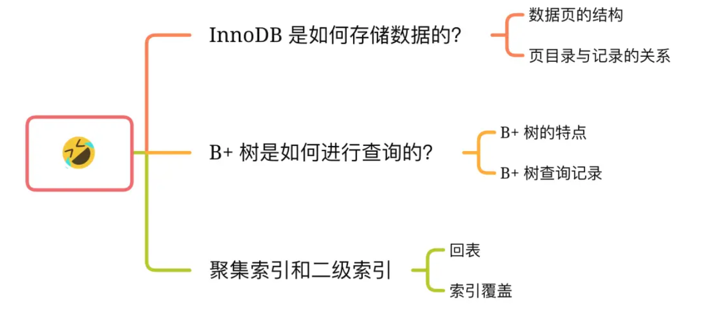
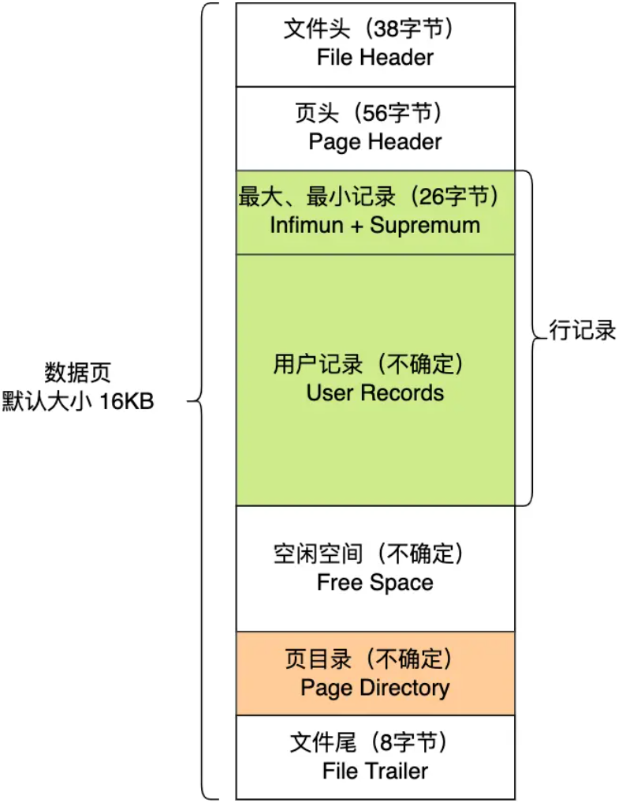
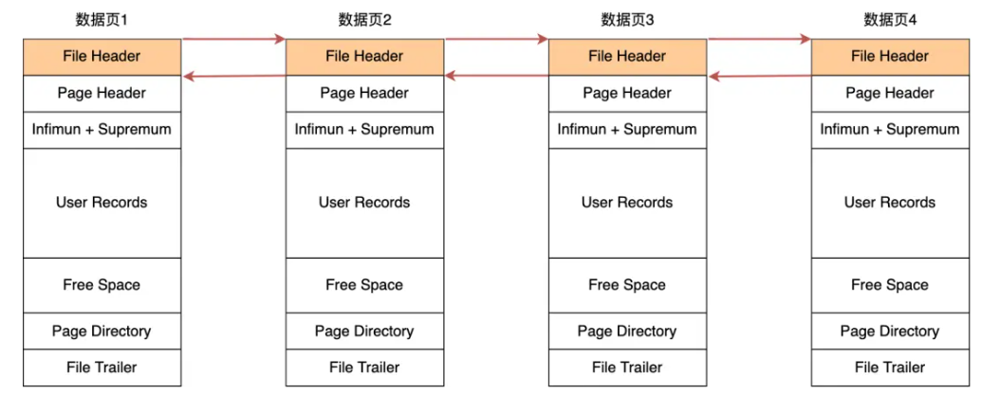
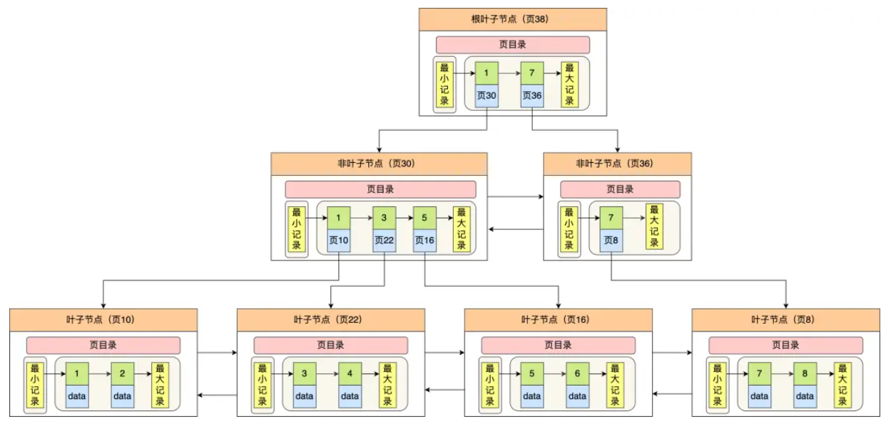

# 从数据页的角度看 B+ 树

 	

## InnoDB 是如何存储数据的？

**InnoDB 的数据是按「数据页」为单位来读写的**，也就是说，当需要读一条记录的时候，并不是将这个记录本身从磁盘读出来，而是以页为单位，将其整体读入内存。

数据库的 I/O 操作的最小单位是页，**InnoDB 数据页的默认大小是 16KB**，意味着数据库每次读写都是以 16KB 为单位的，一次最少从磁盘中读取 16K 的内容到内存中，一次最少把内存中的 16K 内容刷新到磁盘中。

在 File Header 中有两个指针，分别指向上一个数据页和下一个数据页，连接起来的页相当于一个双向的链表，如下图所示：

采用链表的结构是让数据页之间不需要是物理上的连续的，而是逻辑上的连续。

数据页的主要作用是存储记录，也就是数据库的数据，所以重点说一下数据页中的 **User Records** 是怎么组织数据的。

**数据页中的记录按照「主键」顺序组成单向链表**，单向链表的特点就是插入、删除非常方便，但是检索效率不高，最差的情况下需要遍历链表上的所有节点才能完成检索。

因此，数据页中有一个**页目录**，起到记录的索引作用

页目录创建的过程如下：

1. 将所有的记录划分成几个组，这些记录包括最小记录和最大记录，但不包括标记为“已删除”的记录；
2. 每个记录组的最后一条记录就是组内最大的那条记录，并且最后一条记录的头信息中会存储该组一共有多少条记录，作为 n_owned 字段（上图中粉红色字段）
3. 页目录用来存储每组最后一条记录的地址偏移量，这些地址偏移量会按照先后顺序存储起来，每组的地址偏移量也被称之为槽（slot），**每个槽相当于指针指向了不同组的最后一个记录**。

从图可以看到，**页目录就是由多个槽组成的，槽相当于分组记录的索引**。然后，因为记录是按照「主键值」从小到大排序的，所以**我们通过槽查找记录时，可以使用二分法快速定位要查询的记录在哪个槽（哪个记录分组），定位到槽后，再遍历槽内的所有记录，找到对应的记录**，无需从最小记录开始遍历整个页中的记录链表。

InnoDB 里的 B+ 树中的**每个节点都是一数据页**，结构示意图如下：

## 聚簇索引和二级索引

另外，索引又可以分成聚簇索引和非聚簇索引（二级索引），它们区别就在于叶子节点存放的是什么数据：

- 聚簇索引的叶子节点存放的是实际数据，所有完整的用户记录都存放在聚簇索引的叶子节点；
- 二级索引的叶子节点存放的是主键值，而不是实际数据。

二级索引的 B+ 树如下图，数据部分为主键值：

因此，**如果某个查询语句使用了二级索引，但是查询的数据不是主键值，这时在二级索引找到主键值后，需要去聚簇索引中获得数据行，这个过程就叫作「回表」，也就是说要查两个 B+ 树才能查到数据。不过，当查询的数据是主键值时，因为只在二级索引就能查询到，不用再去聚簇索引查，这个过程就叫作「索引覆盖」，也就是只需要查一个 B+ 树就能找到数据。**

## 总结

InnoDB 的数据是按「**数据页**」为单位来读写的，默认数据页大小为 16 KB。每个数据页之间通过**双向链表**的形式组织起来，物理上不连续，但是逻辑上连续。

数据页内包含用户记录，每个记录之间用**单向链表**的方式组织起来，为了加快在数据页内高效查询记录，设计了一个页目录，页目录存储各个槽（分组），且主键值是有序的，于是可以通过二分查找法的方式进行检索从而提高效率。

为了高效查询记录所在的数据页，InnoDB 采用 **b+ 树**作为索引，**每个节点都是一个数据页。**

如果叶子节点存储的是实际数据的就是聚簇索引，一个表只能有一个聚簇索引；如果叶子节点存储的不是实际数据，而是主键值则就是二级索引，一个表中可以有多个二级索引。

在使用二级索引进行查找数据时，如果查询的数据能在二级索引找到，那么就是「索引覆盖」操作，如果查询的数据不在二级索引里，就需要先在二级索引找到主键值，需要去聚簇索引中获得数据行，这个过程就叫作「回表」。