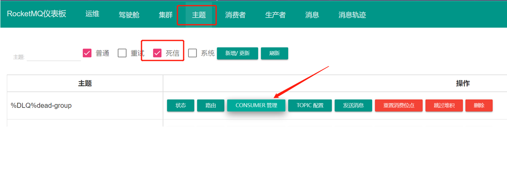

# 中文文档

https://github.com/apache/rocketmq/tree/master/docs/cn

# 官方文档

https://rocketmq.apache.org/zh/docs/4.x/bestPractice/01bestpractice#%E6%B6%88%E8%B4%B9%E8%BF%87%E7%A8%8B%E5%B9%82%E7%AD%89

# 1 和主流产品的比较


# 2 RocketMQ重要概念


**Producer**：消息的发送者，生产者；举例：发件人**

**Consumer**：消息接收者，消费者；举例：收件人**

**Broker**：暂存和传输消息的通道；举例：快递**

**NameServer**：管理Broker；举例：各个快递公司的管理机构相当于broker的注册中心，保留了broker的信息

**Queue**：队列，消息存放的位置，一个Broker中可以有多个队列

**Topic**：主题，消息的分类

ProducerGroup：生产者组 

ConsumerGroup：消费者组，多个消费者组可以同时消费一个主题的消息（**特别注意：同一个消费者组中的消费者必须订阅相同的topic+tag+key**）

**消息发送的流程**：Producer询问NameServer，NameServer分配一个broker 然后Consumer也要询问NameServer，得到一个具体的broker，然后消费消息（单机图）


# 3 RocketMQ快速入门

RocketMQ提供了发送多种发送消息的模式，例如同步消息，异步消息，顺序消息，延迟消息，事务消息等，我们一一学习

## 3.1 消息发送和监听的流程

### 3.1.1 消息生产者

1. 创建消息生产者producer，并制定生产者组名  

2. 指定Nameserver地址  

3. 启动producer  

4. 创建消息对象，指定主题Topic、Tag和消息体等  
5. 发送消息  
6. 关闭生产者producer  

### 3.1.2 消息消费者

1. 创建消费者consumer，制定消费者组名

2. 指定Nameserver地址

3. 创建监听订阅主题Topic和Tag等

4. 处理消息

5. 启动消费者consumer

## 3.2 搭建Rocketmq-demo

### 3.2.1 加入依赖

```XML
<dependencies>
    <dependency>
        <groupId>org.apache.rocketmq</groupId>
        <artifactId>rocketmq-client</artifactId>
        <version>4.9.2</version>
        <!--docker的用下面这个版本-->
		<version>4.4.0</version>
    </dependency>
    <dependency>
        <groupId>junit</groupId>
        <artifactId>junit</artifactId>
        <version>4.12</version>
    </dependency>
    <dependency>
        <groupId>org.projectlombok</groupId>
        <artifactId>lombok</artifactId>
        <version>1.18.22</version>
    </dependency>
</dependencies>

```

### 3.2.2 编写生产者

```JAVA
/**
 * 测试生产者
 *
 * @throws Exception
 */
@Test
public void testProducer() throws Exception {
    // 创建默认的生产者
    DefaultMQProducer producer = new DefaultMQProducer("test-group");
    // 设置nameServer地址
    producer.setNamesrvAddr("localhost:9876");
    // 启动实例
    producer.start();
    for (int i = 0; i < 10; i++) {
        // 创建消息
        // 第一个参数：主题的名字
        // 第二个参数：消息内容
        Message msg = new Message("TopicTest", ("Hello RocketMQ " + i).getBytes());
        SendResult send = producer.send(msg);
        System.out.println(send);
    }
    // 关闭实例
    producer.shutdown();
}

```

### 3.2.3 编写消费者

```JAVA
/**
     * 测试消费者
     *
     * @throws Exception
     */
    @Test
    public void testConsumer() throws Exception {
        // 创建默认消费者组
        DefaultMQPushConsumer consumer = new DefaultMQPushConsumer("consumer-group");
        // 设置nameServer地址
        consumer.setNamesrvAddr("localhost:9876");
        // 订阅一个主题来消费   *表示没有过滤参数 表示这个主题的任何消息
        consumer.subscribe("TopicTest", "*");
        // 注册一个消费监听 MessageListenerConcurrently 是多线程消费，默认20个线程，可以参看consumer.setConsumeThreadMax()
        consumer.registerMessageListener(new MessageListenerConcurrently() {
            @Override
            public ConsumeConcurrentlyStatus consumeMessage(List<MessageExt> msgs,
                                                            ConsumeConcurrentlyContext context) {
                System.out.println(Thread.currentThread().getName() + "----" + msgs);
                // 返回消费的状态 如果是CONSUME_SUCCESS 则成功，若为RECONSUME_LATER则该条消息会被重回队列，重新被投递
                // 重试的时间为messageDelayLevel = "1s 5s 10s 30s 1m 2m 3m 4m 5m 6m 7m 8m 9m 10m 20m 30m 1h 2h
                // 也就是第一次1s 第二次5s 第三次10s  ....  如果重试了18次 那么这个消息就会被终止发送给消费者
//                return ConsumeConcurrentlyStatus.CONSUME_SUCCESS;
                return ConsumeConcurrentlyStatus.RECONSUME_LATER;
            }
        });
        // 这个start一定要写在registerMessageListener下面
        consumer.start();
        System.in.read();
    }

```


**注意：一个topic假如有4个队列，同一个消费者组中的消费者会分配固定的队列进行监听**


**一次性可以拿到很多消息但是只有消费者成功消费了mq里面才会移动位点**

# 4 RocketMQ发送同步消息

上面的快速入门就是发送同步消息，发送过后会有一个返回值，也就是mq服务器接收到消息后返回的一个确认，这种方式非常安全，但是性能上并没有这么高，而且在mq集群中，也是要**等到所有的从机都复制了消息以后才会返回**，所以针对重要的消息可以选择这种方式。（快速入门就是同步消息）


# 5 RocketMQ发送异步消息

异步消息通常用在对响应时间敏感的业务场景，即发送端不能容忍长时间地等待Broker的响应。发送完以后会有一个异步消息通知

## 5.1 异步消息生产者

```java
@Test
public void testAsyncProducer() throws Exception {
    // 创建默认的生产者
    DefaultMQProducer producer = new DefaultMQProducer("test-group");
    // 设置nameServer地址
    producer.setNamesrvAddr("localhost:9876");
    // 启动实例
    producer.start();
    Message msg = new Message("TopicTest", ("异步消息").getBytes());
    producer.send(msg, new SendCallback() {
        @Override
        public void onSuccess(SendResult sendResult) {
            System.out.println("发送成功");
        }
        @Override
        public void onException(Throwable e) {
            System.out.println("发送失败");
        }
    });
    System.out.println("看看谁先执行");
    // 挂起jvm 因为回调是异步的不然测试不出来
    System.in.read();
    // 关闭实例
    producer.shutdown();
}
```

消费者同同步消息

# 6 RocketMQ发送单向消息

这种方式主要用在不关心发送结果的场景，这种方式吞吐量很大，但是存在消息丢失的风险，例如日志信息的发送

```java
@Test
public void testOnewayProducer() throws Exception {
    // 创建默认的生产者
    DefaultMQProducer producer = new DefaultMQProducer("test-group");
    // 设置nameServer地址
    producer.setNamesrvAddr("localhost:9876");
    // 启动实例
    producer.start();
    Message msg = new Message("TopicTest", ("单向消息").getBytes());
    // 发送单向消息
    producer.sendOneway(msg);
    // 关闭实例
    producer.shutdown();
}
```

消费者同同步消息

# 7 RocketMQ发送延迟消息

消息放入mq后，过一段时间，才会被监听到，然后消费

比如下订单业务，提交了一个订单就可以发送一个延时消息，30min后去检查这个订单的状态，如果还是未付款就取消订单释放库存。

```java
@Test
public void testDelayProducer() throws Exception {
    // 创建默认的生产者
    DefaultMQProducer producer = new DefaultMQProducer("test-group");
    // 设置nameServer地址
    producer.setNamesrvAddr("localhost:9876");
    // 启动实例
 	producer.start();
    Message msg = new Message("TopicTest", ("延迟消息").getBytes());
    // 给这个消息设定一个延迟等级
    // messageDelayLevel = "1s 5s 10s 30s 1m 2m 3m 4m 5m 6m 7m 8m 9m 10m 20m 30m 1h 2h
    msg.setDelayTimeLevel(3);
    // 发送单向消息
    producer.send(msg);
    // 打印时间
    System.out.println(new Date());
    // 关闭实例
    producer.shutdown();
}

```

# 8 RocketMQ发送批量消息

## 8.1 批量消息生产者

```java
@Test
public void testBatchProducer() throws Exception {
    // 创建默认的生产者
    DefaultMQProducer producer = new DefaultMQProducer("test-group");
    // 设置nameServer地址
    producer.setNamesrvAddr("localhost:9876");
    // 启动实例
    producer.start();
    List<Message> msgs = Arrays.asList(
            new Message("TopicTest", "我是一组消息的A消息".getBytes()),
            new Message("TopicTest", "我是一组消息的B消息".getBytes()),
            new Message("TopicTest", "我是一组消息的C消息".getBytes())
    );
    SendResult send = producer.send(msgs);
    System.out.println(send);
    // 关闭实例
    producer.shutdown();
}
```

## 8.2 批量消息消费者

```
@Test
public void testBatchConsumer() throws Exception {
    // 创建默认消费者组
    DefaultMQPushConsumer consumer = new DefaultMQPushConsumer("consumer-group");
    // 设置nameServer地址
    consumer.setNamesrvAddr("localhost:9876");
    // 订阅一个主题来消费   表达式，默认是*
     consumer.subscribe("TopicTest", "*");
    // 注册一个消费监听 MessageListenerConcurrently是并发消费
    // 默认是20个线程一起消费，可以参看 consumer.setConsumeThreadMax()
    consumer.registerMessageListener(new MessageListenerConcurrently() {
        @Override
        public ConsumeConcurrentlyStatus consumeMessage(List<MessageExt> msgs,
                                                        ConsumeConcurrentlyContext context) {
            // 这里执行消费的代码 默认是多线程消费
            System.out.println(Thread.currentThread().getName() + "----" + new String(msgs.get(0).getBody()));
            return ConsumeConcurrentlyStatus.CONSUME_SUCCESS;
        }
    });
    consumer.start();
    System.in.read();
}

```

这样会将这些批量数据添加到同一个队列里

# 9 RocketMQ发送顺序消息

消息有序指的是可以**按照消息的发送顺序来消费**(FIFO)。RocketMQ可以严格的保证消息有序，可以分为：分区有序或者全局有序。

可能大家会有疑问，mq不就是FIFO吗？

rocketMq的broker的机制，导致了rocketMq会有这个问题

因为一个broker中对应了四个queue


顺序消费的原理解析，在默认的情况下消息发送会采取Round Robin轮询方式把消息发送到不同的queue(分区队列)；而消费消息的时候从多个queue上拉取消息，这种情况发送和消费是不能保证顺序。但是如果控制发送的顺序消息只依次发送到同一个queue中，消费的时候只从这个queue上依次拉取，则就保证了顺序。当发送和消费参与的queue只有一个，则是全局有序；如果多个queue参与，则为分区有序，即相对每个queue，消息都是有序的。

下面用订单进行分区有序的示例。一个订单的顺序流程是：下订单、发短信通知、物流、签收。订单顺序号相同的消息会被先后发送到同一个队列中，消费时，同一个顺序获取到的肯定是同一个队列。

## 9.1 场景分析

模拟一个订单的发送流程，创建两个订单，发送的消息分别是

订单号111 消息流程 下订单->物流->签收

订单号112 消息流程 下订单->物流->拒收

## 9.2 创建一个订单对象

```java
@Data
@AllArgsConstructor
@NoArgsConstructor
public class Order {
    /**
     * 订单id
     */
    private Integer orderId;

    /**
     * 订单编号
     */
    private Integer orderNumber;
    
    /**
     * 订单价格
     */
    private Double price;

    /**
     * 订单号创建时间
     */
    private Date createTime;

    /**
     * 订单描述
     */
    private String desc;

}
```

## 9.3 顺序消息生产者

```java
@Test
public void testOrderlyProducer() throws Exception {
    // 创建默认的生产者
    DefaultMQProducer producer = new DefaultMQProducer("test-group");
    // 设置nameServer地址
    producer.setNamesrvAddr("localhost:9876");
    // 启动实例
    producer.start();
    List<Order> orderList = Arrays.asList(
            new Order(1, 111, 59D, new Date(), "下订单"),
            new Order(2, 111, 59D, new Date(), "物流"),
            new Order(3, 111, 59D, new Date(), "签收"),
            new Order(4, 112, 89D, new Date(), "下订单"),
            new Order(5, 112, 89D, new Date(), "物流"),
            new Order(6, 112, 89D, new Date(), "拒收")
    );
    // 循环集合开始发送
    orderList.forEach(order -> {
        Message message = new Message("TopicTest", order.toString().getBytes());
        try {
            // 发送的时候 相同的订单号选择同一个队列
            producer.send(message, new MessageQueueSelector() {
                @Override
                public MessageQueue select(List<MessageQueue> mqs, Message msg, Object arg) {
                    // 当前主题有多少个队列
                    int queueNumber = mqs.size();
                    // 这个arg就是后面传入的 order.getOrderNumber()
                    Integer i = (Integer) arg;
                    // 用这个值去%队列的个数得到一个队列
                    int index = i % queueNumber;
                    // 返回选择的这个队列即可 ，那么相同的订单号 就会被放在相同的队列里 实现FIFO了
                    return mqs.get(index);
                }
            }, order.getOrderNumber());
        } catch (Exception e) {
            System.out.println("发送异常");
        }
    });
    // 关闭实例
    producer.shutdown();
}

```

## 9.4 顺序消息消费者

```java
@Test
public void testOrderlyConsumer() throws Exception {
    // 创建默认消费者组
    DefaultMQPushConsumer consumer = new DefaultMQPushConsumer("consumer-group");
    // 设置nameServer地址
    consumer.setNamesrvAddr("localhost:9876");
    // 订阅一个主题来消费   *表示没有过滤参数 表示这个主题的任何消息
    consumer.subscribe("TopicTest", "*");
    // 注册一个消费监听 MessageListenerOrderly 是顺序消费 单线程消费
    consumer.registerMessageListener(new MessageListenerOrderly() {
        @Override
        public ConsumeOrderlyStatus consumeMessage(List<MessageExt> msgs, ConsumeOrderlyContext context) {
            MessageExt messageExt = msgs.get(0);
            System.out.println(new String(messageExt.getBody()));
            return ConsumeOrderlyStatus.SUCCESS;
        }
    });
    consumer.start();
    System.in.read();
}
```

# 10 RocketMQ发送带标签的消息，消息过滤

Rocketmq提供**消息过滤功能，通过tag或者key进行区分**

我们往一个主题里面发送消息的时候，根据业务逻辑，可能需要区分，比如带有tagA标签的被A消费，带有tagB标签的被B消费，还有在事务监听的类里面，只要是事务消息都要走同一个监听，我们也需要通过过滤才区别对待

## 10.1 标签消息生产者

```java
@Test
public void testTagProducer() throws Exception {
    // 创建默认的生产者
    DefaultMQProducer producer = new DefaultMQProducer("test-group");
    // 设置nameServer地址
    producer.setNamesrvAddr("localhost:9876");
    // 启动实例
    producer.start();
    Message msg = new Message("TopicTest","tagA", "我是一个带标记的消息".getBytes());
    SendResult send = producer.send(msg);
    System.out.println(send);
    // 关闭实例
    producer.shutdown();
}
```

## 10.2 标签消息消费者

```java
@Test
public void testTagConsumer() throws Exception {
    // 创建默认消费者组
    DefaultMQPushConsumer consumer = new DefaultMQPushConsumer("consumer-group");
    // 设置nameServer地址
    consumer.setNamesrvAddr("localhost:9876");
    // 订阅一个主题来消费   表达式，默认是*,支持"tagA || tagB || tagC" 这样或者的写法 只要是符合任何一个标签都可以消费
    consumer.subscribe("TopicTest", "tagA || tagB || tagC");
    // 注册一个消费监听 MessageListenerConcurrently是并发消费
    // 默认是20个线程一起消费，可以参看 consumer.setConsumeThreadMax()
    consumer.registerMessageListener(new MessageListenerConcurrently() {
        @Override
        public ConsumeConcurrentlyStatus consumeMessage(List<MessageExt> msgs,
                                                        ConsumeConcurrentlyContext context) {
            // 这里执行消费的代码 默认是多线程消费
            System.out.println(Thread.currentThread().getName() + "----" + new String(msgs.get(0).getBody()));
            System.out.println(msgs.get(0).getTags());
            return ConsumeConcurrentlyStatus.CONSUME_SUCCESS;
        }
    });
    consumer.start();
    System.in.read();
}
```

## 10.3 什么时候该用 Topic，什么时候该用 Tag？

总结：**不同的业务应该使用不同的Topic如果是相同的业务里面有不同的表现形式，那么我们要使用tag进行区分**

可以从以下几个方面进行判断：

1.消息类型是否一致：如普通消息、事务消息、定时（延时）消息、顺序消息，不同的消息类型使用不同的 Topic，无法通过 Tag 进行区分。

2.业务是否相关联：没有直接关联的消息，如淘宝交易消息，京东物流消息使用不同的 Topic 进行区分；而同样是天猫交易消息，电器类订单、女装类订单、化妆品类订单的消息可以用 Tag 进行区分。

3.消息优先级是否一致：如同样是物流消息，盒马必须小时内送达，天猫超市 24 小时内送达，淘宝物流则相对会慢一些，不同优先级的消息用不同的 Topic 进行区分。

4.消息量级是否相当：有些业务消息虽然量小但是实时性要求高，如果跟某些万亿量级的消息使用同一个 Topic，则有可能会因为过长的等待时间而“饿死”，此时需要将不同量级的消息进行拆分，使用不同的 Topic。

**总的来说，针对消息分类，您可以选择创建多个 Topic**，或者在同一个 Topic **下创建多个 Tag**。但通常情况下，不同的 Topic **之间的消息没有必然的联系，而 Tag** **则用来区分同一个 Topic** **下相互关联的消息，例如全集和子集的关系、流程先后的关系。**

# 11 RocketMQ中消息的Key

在rocketmq中的消息，默认会有一个messageId当做消息的唯一标识，我们也可以给消息携带一个key，用作唯一标识或者业务标识，包括在控制面板查询的时候也可以使用messageId或者key来进行查询


## 11.1 带key消息生产者

```java
@Test
public void testKeyProducer() throws Exception {
    // 创建默认的生产者
    DefaultMQProducer producer = new DefaultMQProducer("test-group");
    // 设置nameServer地址
    producer.setNamesrvAddr("localhost:9876");
    // 启动实例
    producer.start();
    Message msg = new Message("TopicTest","tagA","key", "我是一个带标记和key的消息".getBytes());
    SendResult send = producer.send(msg);
    System.out.println(send);
    // 关闭实例
    producer.shutdown();
}
```

## 11.2 带key消息消费者

```java
@Test
public void testKeyConsumer() throws Exception {
    // 创建默认消费者组
    DefaultMQPushConsumer consumer = new DefaultMQPushConsumer("consumer-group");
    // 设置nameServer地址
    consumer.setNamesrvAddr("localhost:9876");
    // 订阅一个主题来消费   表达式，默认是*,支持"tagA || tagB || tagC" 这样或者的写法 只要是符合任何一个标签都可以消费
    consumer.subscribe("TopicTest", "tagA || tagB || tagC");
    // 注册一个消费监听 MessageListenerConcurrently是并发消费
    // 默认是20个线程一起消费，可以参看 consumer.setConsumeThreadMax()
    consumer.registerMessageListener(new MessageListenerConcurrently() {
        @Override
        public ConsumeConcurrentlyStatus consumeMessage(List<MessageExt> msgs,
                                                        ConsumeConcurrentlyContext context) {
            // 这里执行消费的代码 默认是多线程消费
            System.out.println(Thread.currentThread().getName() + "----" + new String(msgs.get(0).getBody()));
            System.out.println(msgs.get(0).getTags());
            System.out.println(msgs.get(0).getKeys());
            return ConsumeConcurrentlyStatus.CONSUME_SUCCESS;
        }
    });
    consumer.start();
    System.in.read();
}
```

# 12 消费过程幂等

**RocketMQ无法避免消息重复（Exactly-Once）**，所以如果业务对消费重复非常敏感，务必要在**业务层面进行去重处理**。可以借助**关系数据库 mysql**进行去重，**或者redis**。首先需要确定消息的**唯一键**，可以是msgId，也可以是消息内容中的唯一标识字段，例如订单Id等。在消费之前判断唯一键是否在关系数据库中存在。如果不存在则插入，并消费，否则跳过。（实际过程要考虑原子性问题，判断是否存在可以尝试插入，如果报主键冲突，则插入失败，直接跳过）

msgId一定是全局唯一标识符，但是实际使用中，可能会存在相同的消息有两个不同msgId的情况（消费者主动重发、因客户端重投机制导致的重复等），这种情况就需要使业务字段进行重复消费。


# 13 RocketMQ重试机制

## 13.1 RocketMQ重试机制

```java
// 失败的情况重发3次
producer.setRetryTimesWhenSendFailed(3);
// 消息在1S内没有发送成功，就会重试
producer.send(msg, 1000);
```

## 13.2 消费者重试

在消费者放return ConsumeConcurrentlyStatus.RECONSUME_LATER;后就会执行重试

上图代码中说明了，我们再实际生产过程中，一般重试3-5次，如果还没有消费成功，则可以把消息签收了，通知人工等处理

```java
/**
 * 测试消费者
 *
 * @throws Exception
 */
@Test
public void testConsumer() throws Exception {
    // 创建默认消费者组
    DefaultMQPushConsumer consumer = new DefaultMQPushConsumer("consumer-group");
    // 设置nameServer地址
    consumer.setNamesrvAddr("localhost:9876");
    // 订阅一个主题来消费   *表示没有过滤参数 表示这个主题的任何消息
    consumer.subscribe("TopicTest", "*");
    // 注册一个消费监听
    consumer.registerMessageListener(new MessageListenerConcurrently() {
        @Override
        public ConsumeConcurrentlyStatus consumeMessage(List<MessageExt> msgs,
                                                        ConsumeConcurrentlyContext context) {
            try {
                // 这里执行消费的代码
                System.out.println(Thread.currentThread().getName() + "----" + msgs);
                // 这里制造一个错误
                int i = 10 / 0;
            } catch (Exception e) {
                // 出现问题 判断重试的次数
                MessageExt messageExt = msgs.get(0);
                // 获取重试的次数 失败一次消息中的失败次数会累加一次
                int reconsumeTimes = messageExt.getReconsumeTimes();
                if (reconsumeTimes >= 3) {
                    // 则把消息确认了，可以将这条消息记录到日志或者数据库 通知人工处理
                    return ConsumeConcurrentlyStatus.CONSUME_SUCCESS;
                } else {
                    return ConsumeConcurrentlyStatus.RECONSUME_LATER;
                }
            }
            return ConsumeConcurrentlyStatus.CONSUME_SUCCESS;
        }
    });
    consumer.start();
    System.in.read();
}
```

# 14 RocketMQ死信消息

当消费重试到达阈值以后，消息不会被投递给消费者了，而是进入了死信队列

当一条消息初次消费失败，RocketMQ会自动进行消息重试，达到最大重试次数后，若消费依然失败，则表明消费者在正常情况下无法正确地消费该消息。此时，该消息不会立刻被丢弃，而是将其发送到该消费者对应的特殊队列中，这类消息称为死信消息（Dead-Letter Message），存储死信消息的特殊队列称为死信队列（Dead-Letter Queue），死信队列是死信Topic下分区数唯一的单独队列。如果产生了死信消息，那对应的ConsumerGroup的死信Topic名称为%DLQ%ConsumerGroupName，**死信队列的消息将不会再被消费。可以利用RocketMQ Admin工具或者RocketMQ Dashboard上查询到对应死信消息的信息。我们也可以去监听死信队列，然后进行自己的业务上的逻辑**

## 14.1 消息生产者

```java
@Test
public void testDeadMsgProducer() throws Exception {
    DefaultMQProducer producer = new DefaultMQProducer("dead-group");
    producer.setNamesrvAddr("localhost:9876");
    producer.start();
    Message message = new Message("dead-topic", "我是一个死信消息".getBytes());
    producer.send(message);
    producer.shutdown();
}
```

## 14.2 消息消费者

```java
@Test
public void testDeadMsgConsumer() throws Exception {
    DefaultMQPushConsumer consumer = new DefaultMQPushConsumer("dead-group");
    consumer.setNamesrvAddr("localhost:9876");
    consumer.subscribe("dead-topic", "*");
    // 设置最大消费重试次数 2 次
    consumer.setMaxReconsumeTimes(2);
    consumer.registerMessageListener(new MessageListenerConcurrently() {
        @Override
        public ConsumeConcurrentlyStatus consumeMessage(List<MessageExt> msgs, ConsumeConcurrentlyContext context) {
            System.out.println(msgs);
            // 测试消费失败
            return ConsumeConcurrentlyStatus.RECONSUME_LATER;
        }
    });
    consumer.start();
    System.in.read();
}
```

## 14.3 死信消费者

注意权限问题


```java
@Test
public void testDeadMq() throws  Exception{
    DefaultMQPushConsumer consumer = new DefaultMQPushConsumer("dead-group");
    consumer.setNamesrvAddr("localhost:9876");
    // 消费重试到达阈值以后，消息不会被投递给消费者了，而是进入了死信队列
    // 队列名称 默认是 %DLQ% + 消费者组名
    consumer.subscribe("%DLQ%dead-group", "*");
    consumer.registerMessageListener(new MessageListenerConcurrently() {
        @Override
        public ConsumeConcurrentlyStatus consumeMessage(List<MessageExt> msgs, ConsumeConcurrentlyContext context) {
            System.out.println(msgs);
            // 处理消息 签收了
            return ConsumeConcurrentlyStatus.CONSUME_SUCCESS;
        }
    });
    consumer.start();
    System.in.read();
}
```

## 14.4 控制台显示




