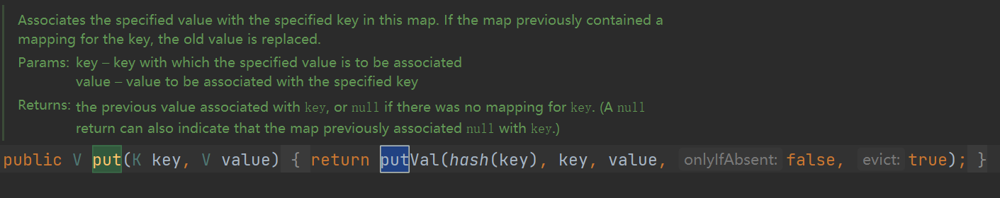
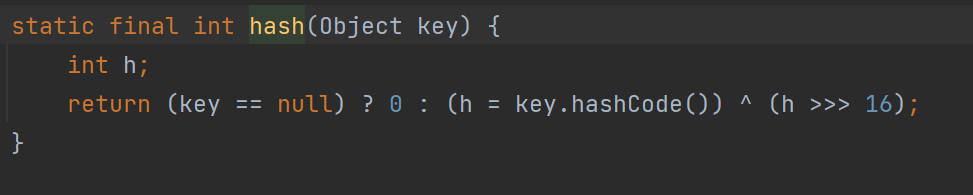
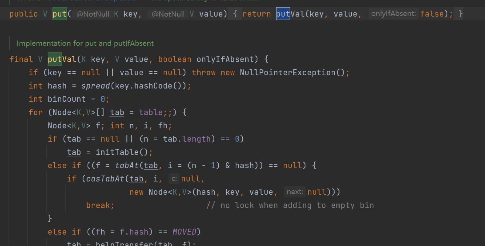
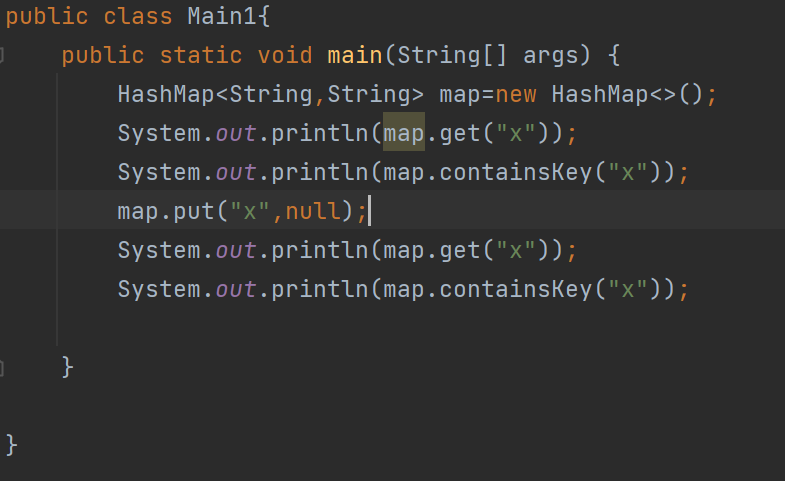
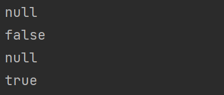

### HashMap 为什么线程不安全？

rehash时出现问题的情况：https://coolshell.cn/articles/9606.html


JDK1.7 及之前版本，在多线程环境下，`HashMap` 扩容时会造成死循环和数据丢失的问题。

数据丢失这个在 JDK1.7 和 JDK 1.8 中都存在，这里以 JDK 1.8 为例进行介绍。

JDK 1.8 后，在 `HashMap` 中，多个键值对可能会被分配到同一个桶（bucket），并以链表或红黑树的形式存储。**多个线程对 `HashMap` 的 `put` 操作会导致线程不安全，具体来说会有数据覆盖的风险。**

举个例子：

- 两个线程 1,2 同时进行 put 操作，并且发生了哈希冲突（hash 函数计算出的插入下标是相同的）。
- 不同的线程可能在不同的时间片获得 CPU 执行的机会，当前线程 1 执行完哈希冲突判断后，由于时间片耗尽挂起。线程 2 先完成了插入操作。
- 随后，线程 1 获得时间片，由于之前已经进行过 hash 碰撞的判断，所有此时会直接进行插入，这就导致线程 2 插入的数据被线程 1 覆盖了。

```java
public V put(K key, V value) {
    return putVal(hash(key), key, value, false, true);
}

final V putVal(int hash, K key, V value, boolean onlyIfAbsent,
                   boolean evict) {
    // ...
    // 判断是否出现 hash 碰撞
    // (n - 1) & hash 确定元素存放在哪个桶中，桶为空，新生成结点放入桶中(此时，这个结点是放在数组中)
    if ((p = tab[i = (n - 1) & hash]) == null)
        tab[i] = newNode(hash, key, value, null);
    // 桶中已经存在元素（处理hash冲突）
    else {
    // ...
}

```

还有一种情况是这两个线程同时 `put` 操作导致 `size` 的值不正确，进而导致数据覆盖的问题：

1. 线程 1 执行 `if(++size > threshold)` 判断时，假设获得 `size` 的值为 10，由于时间片耗尽挂起。
2. 线程 2 也执行 `if(++size > threshold)` 判断，获得 `size` 的值也为 10，并将元素插入到该桶位中，并将 `size` 的值更新为 11。
3. 随后，线程 1 获得时间片，它也将元素放入桶位中，并将 size 的值更新为 11。
4. 线程 1、2 都执行了一次 `put` 操作，但是 `size` 的值只增加了 1，也就导致实际上只有一个元素被添加到了 `HashMap` 中。

------

```
public V put(K key, V value) {
    return putVal(hash(key), key, value, false, true);
}

final V putVal(int hash, K key, V value, boolean onlyIfAbsent,
                   boolean evict) {
    // ...
    // 实际大小大于阈值则扩容
    if (++size > threshold)
        resize();
    // 插入后回调
    afterNodeInsertion(evict);
    return null;
}

```


# ConcurrentHashMap为什么key和value不能为null

## HashMap源码：





当key为null时，计算出的hash值为0，value放置在第0个桶上

## ConcurrentHashMap源码：



没有像HashMap一样先计算hash
先进行了判断key和value是否为null

## 为什么ConcurrentHashMap需要加空值校验呢？

因为存在二义性问题且ConcurrentHashMap没法解决

### 测试代码



### 代码分析

22行：获取test的value
23行：containsKey判断是否有test
24行：增加test和null值
25行：再次获取test的value
26行：containsKey再次判断是否有test



get方法获取到的value的结果都为null。所以当我们用get方法获取到一个value为null的时候，这里会产生二义性：

1. 可能没有test这个key
2. 可能有test这个key，只不过value为null

### HashMap如何解决二义性问题

containsKey方法的结果一个为false一个为true，可以通过这个方法来区分上面说道的二义性问题

```java
public boolean containsKey(Object key) {
    return getNode(hash(key), key) != null;
}
```

- 如果存在key为null的元素（key=null对应的hash值=0），getNode获取到值不为null；
- 如果不存在key为null的元素，此时hash值=0对应的下标元素为null，即getNode获取到的值为null；

### ConcurrentHashMap为什么不能解决二义性问题

因为ConcurrentHashMap是线程安全的，一般使用在**并发环境**下，**你一开始get方法获取到null之后，再去调用containsKey方法，没法确保get方法和containsKey方法之间，没有别的线程来捣乱，刚好把你要查询的对象设置了进去或者删除掉了。**

