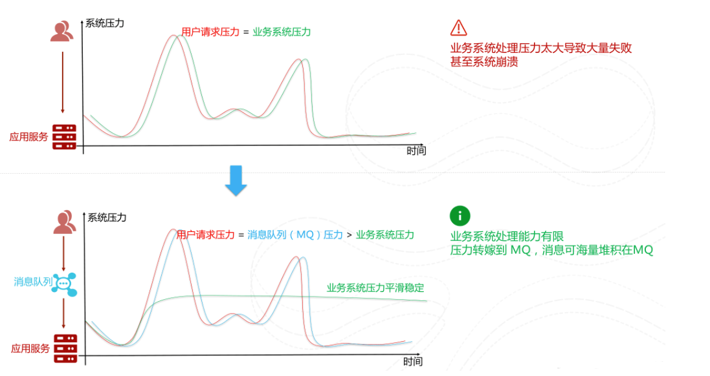
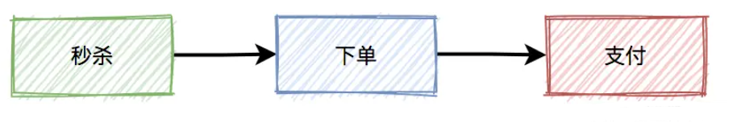

为什么秒杀系统的设计是一个难点呢?是因为它的业务复杂么?当然不是!


秒杀系统的业务逻辑非常简单，一般就是下订单减库存，难点在于我们如何保障秒杀能够顺利进行。


- 秒杀开始的时候，会有大量用户同时参与进来，因此秒杀系统一定要满足**高并发和高性能**。
- 为了保证秒杀整个流程的顺利进行，整个秒杀系统必须要满足**高可用**。
- 除此之外，由于商品的库存有限，在面对大量订单的情况下，一定不能超卖，我们还需要保证**一致性**。


知道了秒杀系统的特点之后，我们站在技术层面来思考一下:“设计秒杀系统的过程中需要重点关注哪些问题”。

1．参与秒杀的商品属于热点数据，我们该**如何处理热点数据**?

2．商品的库存有限，在面对大量订单的情况下，**如何解决超卖**的问题?

3．如果系统用了消息队列，如何**保证消息队列不丢失消息**?

4．如何保证秒杀系统的**高可用**?

5．如何对项目进行**压测**? 有哪些工具?


# 高性能


## 热点数据处理


根据热点数据的特点，我们通常将其分为两类:

- **静态**热点数据︰可以提前预测到的热点数据。比如要秒杀的商品。

- **动态**热点数据︰不能够提前预测到的热点数据，需要通过一些手段动态检测系统运行情况产生。


### 如何检测热点数据


另外，我们平时使用Redis 做缓存比较多，关于如何快速定位Redis 热点数据，可以看下https://www.infoq.cn/article/3l3zaq4h8xpnom2glsyi

### 如何处理热点数据

热点数据**一定要放在缓存中**，并且最好可以写入到jvm内存一份(**多级缓存**)，并设置个过期时间。需要注意写入到jvm的热点数据不宜过多，避免内存占用过大，一定要设置到淘汰策略。

为什么还要放在jvm内存一份?因为放在jvm内存中的数据访问速度是最快的，不存在什么网络开销。


## 静态资源处理-页面静态化

秒杀页面可能涉及到很多静态资源比如商品图片、CSS、JS。秒杀开始之前以及进行中的时候，会有大量的用户点开页面，有的用户还会不断的刷新秒杀界面。如果这些界面中的静态资源全部通过服务器获取，会造成大量的带宽消耗，甚至造成秒杀还没开始服务器就崩了。


对于这些静态资源，我们可以使用CDN进行处理，这是业内目前比较成熟的解决方案。


## 读多写少

在秒杀的过程中，系统一般会先查一下库存是否足够，如果足够才允许下单，写数据库。如果不够，则直接返回该商品已经抢完。

这是非常典型的：`读多写少` 的场景。


如果有数十万的请求过来，同时通过数据库查缓存是否足够，此时数据库可能会挂掉。因为数据库的连接资源非常有限，比如：mysql，无法同时支持这么多的连接。

而应该改用缓存，比如：redis。


## 


# 高可用


## 集群化

如果我们想要保证系统中某一个组件的高可用，往往需要搭建集群来避免单点风险，比如说Nginx集群、Kafka 集群、Redis 集群。

我们拿Redis来举例说明。如果我们需要保证Redis高可用的话，该怎么做呢?

你直接通过Redis replication(异步复制)搞个一主(master)多从(slave)来提高可用性和读吞吐量，slave的多少取决于你的读吞吐量。


## 限流

> 限流是秒杀业务最常用的一个手段，所以经常你一参加秒杀就会提示“当前人数过多，请稍后再试”。

目前有两种常用的限流方式：

1. 基于nginx限流
2. 基于redis限流

### 接口限流

限流是从用户访问压力的角度来考虑如何应对系统故障。接口限流是为了对服务端的接口接受请求的频率进行限制，防止服务挂掉。

举个例子:我们的秒杀接口一秒只能处理10w个请求，结果秒杀活动刚开始一下子来了15w个请求。这肯定不行啊!我们**只能通过限流把5w个请求给拦截住**，不然系统直接就给整挂掉了!

接口限流的话可以直接用**Redis**来做（建议基于Lua脚本)，也可以使用现成的流量控制组件比如**Sentinel** ， **Hystrix** ，**Resilience4J**。

Hystrix是Netflix开源的熔断降级组件。

Sentinel是阿里巴巴体提供的面向分布式服务架构的流量控制组件，经历了淘宝近10年双11 (11.11)购物节的所有核心场景（比如秒杀活动)的考验。Sentinel主要以流量为切入点，提供**流量控制**、**熔断降级**、**系统自适应保护**等功能来保护系统的稳定性和可用性。

除了直接对**接口进行限流**之外，我们还可以对**用户、IP进行限流**，限制同一用户以及IP单位时间内可以请求接口的次数。


### 对同一用户限流

为了防止某个用户，请求接口次数过于频繁，可以只针对该用户做限制。


限制同一个用户id，比如每分钟只能请求5次接口。

###  对同一ip限流

有时候只对某个用户限流是不够的，有些高手可以模拟多个用户请求，这种nginx就没法识别了。

这时需要加同一ip限流功能。


限制同一个ip，比如每分钟只能请求5次接口。

**但这种限流方式可能会有误杀的情况，比如同一个公司或网吧的出口ip是相同的，如果里面有多个正常用户同时发起请求，有些用户可能会被限制住。**

### 对接口限流

别以为限制了用户和ip就万事大吉，有些高手甚至可以使用代理，每次都请求都换一个ip。

这时可以限制请求的接口总次数。


在高并发场景下，这种限制对于系统的稳定性是非常有必要的。但可能由于有些非法请求次数太多，达到了该接口的请求上限，而影响其他的正常用户访问该接口。看起来有点得不偿失。

### 加验证码

相对于上面三种方式，加验证码的方式可能更精准一些，同样能限制用户的访问频次，但好处是不会存在误杀的情况。


我们可以在用户发起秒杀请求之前让其进行答题或者输入验证码。**用户带着验证码请求接口**。这种方式一方面可以避免用户请求过于集中，另一方面可以有效解决用户使用脚本作弊。

回答问题/验证码这一步**建议除了对答案的正确性做校验，还需要对用户的提交时间做校验**，比如提交时间过短(<1s)的话，大概就是使用脚本来处理的。


**提前预约**

采用提前预约才能参加秒杀活动的方式过滤一批人。并且，我们在秒杀活动开始之前，还可以对预约的这些人进行筛选，通过某些方式找出潜在的黄牛。


## 流量削峰

对于突发的大流量我们还可以使用消息队列进行流量削峰。

秒杀开始之后的流量不是很大，我处理不了嘛!那我就先把这些请求放到消息队列中去。然后，咱后端服务再慢慢根据自己的能力去消费这些消息，这样就避免直接把后端服务打垮掉。



不过，如果你已经对接口进行的限流处理的话，这里其实就没必要再上消息队列了。


## 降级

降级是从**系统功能优先级**的角度考虑如何应对系统故障。

服务降级指的是当服务器压力剧增的情况下，根据当前业务情况及流量对一些服务和页面有策略的降级，以此释放服务器资源以保证核心任务的正常运行。降级的核心思想就是**丢车保帅，优先保证核心业务**。

举个例子:当请求量达到一个阈值的时候，我们对系统中一些非核心的功能直接关闭或者让它们功能降低。这样的话，系统就有更多的资源留给秒杀功能了!


## 熔断

熔断和降级是两个比较容易混淆的概念，两者的含义并不相同。降级的目的在于应对系统自身的故障，而熔断的目的在于应对当前系统依赖的外部系统或者第三方系统的故障。

熔断可以防止因为秒杀交易影响到其他正常服务的提供

举个例子:秒杀功能位于服务A上，服务A上同时还有其他的一些功能比如商品管理。如果服务A上的商品管理接口响应非常慢的话，其他服务直接不再请求服务A上的商品管理这个接口，从而有效避免其他服务被拖慢甚至拖死。


# 一致性


## 减库存方案

一般情况下是 **下单减扣库存** ，像现在的购物网站比如京东

不过，我们还会对业务逻辑做进一步优化，比如说对**超过一定时间不付款的订单特殊处理，释放库存**。

所以，在这里引出了一个`预扣库存`的概念，预扣库存的主要流程如下：


扣减库存中除了上面说到的`预扣库存`和`回退库存`之外，还需要特别注意的是**库存不足和库存超卖**问题。

redis的`incr`方法是原子性的，可以用该方法扣减库存。伪代码如下：

```java
 boolean exist = redisClient.query(productId,userId);
  if(exist) {
    return -1;
  }
  int stock = redisClient.queryStock(productId);
  if(stock <=0) {
    return 0;
  }
  redisClient.incrby(productId, -1);
  redisClient.add(productId,userId);
return 1;
```

代码流程如下：

1. 先判断该用户有没有秒杀过该商品，如果已经秒杀过，则直接返回-1。
2. 查询库存，如果库存小于等于0，则直接返回0，表示库存不足。
3. 如果库存充足，则扣减库存，然后将本次秒杀记录保存起来。然后返回1，表示成功。

有什么问题呢？

如果在高并发下，有多个请求同时查询库存，当时都大于0。由于查询库存和更新库存非原则操作，则会出现库存为负数的情况，即`库存超卖`。

当然有人可能会说，**加个`synchronized`不就解决问题**？

加`synchronized`确实能解决库存为负数问题，但是这样会导致接口性能急剧下降，每次查询都需要竞争同一把锁，显然不太合理。

### lua脚本扣减库存

我们都知道lua脚本，是能够保证原子性的，它跟redis一起配合使用，能够完美解决上面的问题。

我们上面也说，我们一般会提前将秒杀商品的信息放到缓存中去。我们可以通过Redis对库存进行原子操作。通过Lua脚本来减少多个命令的网络开销并保证多个命令整体的原子性。伪代码如下（非常经典的lua代码）:

```java
  StringBuilder lua = new StringBuilder();
  lua.append("if (redis.call('exists', KEYS[1]) == 1) then");
  lua.append("    local stock = tonumber(redis.call('get', KEYS[1]));");
  lua.append("    if (stock == -1) then");
  lua.append("        return 1;");
  lua.append("    end;");
  lua.append("    if (stock > 0) then");
  lua.append("        redis.call('incrby', KEYS[1], -1);");
  lua.append("        return stock;");
  lua.append("    end;");
  lua.append("    return 0;");
  lua.append("end;");
  lua.append("return -1;");	
```

该代码的主要流程如下：

1. 先判断商品id是否存在，如果不存在则直接返回。
2. 获取该商品id的库存，判断库存如果是-1，则直接返回，表示不限制库存。
3. 如果库存大于0，则扣减库存。
4. 如果库存等于0，是直接返回，表示库存不足。


**当秒杀刚刚开始时，缓存中没有热点数据的key，那么这时每个用户的请求都会直接打到数据库中，导致数据库瘫痪**

解决方法：

1. 预先缓存：秒杀开始之前将热点数据缓存到redis
2. 加分布式锁：每次只允许一个请求去读数据库然后写回缓存（redisson）

## mq异步处理

我们都知道在真实的秒杀场景中，有三个核心流程：



而这三个核心流程中，真正并发量大的是秒杀功能，下单和支付功能实际并发量很小。所以，我们在设计秒杀系统时，有必要把**下单和支付功能从秒杀的主流程中拆分出来**，特别是下单功能要做成**mq异步处理**的。而支付功能，比如支付宝支付，是业务场景本身保证的异步。

于是，秒杀后下单的流程变成如下：


### 消息丢失问题


秒杀成功了，往mq发送下单消息的时候，有可能会失败。原因有很多，比如：网络问题、broker挂了、mq服务端磁盘问题等。这些情况，都可能会造成消息丢失。

那么，**如何防止消息丢失呢？**

答：**加一张消息发送表。**


在生产者发送mq消息之前，先把该条消息写入消息发送表，初始状态是待处理，然后再发送mq消息。消费者消费消息时，处理完业务逻辑之后，再回调生产者的一个接口，修改消息状态为已处理。

如果生产者把消息写入消息发送表之后，再发送mq消息到mq服务端的过程中失败了，造成了消息丢失。

这时候，要如何处理呢？

答：使用job，增加重试机制。


### 重复消费问题

**RocketMQ、Kafka等消息队列的说明中已经明确表示，消息队列本身不能处理和避免重复消费的情况，这需要业务人员自己处理。**

其实就是接口的幂等性

- **强校验（数据库的方式）** 一般与金融相关的操作都是强校验的 （人在996，锅从天上来 偷跑) 比如消费者是一个打款服务，在付款成功后都加一条流水记录。且两个操作放入一个事务中。 再次消费的时候就去流水表查一下有没有这条纪录，如果有表示已经消费过了，直接返回。流水表也能起到对账的作用！ 一些简单的场景也可以依赖数据库唯一约束实现
- **弱校验** 这个就没那么严格，重复一下也没那么重要的情况。 可以将ID保存在redis set中，过期时间看情况设置。 如果ID不能保证唯一可以选择生产方生成一个token存入redis，消费方在消费后将其删除（redis的操作能够保证其原子性，删除失败会返回0）


### 延迟消费问题

通常情况下，如果用户秒杀成功了，下单之后，在15分钟之内还未完成支付的话，该订单会被自动取消，回退库存。

那么，在15分钟内未完成支付，订单被自动取消的功能，要如何实现呢？

我们首先想到的可能是job，因为它比较简单。

但job有个问题，需要每隔一段时间处理一次，实时性不太好。

还有更好的方案？

答：使用延迟队列。

我们都知道rocketmq，自带了延迟队列的功能。


下单时消息生产者会先生成订单，此时状态为待支付，然后会向延迟队列中发一条消息。达到了延迟时间，消息消费者读取消息之后，会查询该订单的状态是否为待支付。如果是待支付状态，则会更新订单状态为取消状态。如果不是待支付状态，说明该订单已经支付过了，则直接返回。

## 接口幂等

什么是幂等呢?在分布式系统中，幂等(idempotency)是对请求操作结果的一个描述，**这个描述就是不论执行多少次相同的请求，产生的效果和返回的结果都和发出单个请求是一样的。**

举个例子:假如咱们的前后端没有保证接口幂等性，我作为用户在秒杀商品的时候，我同时点击了多次秒杀商品按钮，后端处理了多次相同的订单请求，结果导致一个人秒杀了多个商品。这个肯定是不能出现的，属于非常严重的bug 了!

前端保证幂等性的话比较简单，一般通过当用户提交请求后将按钮致灰来做到。后端保证幂等性就稍微麻烦一点，方法也是有很多种，比如:

1. 同步锁;
2. 分布式锁;  我们通过加锁的方式限制用户在第一次请求未结束之前，无法进行第二次请求。
3. 业务字段添加唯一性索引

