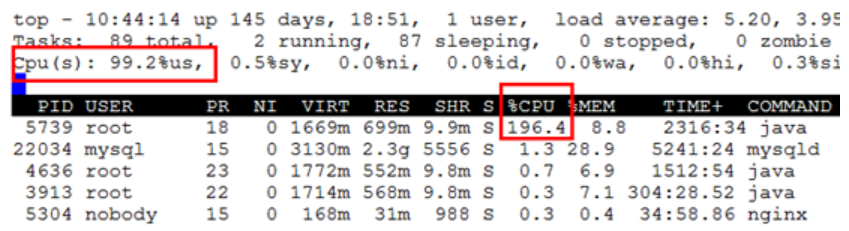
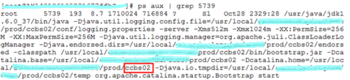
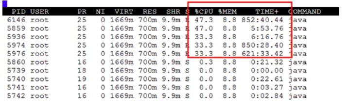
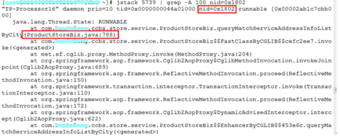
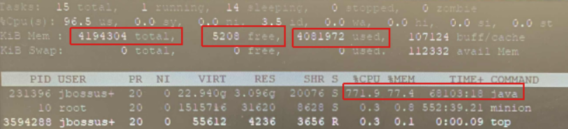
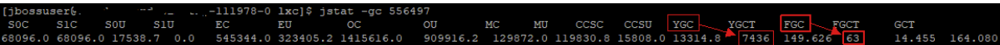

### 1. 使用top查看系统的资源占用情况

并按大写P以cpu利用率排序

连到生产服务器，执行top命令，发现双核的CPU几乎全被一个PID为5739的进程给用掉了，99.2%的用户空间（也可以叫用户态）消耗，极有可能是出现了死循环。

一般来说java程序cpu利用率过高会有两个原因

（1）执行任务的java线程本身存在bug，死循环或者操作本身耗cpu，导致cpu占用过高

（2）jvm发生频繁gc，导致cpu过高

### 2. 使用ps命令查看进程对应的是哪个程序

可以看出，罪魁祸首是ccbs。这里也可以使用jps命令。

### 3. 使用top -p [PID] -H 观察该进程中所有线程的资源占用

执行 top -p 5739 -H

| 参数 | 说明                                     |
| :--- | :--------------------------------------- |
| -p   | 需要监控的进程id                         |
| -H   | 显示每个线程的情况，否则就是进程的总状态 |

发现若干线程实时CPU占用率（%CPU）较高，并且处理机使用时间（TIME+）非常长，6146线程实际占有处理机852分钟40.44秒，那么如何知道这个线程正在干嘛呢？**我猜测Java这么成熟的平台，肯定有可以解决问题的工具，毕竟这样的问题很多人都会遇到**。

### 4.使用jstack查看线程快照

通过在搜索引擎中查找，我得知通过jstack可以生成java虚拟机当前时刻的线程快照。
执行jstack 5739 | grep -A 100 nid=0x1802

**使用命令 jstack [java进程pid] | grep [线程id十六进制值] -A 30**（-A 30表示向下打印30行）

jstack后面的参数是PID的值，nid的含义是操作系统映射的线程id，可以通过nid的值过滤上面占用CPU较高的6146线程，**线程id需要转成十六进制，并且字母要小写**。
通过观察输出，可以看到线程长期处于可运行状态，直接根据堆栈信息找到对应的代码。

**至此即可排查java程序内部错误**

### 5.排查gc问题

首先确定当前内存消耗情况，使用top命令或者查看设备监控管理系统，确定内存利用率达97%：

### 确认gc次数

使用命令 jstat -gc [java进程ID]：

***YGC，表示 Young GC，也就是Minor GC，发生在新生代中的GC\***

***FGC，表示 Full GC，发生在整个堆中的GC\***

S0C：第一个幸存区的大小
S1C：第二个幸存区的大小
S0U：第一个幸存区的使用大小
S1U：第二个幸存区的使用大小
EC：伊甸园区的大小
EU：伊甸园区的使用大小
OC：老年代大小
OU：老年代使用大小
MC：方法区大小
MU：方法区使用大小
CCSC:压缩类空间大小
CCSU:压缩类空间使用大小
YGCT：年轻代垃圾回收消耗时间
FGCT：老年代垃圾回收消耗时间
GCT：垃圾回收消耗总时间 

**结合上图可知，程序运行以来共发生7436次YGC，63次FGC，gc次数较多**

**基本可以说明存在频繁GC导致cpu占用高的问题**

如果发现FGC次数和频率很高,那么不用怀疑,你的程序肯定哪里写的有问题。这个时候就需要用jstack和jmap去分析堆内存使用情况

### 使用命令**jmap** 内存堆存储快照

**jmap -dump:format=b,file=/tmp/my.hprof [java进程id]**

然后使用内存分析工具，如Eclipse Memory Analyzer等分析**my.hprof**文件，分析内存那块占用大，存在内存泄露，导致空间无法释放。

专用软件如**jprofiler** 分析出什么对象占用了大量空间