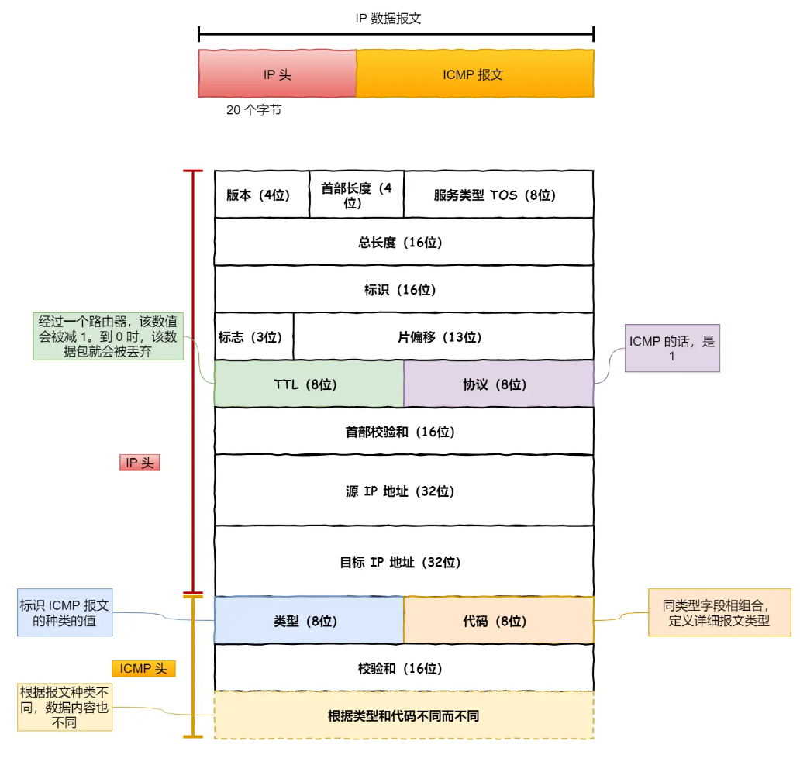
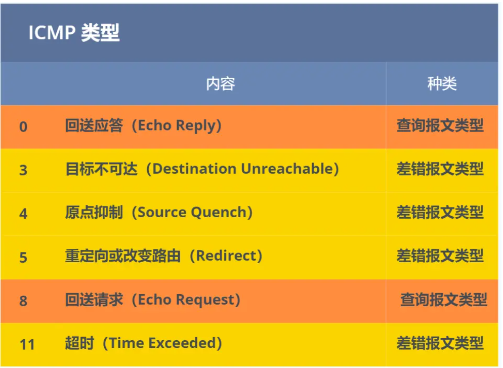

## IP 基本认识

IP 在 TCP/IP 参考模型中处于第三层，也就是**网络层**。

网络层的主要作用是：**实现主机与主机之间的通信，也叫点对点（end to end）通信。**

## IP协议的助手 —— ICMP 协议

ping 是基于 `ICMP` 协议工作的，所以要明白 ping 的工作，首先我们先来熟悉 **ICMP 协议**。

> ICMP 是什么？

ICMP 全称是 **Internet Control Message Protocol**，也就是**互联网控制报文协议**。

`ICMP` 主要的功能包括：

1. 确认 IP 包是否成功送达目标地址
2. 报告发送过程中 IP 包被废弃的原因
3. 改善网络设置

ICMP 报文是**封装**在 IP 包里面，它工作在网络层，是 IP 协议的助手。

ICMP 包头的**类型**字段，大致可以分为两大类：

- 一类是用于诊断的查询消息，也就是「**查询报文类型**」
- 另一类是通知出错原因的错误消息，也就是「**差错报文类型**」

## ping —— 查询报文类型的使用

ping 这个程序是**使用了 ICMP 里面的 ECHO REQUEST（类型为 8 ） 和 ECHO REPLY （类型为 0）**。