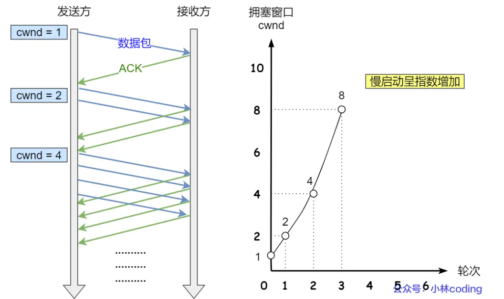
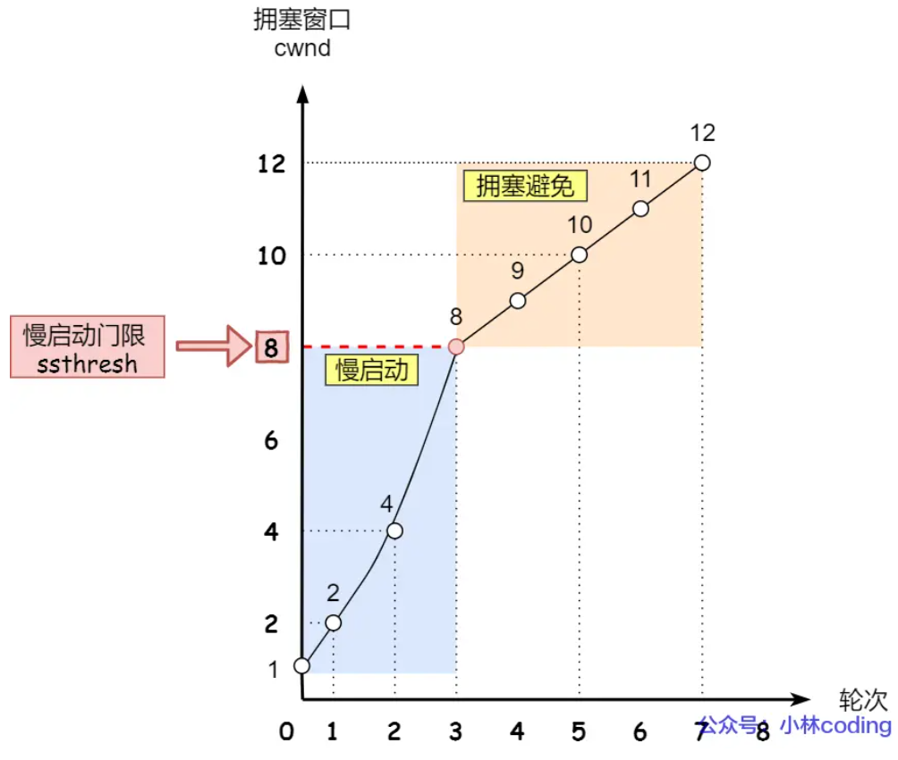
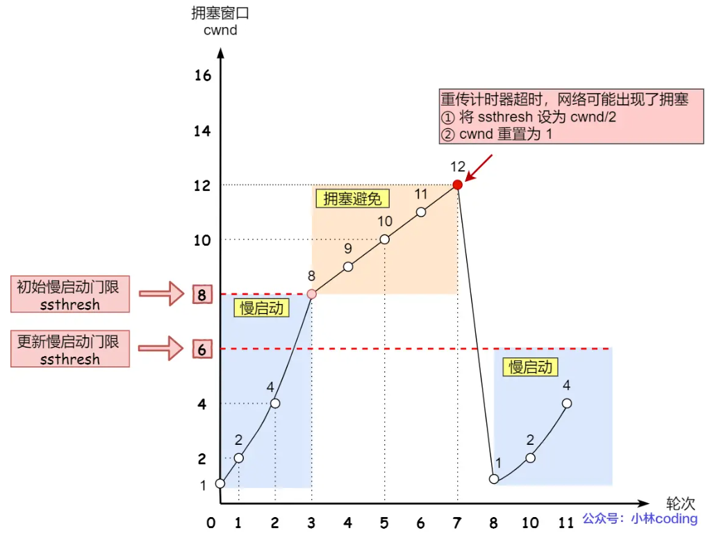
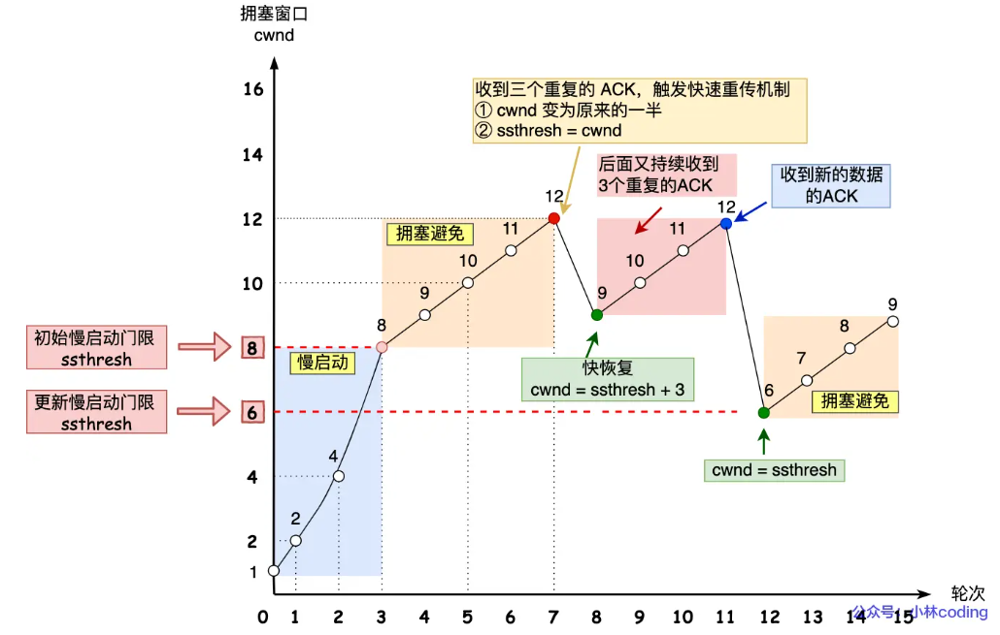
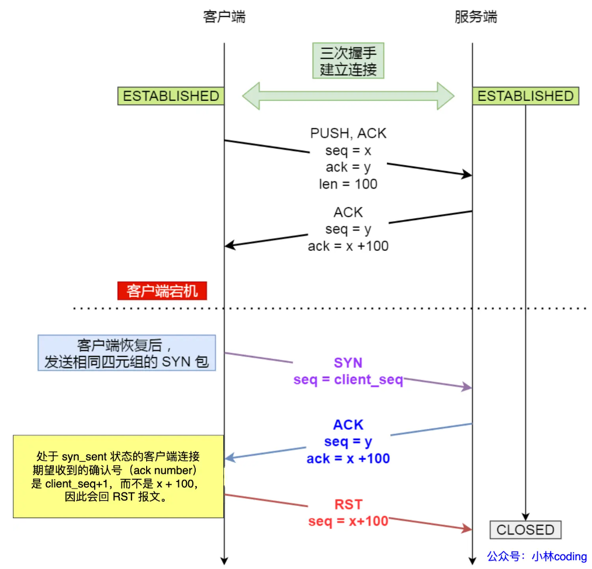

## TCP 基本认识

### TCP 头格式有哪些？


**序列号**：在建立连接时由计算机生成的随机数作为其初始值，通过 SYN 包传给接收端主机，每发送一次数据，就「累加」一次该「数据字节数」的大小。**用来解决网络包乱序问题。**

**确认应答号**：指下一次「期望」收到的数据的序列号，发送端收到这个确认应答以后可以认为在这个序号以前的数据都已经被正常接收。**用来解决丢包的问题。**

**控制位：**（表示该包的期望作用）

- *ACK*：该位为 `1` 时，「确认应答」的字段变为有效，TCP 规定除了最初建立连接时的 `SYN` 包之外该位必须设置为 `1` 。
- *RST*：该位为 `1` 时，表示 TCP 连接中出现异常必须强制断开连接。
- *SYN*：该位为 `1` 时，表示希望建立连接，并在其「序列号」的字段进行序列号初始值的设定。
- *FIN*：该位为 `1` 时，表示今后不会再有数据发送，希望断开连接。当通信结束希望断开连接时，通信双方的主机之间就可以相互交换 `FIN` 位为 1 的 TCP 段。

### 为什么需要 TCP 协议？ TCP 工作在哪一层？

`IP` 层是「不可靠」的，它不保证网络包的交付、不保证网络包的按序交付、也不保证网络包中的数据的完整性。

如果需要保障网络数据包的可靠性，那么就需要由上层（传输层）的 `TCP` 协议来负责。

因为 TCP 是一个工作在**传输层**的**可靠**数据传输的服务，它能确保接收端接收的网络包是**无损坏、无间隔、非冗余和按序的。**

### 什么是 TCP ？

- TCP 是**面向连接的、可靠的、基于字节流**的传输层通信协议。

- **可靠的**：无论的网络链路中出现了怎样的链路变化，TCP 都可以保证一个报文一定能够到达接收端；

- **字节流**：用户消息通过 TCP 协议传输时，消息可能会被操作系统「分组」成多个的 TCP 报文，如果接收方的程序如果不知道「消息的边界」，是无法读出一个有效的用户消息的。并且 TCP 报文是「有序的」，当「前一个」TCP 报文没有收到的时候，即使它先收到了后面的 TCP 报文，那么也不能扔给应用层去处理，同时对「重复」的 TCP 报文会自动丢弃。

### 如何唯一确定一个 TCP 连接呢？


源地址和目的地址的字段（32 位）是在 IP 头部中，作用是通过 IP 协议发送报文给对方主机。

源端口和目的端口的字段（16 位）是在 TCP 头部中，作用是告诉 TCP 协议应该把报文发给哪个进程。

> 有一个 IP 的服务端监听了一个端口，它的 TCP 的最大连接数是多少？
>
> 服务端通常固定在某个本地端口上监听，等待客户端的连接请求。
>
> 因此，客户端 IP 和端口是可变的，其理论值计算公式如下:
>
> 
>
> 对 IPv4，客户端的 IP 数最多为 `2` 的 `32` 次方，客户端的端口数最多为 `2` 的 `16` 次方，也就是服务端单机最大 TCP 连接数，约为 `2` 的 `48` 次方。

### UDP 和 TCP 有什么区别呢？分别的应用场景是？

UDP 不提供复杂的控制机制，利用 IP 提供面向「无连接」的通信服务。

UDP 协议真的非常简，头部只有 `8` 个字节（64 位），UDP 的头部格式如下：


**TCP 和 UDP 区别：**

*1. 连接*

- TCP 是面向连接的传输层协议，传输数据前先要建立连接。
- UDP 是不需要连接，即刻传输数据。

*2. 服务对象*

- TCP 是一对一的两点服务，即一条连接只有两个端点。
- UDP 支持一对一、一对多、多对多的交互通信

*3. 可靠性*

- TCP 是可靠交付数据的，数据可以无差错、不丢失、不重复、按序到达。
- UDP 是尽最大努力交付，不保证可靠交付数据。但是我们可以基于 UDP 传输协议实现一个可靠的传输协议，比如 QUIC 协议，具体可以参见这篇文章：[如何基于 UDP 协议实现可靠传输？(opens new window)](https://xiaolincoding.com/network/3_tcp/quic.html)

*4. 拥塞控制、流量控制*

- TCP 有拥塞控制和流量控制机制，保证数据传输的安全性。
- UDP 则没有，即使网络非常拥堵了，也不会影响 UDP 的发送速率。

*5. 首部开销*

- TCP 首部长度较长，会有一定的开销，首部在没有使用「选项」字段时是 `20` 个字节，如果使用了「选项」字段则会变长的。
- UDP 首部只有 8 个字节，并且是固定不变的，开销较小。

*6. 传输方式*

- TCP 是流式传输，没有边界，但保证顺序和可靠。
- UDP 是一个包一个包的发送，是有边界的，但可能会丢包和乱序。

*7. 分片不同*

- TCP 的数据大小如果大于 MSS 大小，则会在传输层进行分片，目标主机收到后，也同样在传输层组装 TCP 数据包，如果中途丢失了一个分片，只需要传输丢失的这个分片。
- UDP 的数据大小如果大于 MTU 大小，则会在 IP 层进行分片，目标主机收到后，在 IP 层组装完数据，接着再传给传输层。

由于 TCP 是面向连接，能保证数据的可靠性交付，因此经常用于：

- `FTP` 文件传输；
- HTTP / HTTPS；

由于 UDP 面向无连接，它可以随时发送数据，再加上 UDP 本身的处理既简单又高效，因此经常用于：

- 包总量较少的通信，如 `DNS` 、`SNMP` 等；
- 视频、音频等多媒体通信；
- 广播通信；

### 既然 IP 层会分片，为什么 TCP 层还需要 MSS 呢？

我们先来认识下 MTU 和 MSS


- `MTU`：一个网络包的最大长度，以太网中一般为 `1500` 字节；
- `MSS`：除去 IP 和 TCP 头部之后，一个网络包所能容纳的 TCP 数据的最大长度；

如果在 TCP 的整个报文（头部 + 数据）交给 IP 层进行分片，会有什么异常呢？

当 IP 层有一个超过 `MTU` 大小的数据（TCP 头部 + TCP 数据）要发送，那么 IP 层就要进行分片，把数据分片成若干片，保证每一个分片都小于 MTU。把一份 IP 数据报进行分片以后，由目标主机的 IP 层来进行重新组装后，再交给上一层 TCP 传输层。

这看起来井然有序，但这存在隐患的，**那么当如果一个 IP 分片丢失，整个 IP 报文的所有分片都得重传**。

**因为 IP 层本身没有超时重传机制，它由传输层的 TCP 来负责超时和重传。**

所以，为了达到最佳的传输效能 TCP 协议在**建立连接的时候通常要协商双方的 MSS 值**，当 TCP 层发现数据超过 MSS 时，则就先会进行分片，当然由它形成的 IP 包的长度也就不会大于 MTU ，自然也就不用 IP 分片了。


## TCP 连接建立，断开


从上面的过程可以发现**第三次握手是可以携带数据的，前两次握手是不可以携带数据的**，这也是面试常问的题。


- 客户端打算关闭连接，此时会发送一个 TCP 首部 `FIN` 标志位被置为 `1` 的报文，也即 `FIN` 报文，之后客户端进入 `FIN_WAIT_1` 状态。
- 服务端收到该报文后，就向客户端发送 `ACK` 应答报文，接着服务端进入 `CLOSE_WAIT` 状态。
- 客户端收到服务端的 `ACK` 应答报文后，之后进入 `FIN_WAIT_2` 状态。
- 等待服务端处理完数据后，也向客户端发送 `FIN` 报文，之后服务端进入 `LAST_ACK` 状态。
- 客户端收到服务端的 `FIN` 报文后，回一个 `ACK` 应答报文，之后进入 `TIME_WAIT` 状态
- 服务端收到了 `ACK` 应答报文后，就进入了 `CLOSE` 状态，至此服务端已经完成连接的关闭。
- 客户端在经过 `2MSL` 一段时间后，自动进入 `CLOSE` 状态，至此客户端也完成连接的关闭。

你可以看到，每个方向都需要**一个 FIN 和一个 ACK**，因此通常被称为**四次挥手**。

这里一点需要注意是：**主动关闭连接的，才有 TIME_WAIT 状态。**


## Socket 编程

### 针对 TCP 应该如何 Socket 编程


**客户端 connect 成功返回是在第二次握手，服务端 accept 成功返回是在三次握手成功之后。**


### listen 时候参数 backlog 的意义？

Linux内核中会维护两个队列：

- 半连接队列（SYN 队列）：接收到一个 SYN 建立连接请求，处于 SYN_RCVD 状态；
- 全连接队列（Accpet 队列）：已完成 TCP 三次握手过程，处于 ESTABLISHED 状态；


```c
int listen (int socketfd, int backlog)
```

- 参数一 socketfd 为 socketfd 文件描述符
- 参数二 backlog，这参数在历史版本有一定的变化

在早期 Linux 内核 backlog 是 SYN 队列大小，也就是未完成的队列大小。

在 Linux 内核 2.2 之后，backlog 变成 accept 队列，也就是已完成连接建立的队列长度，**所以现在通常认为 backlog 是 accept 队列。**

**但是上限值是内核参数 somaxconn 的大小，也就说 accpet 队列长度 = min(backlog, somaxconn)。**

### 没有 accept，能建立 TCP 连接吗？

答案：**可以的**。

accpet 系统调用并不参与 TCP 三次握手过程，它只是负责从 TCP 全连接队列取出一个已经建立连接的 socket，用户层通过 accpet 系统调用拿到了已经建立连接的 socket，就可以对该 socket 进行读写操作了。	


## TCP的机制

### 重传机制

- **超时重传**：重传机制的其中一个方式，就是在发送数据时，设定一个定时器，当超过指定的时间后，没有收到对方的 `ACK` 确认应答报文，就会重发该数据，也就是我们常说的**超时重传**。
- **快速重传**：
- **SACK 方法**:这种方式需要在 TCP 头部「选项」字段里加一个 `SACK` 的东西，它**可以将已收到的数据的信息发送给「发送方」**，这样发送方就可以知道哪些数据收到了，哪些数据没收到，知道了这些信息，就可以**只重传丢失的数据**。

### 滑动窗口


这样的传输方式有一个缺点：数据包的**往返时间越长，通信的效率就越低**。

为解决这个问题，TCP 引入了**窗口**这个概念。即使在往返时间较长的情况下，它也不会降低网络通信的效率。

那么有了窗口，就可以指定窗口大小，窗口大小就是指**无需等待确认应答，而可以继续发送数据的最大值**。


> 窗口大小由哪一方决定？**这个字段是接收端告诉发送端自己还有多少缓冲区可以接收数据。于是发送端就可以根据这个接收端的处理能力来发送数据，而不会导致接收端处理不过来。**

### 流量控制

发送方不能无脑的发数据给接收方，要考虑接收方处理能力。

如果一直无脑的发数据给对方，但对方处理不过来，那么就会导致触发重发机制，从而导致网络流量的无端的浪费。

为了解决这种现象发生，**TCP 提供一种机制可以让「发送方」根据「接收方」的实际接收能力控制发送的数据量，这就是所谓的流量控制。**

### 拥塞控制

前面的流量控制是避免「发送方」的数据填满「接收方」的缓存，但是并不知道网络的中发生了什么。

一般来说，计算机网络都处在一个共享的环境。因此也有可能会因为其他主机之间的通信使得网络拥堵。

**在网络出现拥堵时，如果继续发送大量数据包，可能会导致数据包时延、丢失等，这时 TCP 就会重传数据，但是一重传就会导致网络的负担更重，于是会导致更大的延迟以及更多的丢包，这个情况就会进入恶性循环被不断地放大....**

所以，TCP 不能忽略网络上发生的事，它被设计成一个无私的协议，当网络发送拥塞时，TCP 会自我牺牲，降低发送的数据量。

于是，就有了**拥塞控制**，控制的目的就是**避免「发送方」的数据填满整个网络。**

拥塞控制主要是四个算法：

- 慢启动
- 拥塞避免
- 拥塞发生
- 快速恢复

#### 慢启动

慢启动的算法记住一个规则就行：**当发送方每收到一个 ACK，拥塞窗口 cwnd 的大小就会加 1。**



可以看出慢启动算法，发包的个数是**指数性的增长**。


> 那慢启动涨到什么时候是个头呢？
>
> 有一个叫慢启动门限 `ssthresh` （slow start threshold）状态变量。
>
> - 当 `cwnd` < `ssthresh` 时，使用慢启动算法。
> - 当 `cwnd` >= `ssthresh` 时，就会使用「拥塞避免算法」。


#### 拥塞避免


当拥塞窗口 `cwnd` 「超过」慢启动门限 `ssthresh` 就会进入拥塞避免算法。

一般来说 `ssthresh` 的大小是 `65535` 字节。

那么进入拥塞避免算法后，它的规则是：**每当收到一个 ACK 时，cwnd 增加 1/cwnd。**


- 当 8 个 ACK 应答确认到来时，每个确认增加 1/8，8 个 ACK 确认 cwnd 一共增加 1，于是这一次能够发送 9 个 `MSS` 大小的数据，变成了**线性增长。**



#### 拥塞发生

当网络出现拥塞，也就是会发生数据包重传，重传机制主要有两种：

- 超时重传
- 快速重传


> 发生超时重传的拥塞发生算法

当发生了「超时重传」，则就会使用拥塞发生算法。

这个时候，ssthresh 和 cwnd 的值会发生变化：

- `ssthresh` 设为 `cwnd/2`，
- `cwnd` 重置为 `1` （是恢复为 cwnd 初始化值，我这里假定 cwnd 初始化值 1）




>  发生快速重传的拥塞发生算法
>
> - `cwnd = cwnd/2` ，也就是设置为原来的一半;
> - `ssthresh = cwnd`;
> - 进入快速恢复算法


#### 快速恢复

快速重传和快速恢复算法一般同时使用，快速恢复算法是认为，你还能收到 3 个重复 ACK 说明网络也不那么糟糕，所以没有必要像 `RTO` 超时那么强烈。

正如前面所说，进入快速恢复之前，`cwnd` 和 `ssthresh` 已被更新了：

- `cwnd = cwnd/2` ，也就是设置为原来的一半;
- `ssthresh = cwnd`;

然后，进入快速恢复算法如下：

- 拥塞窗口 `cwnd = ssthresh + 3` （ 3 的意思是确认有 3 个数据包被收到了）；
- 重传丢失的数据包；
- 如果再收到重复的 ACK，那么 cwnd 增加 1；
- 如果收到新数据的 ACK 后，把 cwnd 设置为第一步中的 ssthresh 的值，原因是该 ACK 确认了新的数据，说明从 duplicated ACK 时的数据都已收到，该恢复过程已经结束，可以回到恢复之前的状态了，也即再次进入拥塞避免状态；

快速恢复算法的变化过程如下图：




## 已建立连接的TCP，收到SYN会发生什么？

如果客户端恢复后，发送的 SYN 报文中的源端口号跟上一次连接的源端口号一样，也就是处于 Established 状态的服务端收到了这个 SYN 报文。




**处于 Established 状态的服务端，如果收到了客户端的 SYN 报文（注意此时的 SYN 报文其实是乱序的，因为 SYN 报文的初始化序列号其实是一个随机数），会回复一个携带了正确序列号和确认号的 ACK 报文，这个 ACK 被称之为 Challenge ACK。**

**接着，客户端收到这个 Challenge ACK，发现确认号（ack num）并不是自己期望收到的，于是就会回 RST 报文，服务端收到后，就会释放掉该连接。**


即先释放，如果需要连接则再次请求


## 在 TIME_WAIT 状态的 TCP 连接，收到 SYN 后会发生什么？

若是合法的SYN包则重新进行3次握手

若是非法，则继续TIME_WAIT


## 4.12 TCP 连接，一端断电和进程崩溃有什么区别？

如果「**客户端进程崩溃**」，客户端的进程在发生崩溃的时候，内核会发送 FIN 报文，与服务端进行四次挥手。

但是，「**客户端主机宕机**」，那么是不会发生四次挥手的，具体后续会发生什么？还要看服务端会不会发送数据？

- 如果服务端会发送数据，由于客户端已经不存在，收不到数据报文的响应报文，服务端的数据报文会超时重传，当重传总间隔时长达到一定阈值（内核会根据 tcp_retries2 设置的值计算出一个阈值）后，会断开 TCP 连接；
- 如果服务端一直不会发送数据，再看服务端有没有开启 TCP keepalive 机制？
  - 如果有开启，服务端在一段时间没有进行数据交互时，会触发 TCP keepalive 机制，探测对方是否存在，如果探测到对方已经消亡，则会断开自身的 TCP 连接；
  - 如果没有开启，服务端的 TCP 连接会一直存在，并且一直保持在 ESTABLISHED 状态。

最后说句，TCP 牛逼，啥异常都考虑到了。


## 拔掉网线后， 原本的 TCP 连接还存在吗？

客户端拔掉网线后，并不会直接影响 TCP 连接状态。所以，拔掉网线后，TCP 连接是否还会存在，关键要看拔掉网线之后，有没有进行数据传输。

有数据传输的情况：

- 在客户端拔掉网线后，如果服务端发送了数据报文，那么在服务端重传次数没有达到最大值之前，客户端就插回了网线，那么双方原本的 TCP 连接还是能正常存在，就好像什么事情都没有发生。
- 在客户端拔掉网线后，如果服务端发送了数据报文，在客户端插回网线之前，服务端重传次数达到了最大值时，服务端就会断开 TCP 连接。等到客户端插回网线后，向服务端发送了数据，因为服务端已经断开了与客户端相同四元组的 TCP 连接，所以就会回 RST 报文，客户端收到后就会断开 TCP 连接。至此， 双方的 TCP 连接都断开了。

没有数据传输的情况：

- 如果双方都没有开启 TCP keepalive 机制，那么在客户端拔掉网线后，如果客户端一直不插回网线，那么客户端和服务端的 TCP 连接状态将会一直保持存在。
- 如果双方都开启了 TCP keepalive 机制，那么在客户端拔掉网线后，如果客户端一直不插回网线，TCP keepalive 机制会探测到对方的 TCP 连接没有存活，于是就会断开 TCP 连接。而如果在 TCP 探测期间，客户端插回了网线，那么双方原本的 TCP 连接还是能正常存在。


=======
正常的修改
